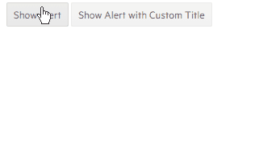
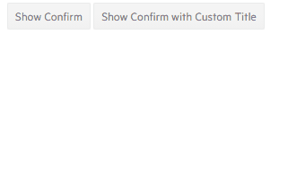
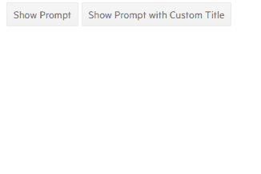

# Predefined Dialogs - Alert, Confirm, Prompt

Telerik UI for Blazor provides styled substitutes to the standard confirm, alert and prompt dialogs. They match the Theme of the components to make it obvious to the user that the modal dialog is coming from your application.

To use these dialogs, receive a cascading parameter of type `Telerik.Blazor.DialogFactory`. It exposes the methods you can use in your method calls.

````CSHTML
[CascadingParameter]
public DialogFactory Dialogs { get; set; }
````

The predefined dialogs can only be used inside child Razor components of the `TelerikRootComponent`. This is easily achieved in standard Blazor apps where the `TelerikRootComponent` resides inside the layout file. When [using UI for Blazor in ASP.NET apps](), an additional child component is needed.

There are three available ready-made dialogs:

* [Alert](#alert)
* [Confirm](#confirm)
* [Prompt](#prompt)

## Alert

The alert dialog usually shows the user that something went wrong, such as a major error that requires their attention and blocks the UI, as opposed to a [notification]() that is not modal and is small.

>caption Use an Alert dialog

````CSHTML
@* Use Alert dialogs, monitor the console for when the code continues *@

<TelerikButton OnClick="@ShowAlert">Show Alert</TelerikButton>
<TelerikButton OnClick="@ShowAlertWithTitle">Show Alert with Custom Title</TelerikButton>

@code {
    [CascadingParameter]
    public DialogFactory Dialogs { get; set; }

    public async Task ShowAlert()
    {
        await Dialogs.AlertAsync("Something went wrong!");

        Console.WriteLine("The user dismissed the alert box.");
    }

    async Task ShowAlertWithTitle()
    {
        await Dialogs.AlertAsync("Something went wrong!", "Read this!");

        Console.WriteLine("The user dismissed the alert box with the custom title.");
    }
}
````



## Confirm

The confirm dialog returns a `bool` value that indicates which button the user clicked - `true` for the `OK` button and `false` for the `Cancel` button. This lets you `await` its execution, and then continue the application logic based on that decision. The method that calls it must be `async Task` and *not* `async void` in order to await the execution.

>caption Use a Confirm dialog

````CSHTML
@* Use Confirm dialogs, monitor the console for when and how the code continues *@

<TelerikButton OnClick="@ShowConfirm">Show Confirm</TelerikButton>
<TelerikButton OnClick="@ShowConfirmWithTitle">Show Confirm with Custom Title</TelerikButton>

@code {
    [CascadingParameter]
    public DialogFactory Dialogs { get; set; }

    public async Task ShowConfirm()
    {
        bool isConfirmed = await Dialogs.ConfirmAsync("Are you sure?");

        if (isConfirmed)
        {
            Console.WriteLine("The user is sure, continue.");
        }
        else
        {
            Console.WriteLine("The user changed their mind");
        }
    }

    async Task ShowConfirmWithTitle()
    {
        bool isConfirmed = await Dialogs.ConfirmAsync("Are you sure?", "Confirmation!");

        Console.WriteLine($"The user is sure: {isConfirmed}.");
    }
}
````




## Prompt

The prompt dialog returns a `string` that the user enters when they press `OK`, and `null` when they press `Cancel`. This lets you `await` its execution, and then continue the application logic based on that decision. The method that calls it must be `async Task` and *not* `async void` in order to await the execution.

>caption Use a Prompt dialog

````CSHTML
@* Use Prompt dialogs, monitor the console for when and how the code continues *@

<TelerikButton OnClick="@ShowPrompt">Show Prompt</TelerikButton>
<TelerikButton OnClick="@ShowPromptWithTitle">Show Prompt with Custom Title</TelerikButton>

@code {
    [CascadingParameter]
    public DialogFactory Dialogs { get; set; }

    public async Task ShowPrompt()
    {
        string userInput = await Dialogs.PromptAsync("Enter your answer.");

        if (userInput == null)
        {
            Console.WriteLine("The user will not answer.");
        }
        else
        {
            Console.WriteLine($"The user said: {userInput}");
        }
    }

    async Task ShowPromptWithTitle()
    {
        string userInput = await Dialogs.PromptAsync("Enter answer:", "Input needed");

        Console.WriteLine($"The user answer: {userInput}");
    }
}
````




## See Also

* [Live Demo: Predefined Dialogs](https://demos.telerik.com/blazor-ui/dialog/predefined-dialogs)

