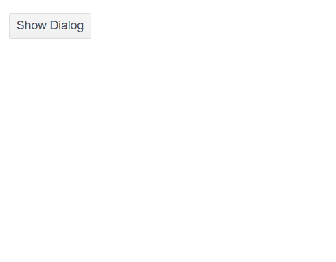

# Dialog Visibility

The Dialog controls its visibility through a `Visible` parameter that supports two-way binding. The component follows the existing approach already used for the Window dialog.

## Example

The following example demonstrates how to control the visibility of the Dialog.

>caption The result from the code snippet.



>caption Visibility control of the Telerik Dialog.

````CSHTML
@* An example of controlling the visibility of the component. *@

<TelerikButton OnClick="@(() => { Visible = true; })">Show Dialog</TelerikButton>

<TelerikDialog @bind-Visible="@Visible"
               Title="@Title">
    <DialogContent>
        <br />
        <div>--- Place here the Dialog content ---</div>
        <br />
    </DialogContent>
    <DialogButtons>
        <TelerikButton Primary="true" OnClick="@(() => { Visible = false; })">Cancel</TelerikButton>
        <TelerikButton OnClick="@(() => { Visible = false; })">OK</TelerikButton>
    </DialogButtons>
</TelerikDialog>

@code {
    private bool Visible { get; set; } = true;
    private string Title { get; set; } = "Title here";
}
````