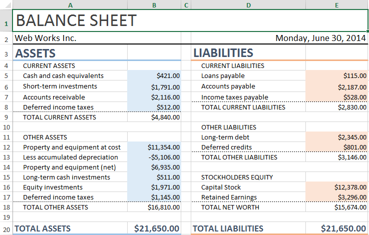

# Telerik SpreadProcessing

>note **RadSpreadProcessing** is part of the **Telerik Document Processing** libraries. The full documentation for this component is available at [https://docs.telerik.com/devtools/document-processing/libraries/radspreadsprocessing](https://docs.telerik.com/devtools/document-processing/libraries/radspreadprocessing/overview).

This library enables you to work with spreadsheet documents – create ones from scratch, modify existing documents or convert between the most common spreadsheet formats. You can save the generated workbook to a local file, stream, or stream it to the client browser.

**RadSpreadProcessing** comes with support for:

* [**Shapes and Images**](https://docs.telerik.com/devtools/document-processing/libraries/radspreadprocessing/features/shapes-and-images): API for insertion, positioning and deletion of images in worksheets.		

* [**Hyperlinks**](https://docs.telerik.com/devtools/document-processing/libraries/radspreadprocessing/features/hyperlink): The API enables you to add, remove, edit and search for hyperlinks in the worksheets of the document.

* [**Workbook Protection**](https://docs.telerik.com/devtools/document-processing/libraries/radspreadprocessing/features/protection/workbook): Prevents the users from modifying the workbook by adding, removing, renaming or reordering sheets.	

* [**Worksheet protection**](https://docs.telerik.com/devtools/document-processing/libraries/radspreadprocessing/features/protection/worksheet): Restricts the user from modifying the content and structure of the worksheet. Additionally, the model offers protection options that let you choose a set of commands that will be available to the user when protection is enabled.

* [**Grouping**](https://docs.telerik.com/devtools/document-processing/libraries/radspreadprocessing/features/grouping): Helps you organize data in sections, to be able to show and hide the currently relevant chunks.

* [**Formulas**](https://docs.telerik.com/devtools/document-processing/libraries/radspreadprocessing/features/formulas/formulas): The library comes with more than 200 built-in functions. The API enables you to easily plug custom ones as well.

* [**Named ranges**](https://docs.telerik.com/devtools/document-processing/libraries/radspreadprocessing/features/named-ranges): You can use the named ranges on workbook and worksheet levels.

* [**Styling**](https://docs.telerik.com/devtools/document-processing/libraries/radspreadprocessing/features/styling/cell-styles): You can apply styles to the cells. The API allows you to duplicate one of the predefined styles or create a new one according to your preferences.

* [**Theming**](https://docs.telerik.com/devtools/document-processing/libraries/radspreadprocessing/features/styling/document-themes): The document model comes with predefined themes called Document themes. They enable you to specify colors, fonts and a variety of graphic effects in a document and affect the look and feel of the whole workbook.

* [**Resizing**](https://docs.telerik.com/devtools/document-processing/libraries/radspreadprocessing/working-with-rows-and-columns/resizing): Auto fit or resize rows and columns.

* [**Number Formats**](https://docs.telerik.com/devtools/document-processing/libraries/radspreadprocessing/features/number-formats): Enable you to format the data in the cells so it can be easily readable. The document model exposes the following categories of predefined formats: **General**, **Number**, **Currency**, **Accounting**, **Date**, **Time**, **Percentage**, **Fraction**, **Scientific**, **Text**, **Special** and also allows you to create **custom** formats.

* **Copy/Paste**: Add or [copy worksheets](https://docs.telerik.com/devtools/document-processing/libraries/radspreadprocessing/working-with-worksheets/copy-worksheet) within or across workbooks. Of course, [copying and pasting of cells](https://docs.telerik.com/devtools/document-processing/libraries/radspreadprocessing/features/clipboard-support) is supported as well.

* [**Data Validation**](https://docs.telerik.com/devtools/document-processing/libraries/radspreadprocessing/features/data-validation): Enables you to control the type of data or the values that users enter into a cell. Different data validation rules are available, including list, number, date, text length or custom rules.

* [**Filtering**](https://docs.telerik.com/devtools/document-processing/libraries/radspreadprocessing/features/filtering) worksheet data.		

* [**Sorting**](https://docs.telerik.com/devtools/document-processing/libraries/radspreadprocessing/features/sorting) the data in the worksheet.	

* [**Find and replace data**](https://docs.telerik.com/devtools/document-processing/libraries/radspreadprocessing/features/find-and-replace).

* [**Freeze Panes**](https://docs.telerik.com/devtools/document-processing/libraries/radspreadprocessing/features/freeze-panes): Keep part of the worksheet visible at all times when scrolling.

* [**Hidden rows and columns**](https://docs.telerik.com/devtools/document-processing/libraries/radspreadprocessing/working-with-rows-and-columns/hidden-rows-columns): The API of the workbook model allows you to set the hidden state of each row or column.
		
* [**Merge and unmerge cells**](https://docs.telerik.com/devtools/document-processing/libraries/radspreadprocessing/features/merge-unmerge-cells): You have the ability to merge two or more adjacent cells into a single cell that spans over multiple rows and columns.

* **[Auto fill](https://docs.telerik.com/devtools/document-processing/libraries/radspreadprocessing/features/fill-data-automatically/repeat-values) and [Series](https://docs.telerik.com/devtools/document-processing/libraries/radspreadprocessing/features/fill-data-automatically/series)**: Fill cells automatically with data following a specific pattern.	

* [**Page Setup**](https://docs.telerik.com/devtools/document-processing/libraries/radspreadprocessing/features/worksheetpagesetup): Set and get header and footer settings and apply various page setup options like paper size, orientation, scaling, margins, breaks, etc. Apply print settings.		

* [**History**](https://docs.telerik.com/devtools/document-processing/libraries/radspreadprocessing/features/history): The document model provides the possibility to maintain a history stack that tracks all changes to the content of the workbook. Each worksheet has its own history stack.

## Supported formats: 

* [**XLSX**](https://docs.telerik.com/devtools/document-processing/libraries/radspreadprocessing/formats-and-conversion/xlsx/xlsxformatprovider)

* [**XLS**](https://docs.telerik.com/devtools/document-processing/libraries/radspreadprocessing/formats-and-conversion/xls/xls) - See the [supported features](https://docs.telerik.com/devtools/document-processing/libraries/radspreadprocessing/formats-and-conversion/xls/features).

* [**CSV**](https://docs.telerik.com/devtools/document-processing/libraries/radspreadprocessing/formats-and-conversion/csv/csvformatprovider) 

* [**Plain text**](https://docs.telerik.com/devtools/document-processing/libraries/radspreadprocessing/formats-and-conversion/txt/txtformatprovider) 

* [**PDF**](https://docs.telerik.com/devtools/document-processing/libraries/radspreadprocessing/formats-and-conversion/pdf/pdfformatprovider) (export only)
 

## See Also

* [Getting Started](https://docs.telerik.com/devtools/document-processing/libraries/radspreadprocessing/getting-started)
* [What is a Workbook](https://docs.telerik.com/devtools/document-processing/libraries/radspreadprocessing/working-with-workbooks/working-wtih-workbooks-what-is-workbook)
* [What is a Worksheet](https://docs.telerik.com/devtools/document-processing/libraries/radspreadprocessing/working-with-worksheets/what-is-worksheet)
