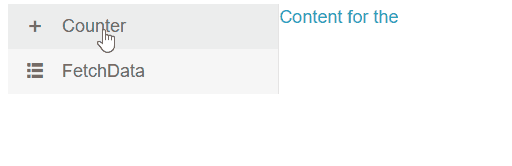

# Drawer Events

This article explains the events available in the Telerik Drawer for Blazor:

* [SelectedItemChanged](#selecteditemchanged)
* [ExpandedChanged](#expandedchanged)


## SelectedItemChanged

The `SelectedItemChanged` event fires every time the user clicks on a new item from the Drawer. You can use it with one-way data binding to respond to the user [selection](). It receives an argument of the Drawer data model type.

>caption Handle SelectedItemChanged event

````CSHTML
@* This example shows how to use one-way data binding for the SelectedItem parameter *@

<TelerikDrawer Data="@Data" Expanded="true" MiniMode="true" Mode="DrawerMode.Push"
               SelectedItem="@selectedItem"
               SelectedItemChanged="((DrawerItem item) => SelectedItemChangedHandler(item))">
    <Content>
        <div class="text-info">
            Content for the @selectedItem?.Text
        </div>
    </Content>
</TelerikDrawer>

@code {
    private void SelectedItemChangedHandler(DrawerItem item)
    {
        selectedItem = item;
        // if you don't update the view-model, the event will effectively be cancelled

        Console.WriteLine($"The user selected {item.Text}");
    }

    protected override void OnInitialized()
    {
        //You can preselect an item in the lifecycle methods that the framework provides.
        selectedItem = Data.FirstOrDefault();
        //Here you can use another LINQ expressions like Where() or else depending on your application needs.
    }

    public DrawerItem selectedItem { get; set; }
    public IEnumerable<DrawerItem> Data { get; set; } =
        new List<DrawerItem>
        {
            new DrawerItem { Text = "Counter", Icon = "plus"},
            new DrawerItem { Text = "FetchData", Icon = "grid-layout"},
                };

    public class DrawerItem
    {
        public string Text { get; set; }
        public string Icon { get; set; }
    }
}
````


## ExpandedChanged

The `ExpandedChanged` event fires every time the component's state is changed - to expanded or to collapsed. You can use it with one-way data binding for the `Expanded` parameter. It takes an argument of the `bool` type that corresponds to its new state - whether the drawer is expanded.

>tip If you only need conditional markup based on the expanded/collapsed state of the drawer, use two-way binding (`@bind-Expanded`) - in this example, hiding the button conditionally can be achieved either way, but two-way binding requires less code.

>caption Handle ExpandedChanged event

````CSHTML
@* This example shows how to use one-way data binding for the Expanded parameter and show/hide the Expand Drawer button based on the value of Expanded *@

@if (!Expanded)
{
    <TelerikButton OnClick="@(() => DrawerRef.ExpandAsync())" Icon="menu">Expand Drawer</TelerikButton>
}

<TelerikDrawer Expanded="@Expanded"
               ExpandedChanged="((bool newValue) => ExpandedChangedHandler(newValue))"
               Data="@Data"
               MiniMode="true"
               Mode="@DrawerMode.Push"
               @bind-SelectedItem="@selectedItem"
               @ref="@DrawerRef">
    <Content>
        <div class="text-info">
            Content for the @selectedItem?.Text
        </div>
    </Content>
</TelerikDrawer>

@code {
    private void ExpandedChangedHandler(bool value)
    {
        Expanded = value;
        // if you don't update the view-model, the event will be effectively cancelled

        Console.WriteLine(string.Format("the user {0} the drawer.", Expanded ? "expanded" : "collapsed"));
    }

    public TelerikDrawer<DrawerItem> DrawerRef { get; set; }
    public DrawerItem selectedItem { get; set; }
    public bool Expanded { get; set; } = true;
    public IEnumerable<DrawerItem> Data { get; set; } =
        new List<DrawerItem>
        {
            new DrawerItem { Text = "Counter", Icon = "plus"},
            new DrawerItem { Text = "FetchData", Icon = "grid-layout"},
         };

    public class DrawerItem
    {
        public string Text { get; set; }
        public string Icon { get; set; }
    }
}
````
>caption The result from the code snippet above



@[template](/_contentTemplates/common/general-info.md#event-callback-can-be-async)

@[template](/_contentTemplates/common/issues-and-warnings.md#valuechanged-lambda-required)
