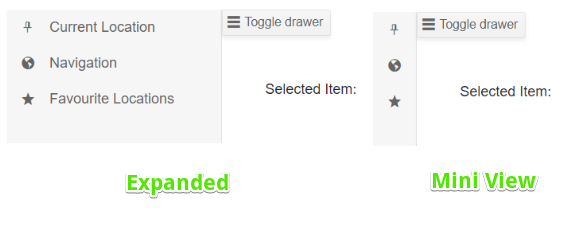

# Drawer Icons

You can put an image, an icon class or a font icon for each item in the Drawer to illustrate its purpose for your end users. To apply them, use the following properties:

* for a [Telerik font icon](), point the `IconField` parameter of the component to a `string` field of the model that contains the corresponding icon name.

* for a raster image, point the `ImageUrlField` parameter of the component to a `string` field of the model that contains the url to the icon (relative or absolute).

* for a custom font icon class, point the `IconClassField` parameter of the component to a `string` field of the model that contains the desired CSS class list which provides the required rules (like font name and glyph symbol). Make sure to also reference the desired font in your app and to use its own recommendations.

The `IconClassField` and `ImageUrlField` are rendered, respectively, as `<span class="the custom class" />` and as ``

>caption How to use icons in Telerik Drawer

````CSHTML
@* This example shows how to add icons to the Drawer items *@

<TelerikDrawer Data="@Data"
               IconField="@nameof(DrawerItem.TelerikIcon)"
               MiniMode="true"
               @bind-Expanded="@DrawerExpanded"
               Mode="DrawerMode.Push"
               @ref="@DrawerRef"
               @bind-SelectedItem="@SelectedItem">
    <Content>
        <TelerikButton OnClick="@(() => DrawerRef.ToggleAsync())" Icon="@IconName.Menu">Toggle drawer</TelerikButton>
        <div class="m-5">
            Selected Item: @SelectedItem?.Text
        </div>
    </Content>
</TelerikDrawer>

@code {
    bool DrawerExpanded { get; set; } = true;
    TelerikDrawer<DrawerItem> DrawerRef { get; set; }
    DrawerItem SelectedItem { get; set; }
    IEnumerable<DrawerItem> Data { get; set; } = new List<DrawerItem>()
        {
                new DrawerItem { Text = "Current Location", TelerikIcon = IconName.Pin},
                new DrawerItem { Text = "Navigation", TelerikIcon = IconName.Globe},
                new DrawerItem { Text = "Favourite Locations", TelerikIcon = IconName.Star},
        };

    public class DrawerItem
    {
        public string Text { get; set; }
        public string TelerikIcon { get; set; }
    }
}
````

>caption The result from the code snippet above




## See Also

  * [Drawer Overview]()
