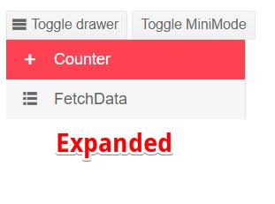
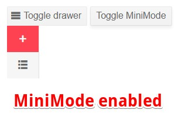
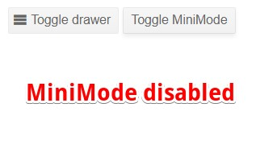

# Mini Mode

The Drawer's `MiniMode` is a visual representation of the collapsed state. In general it will contain an icon which describes the item.

To enable mini mode set the `MiniMode` parameter to `true`. By default this parameter is set to `false`.

When the `MiniMode` parameter is `false` the Drawer will not be visible when collapsed.

## Examples

>caption Observe the behavior of the MiniMode.

````CSHTML
@* Click on the Toggle MiniMode button to enable or disable it. *@
@* The same behavior will be observed in both Push and Overlay modes *@

<TelerikButton OnClick="@(() => DrawerRef.ToggleAsync())" Icon="@IconName.Menu">Toggle drawer</TelerikButton>
<TelerikButton OnClick="@(() => MiniMode = !MiniMode)">Toggle MiniMode</TelerikButton>
<TelerikDrawer @bind-Expanded="Expanded"
               Data="Data"
               MiniMode="MiniMode"
               Mode="DrawerMode.Push"
               @ref="DrawerRef">
</TelerikDrawer>


@code {
    public TelerikDrawer<DrawerItem> DrawerRef { get; set; }
    public bool Expanded { get; set; } = true;
    public bool MiniMode { get; set; } = true;
    public IEnumerable<DrawerItem> Data { get; set; } =
        new List<DrawerItem>
        {
            new DrawerItem { Text = "Counter", Icon = IconName.Plus},
            new DrawerItem { Text = "FetchData", Icon = IconName.GridLayout},
                                };

    public class DrawerItem
    {
        public string Text { get; set; }
        public string Icon { get; set; }
    }
}
````

>caption The result from the code snippet above






