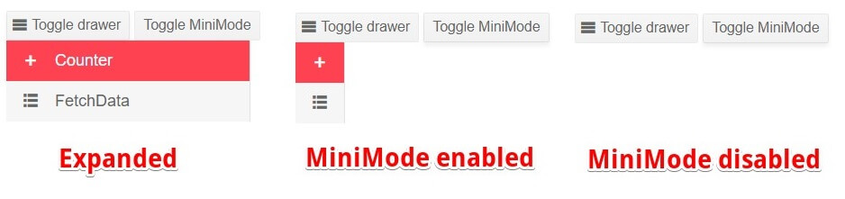

# Mini View

When the Drawer is collapsed, it is not visible at all by default. You can, however, leave a small hint for the user that shows the icons of the items so they can navigate with just a single action.

To enable the mini view when the drawer is collapsed (minimized), set the `MiniMode` parameter to `true`. By default this parameter is set to `false`.

>caption Mini View behavior



>caption Observe the behavior of the MiniMode.

````CSHTML
@* Click on the Toggle MiniMode button to enable or disable it. *@
@* The same behavior will be observed in both Push and Overlay modes *@

<TelerikButton OnClick="@(() => DrawerRef.ToggleAsync())" Icon="menu">Toggle drawer</TelerikButton>
<TelerikButton OnClick="@(() => MiniMode = !MiniMode)">Toggle MiniMode</TelerikButton>
<TelerikDrawer Data="@Data"
               MiniMode="@MiniMode"
               Mode="@DrawerMode.Push"
               @ref="@DrawerRef">
</TelerikDrawer>

@code {
    public TelerikDrawer<DrawerItem> DrawerRef { get; set; }
    public bool MiniMode { get; set; } = true;
    public IEnumerable<DrawerItem> Data { get; set; } =
        new List<DrawerItem>
        {
            new DrawerItem { Text = "Counter", Icon = IconName.Plus},
            new DrawerItem { Text = "FetchData", Icon = IconName.GridLayout},
        };

    public class DrawerItem
    {
        public string Text { get; set; }
        public string Icon { get; set; }
    }
}
````


