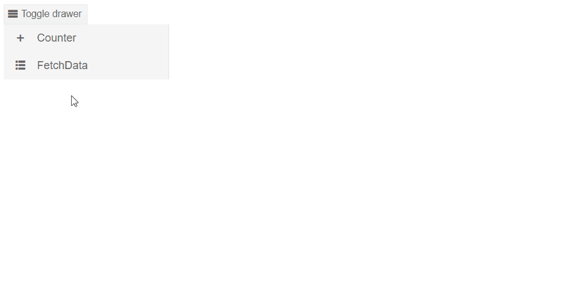

# Drawer Modes

This article explains the different modes the Drawer could be set to.

The Drawer's mode can be controlled by setting the `Mode` parameter and the `DrawerMode` enum, which has two members:
* [Push](#push)
* [Overlay](#overlay)

If the `Mode` is not set, by default the Drawer will be in Overlay mode.

## Push

When the `DrawerMode` enum is set to `Push` the Drawer's default width when expanded is set to `240px` and `50px` when collapsed in [MiniMode](). The component's height is dynamic based on the height of the content. When it's state is changed (expanded/collapsed) the content is resized - the width is increased or decreased based on the state.

>caption Handle the Drawer in Push mode.

>caption The result from the code snippet below



````CSHTML
@* This example shows how to use the Drawer to change its content based on user selecetion *@

<div>
    <TelerikButton OnClick="@(() => DrawerRef.ToggleAsync())" Icon="@IconName.Menu">Toggle drawer</TelerikButton>
    <TelerikDrawer @bind-Expanded="Expanded"
                   Data="Data"
                   MiniMode="true"
                   Mode="DrawerMode.Push"
                   @bind-SelectedItem="selectedItem"
                   @ref="DrawerRef">
        <Content>
        <div class="text-info">
                    Content for the @selectedItem?.Text
                </div>
        </Content>
    </TelerikDrawer>
</div>

@code {

    private void SelectedItemChangedHandler(DrawerItem item)
    {
        selectedItem = item;
    }

    public TelerikDrawer<DrawerItem> DrawerRef { get; set; }
    public DrawerItem selectedItem { get; set; }
    public bool Expanded { get; set; } = true;
    public IEnumerable<DrawerItem> Data { get; set; } =
        new List<DrawerItem>
        {
            new DrawerItem { Text = "Counter", Icon = IconName.Plus},
            new DrawerItem { Text = "FetchData", Icon = IconName.GridLayout},
                    };

    public class DrawerItem
    {
        public string Text { get; set; }
        public string Icon { get; set; }
    }
}
````

## Overlay

When the `DrawerMode` enum is set to `Overlay` the Drawer's navigation is placed on top of the content and its height takes all available vertical space (100%). It also adds blurred background on top of the content until the user clicks on an item of the Drawer or outside.

>caption Handle the Drawer in Overlay mode

>caption The result from the code snippet below


````CSHTML
@* Add padding to the left of the content so that it is not overlapped by the Drawer in collapsed mode. *@

<div class="pl-4">
    <TelerikButton OnClick="@(() => DrawerRef.ToggleAsync())" Icon="@IconName.Menu">Toggle drawer</TelerikButton>
</div>
<TelerikDrawer @bind-Expanded="Expanded"
               Data="Data"
               MiniMode="true"
               Mode="DrawerMode.Overlay"
               @bind-SelectedItem="selectedItem"
               @ref="DrawerRef">
    <Content>
        <div class="text-info pl-4">
            Content for the @selectedItem?.Text
        </div>
    </Content>
</TelerikDrawer>

@code {
    public TelerikDrawer<DrawerItem> DrawerRef { get; set; }
    public DrawerItem selectedItem { get; set; }
    public bool Expanded { get; set; } = true;
    public IEnumerable<DrawerItem> Data { get; set; } =
        new List<DrawerItem>
        {
            new DrawerItem { Text = "Counter", Icon = IconName.Plus},
            new DrawerItem { Text = "FetchData", Icon = IconName.GridLayout},
                                    };

    public class DrawerItem
    {
        public string Text { get; set; }
        public string Icon { get; set; }
    }
}
````
