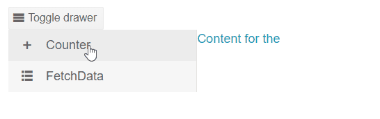

# Drawer Modes

This article explains the different modes the Drawer could be set to.

The Drawer's mode can be controlled by setting the `Mode` parameter and the `DrawerMode` enum, which has two members:
* [Push](#push)
* [Overlay](#overlay)

If the `Mode` is not set, by default the Drawer will be in Overlay mode.

## Push

When the `DrawerMode` enum is set to `Push` the Drawer's default width when expanded is set to `240px` and `50px` when in [MiniMode]() (collapsed). The component's height is dynamic based on the height of the content. When it's state is changed (expanded/collapsed) the content is resized - the width is increased or decreased based on the state.

>caption Handle the Drawer in its basic scenario - as navigation menu on the view.

````CSHTML

@* This example shows how to use the Drawer to change its content based on user selecetion *@
<div>
    <TelerikButton OnClick="@(() => DrawerRef.ToggleAsync())" Icon="rows">Toggle drawer</TelerikButton>
    <TelerikDrawer Expanded="Expanded"
                   Data="Data"
                   MiniMode="true"
                   Mode="DrawerMode.Push"
                   SelectedItem="selectedItem"
                   SelectedItemChanged="((DrawerItem item) => SelectedItemChangedHandler(item))"
                   @ref="DrawerRef">
        <Content>
            @{
                var lowerCaseText = selectedItem?.Text.ToLower();

                if (lowerCaseText == "counter")
                {
                    <Counter />
                }
                else if (lowerCaseText == "fetchdata")
                {
                    <FetchData />
                }
            }
        </Content>
    </TelerikDrawer>
</div>

@code {

    private void SelectedItemChangedHandler(DrawerItem item)
    {
        selectedItem = item;
    }

    public TelerikDrawer<DrawerItem> DrawerRef { get; set; }
    public DrawerItem selectedItem { get; set; }
    public bool Expanded { get; set; } = true;
    public IEnumerable<DrawerItem> Data { get; set; } =
        new List<DrawerItem>
        {
            new DrawerItem { Text = "Counter", Icon = IconName.Plus},
            new DrawerItem { Text = "FetchData", Icon = IconName.GridLayout},
                    };

    public class DrawerItem
    {
        public string Text { get; set; }

        public string Icon { get; set; }
    }
}


````
>caption The result from the code snippet above




## Overlay

When the `DrawerMode` enum is set to `Overlay` the Drawer's navigation is placed on top of the content. It also adds blurred background on top of the content until the user clicks on an item of the Drawer or outside.
