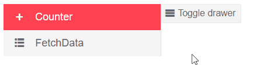

# Drawer Overview

The <a href="https://www.telerik.com/blazor-ui/drawer" target="_blank">Blazor Drawer component</a> is a dismissible or permanently visible panel for [navigating]() in responsive web applications. It allows switching the content of different sections of the page. You can customize its [templates](), [display](), behavior when [minimizing]() and respond to [events]().

#### To use a Telerik Drawer for Blazor

1. Add the `TelerikDrawer` tag.
1. Populate its `Data` property with the collection of items you want the user to see.
1. Place the content of the Drawer in the `<Content>` tag.
    * In this example, we keep it simple by using the selected item. See the [Navigation]() article for a menu-like experience with links.

>caption Basic configuration of the Drawer.

````CSHTML
@* This example shows the basic configuration of the Drawer and how to expand or collapse a Drawer with a click of a button. *@

<TelerikDrawer Data="@Data"
               MiniMode="true"
               Mode="DrawerMode.Push"
               @ref="@DrawerRef"
               @bind-SelectedItem="@SelectedItem">
    <Content>
        <TelerikButton OnClick="@(() => DrawerRef.ToggleAsync())" Icon="menu">Toggle drawer</TelerikButton>

        @* Place your contents here - it can be as simple as text, it can be conditional components or components that
            take the selected item as a parameter, or even the @Body tag for navigation if you place the
            drawer high enough in the project layout hierarchy *@
        <div class="m-5">
            Selected Item: @SelectedItem?.Text
        </div>
    </Content>
</TelerikDrawer>

@code {
    TelerikDrawer<DrawerItem> DrawerRef { get; set; }
    DrawerItem SelectedItem { get; set; }
    IEnumerable<DrawerItem> Data { get; set; } =
        new List<DrawerItem>
        {
            new DrawerItem { Text = "Counter", Icon = IconName.Plus},
            new DrawerItem { Text = "FetchData", Icon = IconName.GridLayout},
        };

    public class DrawerItem
    {
        public string Text { get; set; }
        public string Icon { get; set; }
    }
}
````

>caption The result from the code snippet above




## Features

>caption The Drawer provides the following features:

* `Data` - a collection of flat data for all items in the Drawer. See the [Data Binding]() article for details.

* `Position` - you can control the position of the Drawer, through the `DrawerPosition` enum.
The members of the enum are:
 * `Left` - the default position
 * `Right` - the drawer item list will render on the right hand side of the `Content`

* `Expanded` - two-way bindable property that specifies whether the Drawer is expanded or collapsed. If this parameter is used to expand or collapse the component the animations will not be available. To use animations you have to use the Drawer's [Methods](#methods). You can, however, use the value to implement custom layouts in the drawer [templates]() or in your own layout.

* `Width` - the width of the Drawer when expanded.

* `Class` - the CSS class that will be rendered on the main wrapping element of the Drawer. You can use it to make it fit your layout (e.g., set a `height: 100%` to it, if needed).

* `Mode` - controls whether the Drawer is in `Push` or `Overlay` mode. For more information read the [Display Modes]() article.

* `MiniMode` - controls whether there is mini view when the Drawer is collapsed. For more information read the [Mini View]() article.

* `Content` - the `<Content>` child tag of `<TelerikDrawer>` is a `RenderFragment` where you put a component or custom HTML as the content of the Drawer - this is what the drawer will push or overlay.

* `SelectedItem` - two-way bindable property that contains the currently selected item in the Drawer. For more information read the [Selection]() article.

* `Template` - define a custom template for the entire Drawer. For more information read the [Templates]() article.

* `ItemTemplate` - define a custom template for the Items of the Drawer. For more information see the [Templates]() article.

* Events - you can respond to the user actions to implement your business logic. For more details see the [Events]() article.

## Methods

The Drawer methods are accessible through it's reference. The reference exposes several methods that enable the transition animations. These methods change the value of the `Expanded` parameter.

* `ExpandAsync` - allows you to change the state of the Drawer so it is expanded.

* `CollapseAsync` - allows you to change the state of the Drawer so it is collapsed.

* `ToggleAsync` - allows you to expand or collapse the component depending on the current state of the Drawer.

>caption Get a reference to the drawer and use its methods

````CSHTML
@* The drawer is a generic components and its reference type depends on the type of the model it is bound to. *@

<TelerikButton OnClick="@(() => DrawerRef.ToggleAsync())"
               Icon="menu">
    Toggle drawer
</TelerikButton>

<TelerikDrawer Data="@Data" Mode="@DrawerMode.Push"
               @ref="@DrawerRef">
    <Content>lorem ipsum</Content>
</TelerikDrawer>

@code {
    Telerik.Blazor.Components.TelerikDrawer<DrawerItem> DrawerRef { get; set; }

    IEnumerable<DrawerItem> Data { get; set; } =
        new List<DrawerItem>
        {
            new DrawerItem { Text = "Counter", Icon = IconName.Plus},
            new DrawerItem { Text = "FetchData", Icon = IconName.GridLayout},
        };

    public class DrawerItem
    {
        public string Text { get; set; }
        public string Icon { get; set; }
    }
}
````


## See Also

  * [Drawer Overview Demo](https://demos.telerik.com/blazor-ui/drawer/overview)
  * [Drawer Data Binding]()
  * [Drawer Navigation]()
  * [Drawer Modes]()
  * [Drawer Events]()
  * [Drawer Templates]()
  * [Drawer Selection]()
  * [Sample Project: Drawer as Side Navigation](https://github.com/telerik/blazor-ui/tree/master/drawer/sidenav)
