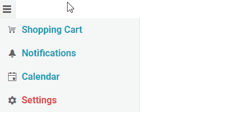
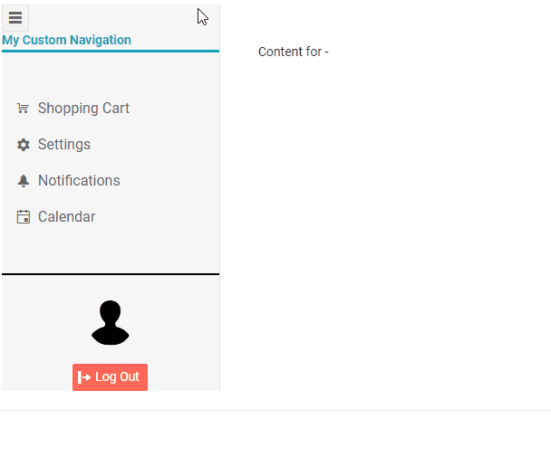

# Drawer Templates

The Drawer can be customized by using Templates. This article explains the available layout templates for the component.

* [ItemTemplate](#itemtemplate)
* [Template](#template)

## ItemTemplate

The `<ItemTemplate>` controls the rendering of the [data bound items]() in the Drawer, in case you want to use a rendering different than the default one.

This template receives a `context` argument that is of the data model type and represents the current item.

>caption Use ItemTemplate to control the rendering of the items in the Drawer.

````CSHTML
@* This example shows how to control the rendering of the items in the Drawer menu *@

<TelerikButton OnClick="@(() => DrawerRef.ToggleAsync())" Icon="@IconName.Menu" />

<TelerikDrawer @bind-Expanded="@Expanded"
               Data="@Data"
               MiniMode="true"
               Mode="@DrawerMode.Push"
               @bind-SelectedItem="@SelectedItem"
               @ref="@DrawerRef">
    <ItemTemplate Context="item">
        <span class="k-icon k-i-@item.Icon" style="margin-right: 8px;"></span>
        @if (Expanded)
        {
            <div class="@( item.Icon.ToLowerInvariant() == "gear" ? "text-danger" : "text-info" )">
                <div style="font-weight:bold;">@item.Text</div>
            </div>
        }
    </ItemTemplate>
    <Content>
        <strong>@SelectedItem?.Description</strong>
    </Content>
</TelerikDrawer>


@code {
    public TelerikDrawer<DrawerItem> DrawerRef { get; set; }
    public DrawerItem SelectedItem { get; set; }
    public bool Expanded { get; set; } = true;
    public IEnumerable<DrawerItem> Data { get; set; } = new List<DrawerItem>
    {
        new DrawerItem {Text = "Shopping Cart", Icon = IconName.Cart, Description = "Items in shopping cart"},
        new DrawerItem {Text = "Notifications", Icon = IconName.Notification, Description = "My profile notifications"},
        new DrawerItem {Text = "Calendar", Icon = IconName.Calendar, Description = "My events"},
        new DrawerItem {Text = "Settings", Icon = IconName.Gear, Description = "My profile settings"},
    };

    public class DrawerItem
    {
        public string Text { get; set; }
        public string Icon { get; set; }
        public string Description { get; set; }
    }
}
````

>caption The result of the code snippet above




## Template

The `<Template>` allows you to control the whole rendering of the Drawer so you can add extra content and application logic. This template receives a `context` argument that is `IEnumerable<TItem>` - it is the `Data` collection of the component.

When using this template the [item selection]() must be implemented by the application as shown in the example below.

The drawer will expand and collapse as usual, but the content has to be controlled by the application entirely.

Make sure that the `<Content>` tag is outside of the `<Template>` - one renders the app outside of the drawer, the second renders the contents of the drawer only.

Using the `<Template>` and `<ItemTemplate>` together is not possible - the Template removes any built-in rendering from the Drawer.

>caption Using a template with manual item selection, header and footer

````CSHTML
@* This example shows how to create header and footer for the Drawer and select an item manually. *@

<TelerikDrawer @bind-Expanded="@DrawerExpanded"
               Data="@Data"
               MiniMode="true"
               Mode="@DrawerMode.Push"
               @bind-SelectedItem="@SelectedItem"
               @ref="@DrawerRef">
    <Template>
        @* the header *@
        <div>
            <TelerikButton OnClick="@(() => DrawerRef.ToggleAsync())" Icon="@IconName.Menu" />
            @if (DrawerExpanded)
            {
                <div class="text-info" style="border-bottom:solid; font-weight: bold; margin-bottom: 3em; white-space:nowrap">
                    My Custom Navigation
                </div>
            }
            else
            {
                <div class="text-info" style="border-bottom:solid; font-weight: bold;">
                    Nav
                </div>
            }
        </div>

        @* custom items rendering and item selection *@

        <div class="k-drawer-items">
            <ul>
                @if (SelectedItem != null && DrawerExpanded)
                {
                    <li class="k-drawer-item" style="white-space:nowrap">
                        <div>
                            <p><strong>@SelectedItem.Text</strong></p>
                            <p>@SelectedItem.Description</p>
                        </div>
                    </li>
                }

                @foreach (var item in Data)
                {
                    @* Use onclick to handle manual item selection *@
                    <li @onclick="@(() => SelectedItem = item)"
                        class="k-drawer-item @GetSelectedItemClass(item)" style="white-space:nowrap">
                        <span class="k-icon k-i-@item.Icon" style="margin-right: 8px;"></span>
                        @if (DrawerExpanded)
                        {
                            <div>
                                <div>@item.Text</div>
                            </div>
                        }
                    </li>
                }
            </ul>
        </div>

        @* the footer *@
        @if (DrawerExpanded)
        {
            <div style="text-align: center; margin-top: 3em; padding-top: 2em; border-top: 2px solid black; white-space:nowrap">
                
                <br /><br />
                <TelerikButton Icon="@IconName.Logout" Primary="true">Log Out</TelerikButton>
            </div>
        }
    </Template>
    <Content>
        <div class="m-5">Content for @SelectedItem?.Text - @SelectedItem?.Description</div>
    </Content>
</TelerikDrawer>

@code {
    public TelerikDrawer<DrawerItem> DrawerRef { get; set; }
    public DrawerItem SelectedItem { get; set; }
    public bool DrawerExpanded { get; set; } = true;
    public IEnumerable<DrawerItem> Data { get; set; } = new List<DrawerItem>
{
        new DrawerItem {Text = "Shopping Cart", Icon = IconName.Cart, Description = "Items in shopping cart"},
        new DrawerItem {Text = "Settings", Icon = IconName.Gear, Description = "My profile settings"},
        new DrawerItem {Text = "Notifications", Icon = IconName.Notification, Description = "My profile notifications"},
        new DrawerItem {Text = "Calendar", Icon = IconName.Calendar, Description = "My events"},
    };

    public string GetSelectedItemClass(DrawerItem item)
    {
        if (SelectedItem == null) return string.Empty;
        return SelectedItem.Text.ToLowerInvariant().Equals(item.Text.ToLowerInvariant()) ? "text-info" : "";
    }

    public class DrawerItem
    {
        public string Text { get; set; }
        public string Icon { get; set; }
        public string Description { get; set; }
    }
}
````
>caption The result of the code snippet above




## See Also

* [Drawer Data Binding]()
* [Drawer Navigation]()
