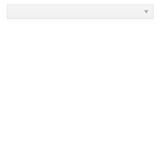
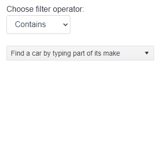

# DropDownList Filter

The Filter in the DropDownList component allows the user to filter the available items by their text, so they can find the one they need faster. It is an input shown at the top of the dropdown popup.

To enable filtering, set the `Filterable` parameter to `true`.

Filtering ignores casing and the default filter operator is `starts with`. Filtering looks in the `TextField`, and the filter is reset when the dropdown closes.

You can choose a different operator through the `FilterOperator` parameter that takes a member of the `Telerik.Blazor.StringFilterOperator` enum.

You can also implement custom (server) filtering and set a data source dynamically through the [`OnRead` event](#onread).

>caption Filtering in the DropDownList



````CSHTML
@* Open the dropdown and type something in the input to search for that item in the dropdown list data, for example "Product 5" *@

<TelerikDropDownList Data="@Data"
                     Filterable="true"
                     @bind-Value="@SelectedValue" TextField="ProductName" ValueField="ProductId">
</TelerikDropDownList>

@code {
    public List<Product> Data { get; set; }
    public int? SelectedValue { get; set; }

    protected override void OnInitialized()
    {
        List<Product> products = new List<Product>();
        for (int i = 0; i < 20; i++)
        {
            products.Add(new Product()
            {
                ProductId = i,
                ProductName = $"Product {i}"
            });
        }

        Data = products;
        base.OnInitialized();
    }

    public class Product
    {
        public int ProductId { get; set; }
        public string ProductName { get; set; }
    }
}
````
>caption Choose Filter Operator



````CSHTML
@* Choose a filter operator, open the dropdown and type something in the input to see the items filtered *@

<label for="filterOperatorChoice">
    Choose filter operator:
    <select @bind="@filterOperator" class="form-control" style="width: 130px;margin-bottom:1rem;"
            id="filterOperatorChoice">
        @foreach (var possibleFilter in Enum.GetValues(typeof(StringFilterOperator)))
        {
            <option value="@possibleFilter">@possibleFilter</option>
        }
    </select>
</label>

@SelectedValue
<br />

<TelerikDropDownList Data="@Data"
                     Filterable="true" FilterOperator="@filterOperator"
                     DefaultText="Find a car by typing part of its make"
                     @bind-Value="@SelectedValue" TextField="Make" ValueField="Id">
</TelerikDropDownList>

@code {
    StringFilterOperator filterOperator { get; set; } = StringFilterOperator.Contains;
    List<Car> Data { get; set; } = new List<Car>
    {
        new Car { Id = 1, Make = "Honda" },
        new Car { Id = 2, Make = "Opel" },
        new Car { Id = 3, Make = "Audi" },
        new Car { Id = 4, Make = "Lancia" },
        new Car { Id = 5, Make = "BMW" },
        new Car { Id = 6, Make = "Mercedes" },
        new Car { Id = 7, Make = "Tesla" },
        new Car { Id = 8, Make = "Vw" },
        new Car { Id = 9, Make = "Alpha Romeo" },
        new Car { Id = 10, Make = "Chevrolet" },
        new Car { Id = 11, Make = "Ford" },
        new Car { Id = 12, Make = "Cadillac" },
        new Car { Id = 13, Make = "Dodge" },
        new Car { Id = 14, Make = "Jeep" },
        new Car { Id = 15, Make = "Chrysler" },
        new Car { Id = 16, Make = "Lincoln" }
    };

    int? SelectedValue { get; set; }

    public class Car
    {
        public int Id { get; set; }
        public string Make { get; set; }
    }
}
````

## See Also

  * [Live Demo: DropDownList Filtering](https://demos.telerik.com/blazor-ui/dropdownlist/filtering)