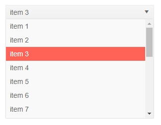

# DropDownList Overview

The DropDownList component allows the user to choose an option from a predefined set of choices presented in a dropdown popup. The developer can control the [data](), sizes, and various appearance options like class and [templates]().

To use a Telerik DropDownList for Blazor

1. add the `TelerikDropDownList` tag
1. populate its `Data` property with the collection of items you want in the dropdown
1. set the `TextField` and `ValueField` properties to point to the corresponding names of the model
1. (optional) set the `Value` property to the initial value of the model.

>caption Basic dropdownlist [data binding](data-bind) and two-way value binding

````CSHTML
Selected value: @selectedValue
<br />

<TelerikDropDownList Data="@myDdlData" TextField="MyTextField" ValueField="MyValueField" @bind-Value="selectedValue">
</TelerikDropDownList>

@code {
	//in a real case, the model is usually in a separate file
	//the model type and value field type must be provided to the dropdpownlist
	public class MyDdlModel
	{
		public int MyValueField { get; set; }
		public string MyTextField { get; set; }
	}

	IEnumerable<MyDdlModel> myDdlData = Enumerable.Range(1, 20).Select(x => new MyDdlModel { MyTextField = "item " + x, MyValueField = x });

	int selectedValue { get; set; } = 3; //usually the current value should come from the model data
}
````

>caption The result from the code snippet above



>caption Component namespace and reference

See the [Component Reference](#component-reference) section in the Data Binding article for details and examples.

## Features

The DropDownList provides the following features:

* `Class` - the CSS class that will be rendered on the main wrapping element of the dropdownlist.

* `Data` - allows you to provide the data source. Required.

* `DefaultText` - sets the hint that is shown if the `Value` has the `default` value for the type of the `ValueField`. For example, `0` for an `int`, and `null` for an `int?` or `string`. You need to make sure that it does not match the value of an existing item in the data source. You can find examples in the [Examples section](#examples) in this article and in the [Input Validation](#dropdownlist) article.

* `Enabled` - whether the component is enabled.

* `Id` - renders as the `id` attribute on the `<select />` element, so you can attach a `<label for="">` to it.

* `PopupHeight` - the height of the expanded dropdown list element.

* `PopupWidth` - the width of the expanded dropdown list element. If you don't specify a value, the dropdown width will match the main element which can help with responsive layouts and 100% widths.

* `TItem` - the type of the model to which the component is bound. Required if you can't provide `Data` or `Value`. Determines the type of the reference object.

* `TValue` - the type of the value field from the model to which the component is bound. Required if you can't provide `Data` or `Value`. Determines the type of the reference object.

* `TabIndex` - the `tabindex` attribute rendered on the dropdown.

* `TextField` - the name of the field from the model that will be shown to the user. Defaults to `Text`.

* `ValueField` - the name of the field from the model that will be the underlying `value`. Defaults to `Value`.

* `Value` and `bind-Value`- get/set the value of the component, can be used for binding. If you set it to a value allowed by the model class value field, the corresponding item from the data collection will be pre-selected. Use the `bind-Value` syntax for two-way binding, for example, to a variable of your own. 
    
    The `Value` and `ValueField` can be of types:

    * `number` (such as `int`, `double` and so on)
    * `string`
    * `Guid`
    * `Enum`

* `Width` - the width of the dropdown and the main element.

* Templates - they allow you to control the rendering of items in the component. See the [Templates]() article for more details.

* Validation - see the [Input Validation]() article for more details.


## Examples

>caption Default text (hint) to show when no actual item is selected

````CSHTML
@MyStringItem
<TelerikDropDownList Data="@MyStringList" @bind-Value="@MyStringItem" DefaultText="Select something">
</TelerikDropDownList>

<br />
<br />

@MyIntItem
<TelerikDropDownList Data="@MyIntList" @bind-Value="@MyIntItem" DefaultText="Select another thing">
</TelerikDropDownList>

@code {
    protected List<string> MyStringList = new List<string>() { "first", "second", "third" };

    protected string MyStringItem { get; set; }

    protected List<int> MyIntList = new List<int>() { 1, 2, 3 };

    protected int MyIntItem { get; set; }
}
````

>caption Get selected item from external code

````CSHTML
@result
<br />

<TelerikDropDownList Data="@myDdlData" TextField="MyTextField" ValueField="MyValueField"
                     @bind-Value="@DdlValue" DefaultText="Select something">
</TelerikDropDownList>

<TelerikButton OnClick="@GetSelectedItem">Get Selected Item</TelerikButton>

@code {
    string result;
    int DdlValue { get; set; } = 5;
    void GetSelectedItem()
    {
        // extract the data item from the data source by using the value
        MyDdlModel selectedItem = myDdlData.Where(d => d.MyValueField == DdlValue).FirstOrDefault();
        if (selectedItem != null)
        {
            result = selectedItem.MyTextField;
        }
        else
        {
            result = "no item selected";
        }

        StateHasChanged();
    }

    public class MyDdlModel
    {
        public int MyValueField { get; set; }
        public string MyTextField { get; set; }
    }

    IEnumerable<MyDdlModel> myDdlData = Enumerable.Range(1, 20).Select(x => new MyDdlModel { MyTextField = "item " + x, MyValueField = x });
}
````


>tip If you are looking for more fields from the view-model that describes the dropdown items, not just the `Value`, see the [Get model from dropodwn]() KB article and the [OnChange](events#onchange) event.
>
> You may also want to review/join the discussion and Vote for this request: <a href="https://www.telerik.com/forums/binding-dropdownlist-value-to-complex-model" target="_blank">Binding DropDownList Value to complex model</a>


## See Also

  * [Data Binding]()
  * [Live Demo: DropDownList](https://demos.telerik.com/blazor-ui/dropdownlist/index)
  * [Live Demo: DropDownList Validation](https://demos.telerik.com/blazor-ui/dropdownlist/validation)
  
