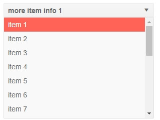
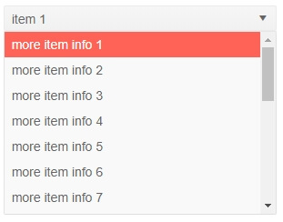
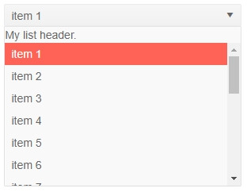
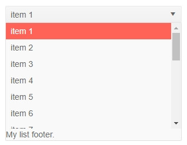

# DropDownList Templates

The DropDownList component allows you to change what is rendered in its items, body, header and footer through templates.

The examples below show how to use inner tags to set the templates. You can also do this through [RenderFragment](https://blazor.net/api/Microsoft.AspNetCore.Blazor.RenderFragment.html) objects that you can pass to the properties of the DropDownList in its main tag.

When using inner tags, make sure to use the correct casing, because, at the time of writing, the framework will list all possible tags and will try to correct the casing of `Header` and `Footer` to the lowercase HTML5 elements.

List of the available templates:

* [Value Template](#value-template)
* [Item Template](#item-template)
* [Header](#header)
* [Footer](#footer)


## Value Template

The Value template determines how the selected item renders in the main element of the dropdown list that is always visible. By default, the text from the model is rendered.

>caption Value Template Example

````CSHTML
@using Telerik.Blazor.Components.DropDownList

<TelerikDropDownList Data="@myDdlData" TextField="MyTextField" ValueField="MyValueField" Value="1">
	<ValueTemplate>
		<strong>@((context as MyDdlModel).ExtraField)</strong>
	</ValueTemplate>
</TelerikDropDownList>


@code {
	public class MyDdlModel
	{
		public int MyValueField { get; set; }
		public string MyTextField { get; set; }
		public string ExtraField { get; set; }
	}

	IEnumerable<MyDdlModel> myDdlData = Enumerable.Range(1, 20).Select(x =>
			new MyDdlModel
			{
				MyTextField = "item " + x,
				MyValueField = x,
				ExtraField = "more item info " + x
			}
		);
}
````

>caption The result from the code snippet above



## Item Template

The Item template determines how the individual items are rendered in the dropdown element of the component. By default, the text from the model is rendered.

>caption Item Template Example

````CSHTML
@using Telerik.Blazor.Components.DropDownList

<TelerikDropDownList Data="@myDdlData" TextField="MyTextField" ValueField="MyValueField" Value="1">
	<ItemTemplate>
		@((context as MyDdlModel).ExtraField)
	</ItemTemplate>
</TelerikDropDownList>


@code {
	public class MyDdlModel
	{
		public int MyValueField { get; set; }
		public string MyTextField { get; set; }
		public string ExtraField { get; set; }
	}

	IEnumerable<MyDdlModel> myDdlData = Enumerable.Range(1, 20).Select(x =>
			new MyDdlModel
			{
				MyTextField = "item " + x,
				MyValueField = x,
				ExtraField = "more item info " + x
			}
		);
}
````

>caption The result from the code snippet above



## Header

The header is content that you can place above the list of items inside the dropdownlist element. It is always visible when the dropdown is expanded. By default it is empty.

>caption Header Example

````CSHTML
@using Telerik.Blazor.Components.DropDownList

<TelerikDropDownList Data="@myDdlData" TextField="MyTextField" ValueField="MyValueField" Value="1">
	<Header>My list header.</Header>
</TelerikDropDownList>


@code {
	public class MyDdlModel
	{
		public int MyValueField { get; set; }
		public string MyTextField { get; set; }
	}

	IEnumerable<MyDdlModel> myDdlData = Enumerable.Range(1, 20).Select(x =>
			new MyDdlModel
			{
				MyTextField = "item " + x,
				MyValueField = x
			}
		);
}
````

>caption The result from the code snippet above



## Footer

The footer is content that you can place below the list of items inside the dropdownlist element. It is always visible when the dropdown is expanded. By default it is empty.

>caption Footer Example

````CSHTML
@using Telerik.Blazor.Components.DropDownList

<TelerikDropDownList Data="@myDdlData" TextField="MyTextField" ValueField="MyValueField" Value="1">
	<Footer>My list footer.</Footer>
</TelerikDropDownList>


@code {
	public class MyDdlModel
	{
		public int MyValueField { get; set; }
		public string MyTextField { get; set; }
	}

	IEnumerable<MyDdlModel> myDdlData = Enumerable.Range(1, 20).Select(x =>
			new MyDdlModel
			{
				MyTextField = "item " + x,
				MyValueField = x
			}
		);
}
````

>caption The result from the code snippet above



## See Also

  * [Live Demo: DropDownList Validation](https://demos.telerik.com/blazor-ui/dropdownlist/validation)
   
  