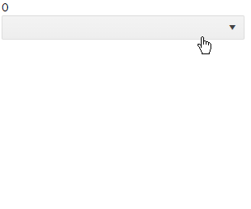

# DropDownList Virtualization

The DropDownList @[template](/_contentTemplates/common/dropdowns-virtualization.md#value-proposition)

#### In This Article

* [Basics](#basics)
* [Local Data Example](#local-data-example)
* [Remote Data Example](#remote-data-example)

## Basics

@[template](/_contentTemplates/common/dropdowns-virtualization.md#basics-core)


* `ValueMapper` - `Func<TValue, Task<TItem>>` - @[template](/_contentTemplates/common/dropdowns-virtualization.md#value-mapper-text)

@[template](/_contentTemplates/common/dropdowns-virtualization.md#remote-data-specifics)

### Limitations

@[template](/_contentTemplates/common/dropdowns-virtualization.md#limitations)

## Local Data Example

The example below shows how you can display, scroll and filter over 10k records in the dropdownlist without delays and performance issues.



````CSHTML
@SelectedValue
<br />
<TelerikDropDownList Data="@Data"

                     ScrollMode="@DropDownScrollMode.Virtual"
                     PopupHeight="200px"
                     ItemHeight="30"
                     PageSize="20"
                     
                     TextField="@nameof(Person.Name)"
                     ValueField="@nameof(Person.Id)"
                     @bind-Value="@SelectedValue"
                     Filterable="true" FilterOperator="@StringFilterOperator.Contains">
</TelerikDropDownList>

@code {
    int SelectedValue { get; set; }
    List<Person> Data { get; set; }

    protected override void OnInitialized()
    {
        Data = Enumerable.Range(1, 12345).Select(x => new Person { Id = x, Name = $"Name {x}" }).ToList();

        base.OnInitialized();
    }

    public class Person
    {
        public int Id { get; set; }
        public string Name { get; set; }
    }
}
````

## Remote Data Example

@[template](/_contentTemplates/common/dropdowns-virtualization.md#remote-data-sample-intro)

Run this and see how you can display, scroll and filter over 10k records in the dropdownlist without delays and performance issues from a remote endpoint. There is artificial delay in these operations for the sake of the demonstration.

````CSHTML
@using Telerik.DataSource.Extensions

@SelectedValue
<br />
<TelerikDropDownList Data="@CurentPageOfData"
                     ScrollMode="@DropDownScrollMode.Virtual"
                     OnRead="@GetRemoteData"
                     TotalCount="@TotalItems"
                     ValueMapper="@GetModelFromValue"
                     PopupHeight="200px"
                     ItemHeight="30"
                     PageSize="20"
    
                     TextField="@nameof(Person.Name)"
                     ValueField="@nameof(Person.Id)"
                     @bind-Value="@SelectedValue"
                     Filterable="true" FilterOperator="@StringFilterOperator.Contains">
</TelerikDropDownList>

@code{
    int SelectedValue { get; set; } = 1234; // pre-select an item to showcase the value mapper
    List<Person> CurentPageOfData { get; set; }
    int TotalItems { get; set; }

    async Task GetRemoteData(DropDownListReadEventArgs e)
    {
        DataEnvelope<Person> result = await MyService.GetItems(e.Request);

        CurentPageOfData = result.Data;
        TotalItems = result.Total;
    }

    async Task<Person> GetModelFromValue(int selectedValue)
    {
        // return a model that matches the selected value so the component can get its text
        return await MyService.GetItemFromValue(selectedValue);
    }


    // mimics a real service in terms of API appearance, refactor as necessary for your app
    public static class MyService
    {
        static List<Person> AllData { get; set; }

        public static async Task<DataEnvelope<Person>> GetItems(DataSourceRequest request)
        {
            if (AllData == null)
            {
                AllData = Enumerable.Range(1, 12345).Select(x => new Person { Id = x, Name = $"Name {x}" }).ToList();
            }

            await Task.Delay(400); // simulate real network and database delays. Remove in a real app

            var result = await AllData.ToDataSourceResultAsync(request);
            DataEnvelope<Person> dataToReturn = new DataEnvelope<Person>
            {
                Data = result.Data.Cast<Person>().ToList(),
                Total = result.Total
            };

            return await Task.FromResult(dataToReturn);
        }

        public static async Task<Person> GetItemFromValue(int selectedValue)
        {
            await Task.Delay(400); // simulate real network and database delays. Remove in a real app

            return await Task.FromResult(AllData.FirstOrDefault(x => selectedValue == x.Id));
        }
    }

    // used to showcase how you could simplify the return of more than one value from the service
    public class DataEnvelope<T>
    {
        public int Total { get; set; }
        public List<T> Data { get; set; }
    }

    public class Person
    {
        public int Id { get; set; }
        public string Name { get; set; }
    }
}
````


## See Also

  * [Live Demo: DropDownList Virtualization](https://demos.telerik.com/blazor-ui/dropdownlist/virtualization)
   
  
