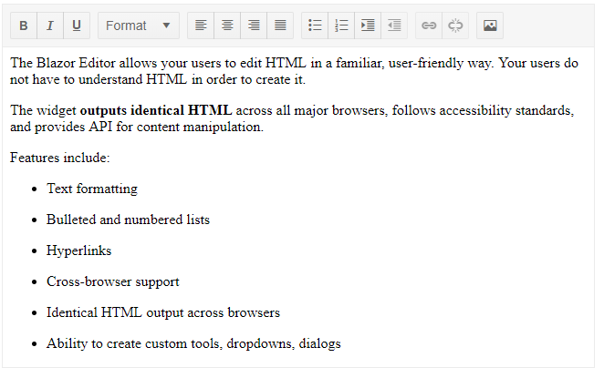

# Blazor Editor Overview

The <a href = "https://www.telerik.com/blazor-ui/editor" target="_blank">Blazor HTML Editor component</a> enables your users to create rich textual content through a What-You-See-Is-What-You-Get (WYSIWYG) interface and delivers a set of tools for creating, editing, and formatting text, paragraphs, lists, and other HTML elements.

## Creating Editor

1. Use the `TelerikEditor` tag to add the component to your razor page.
1. Bind its `Value` to the `string` field you want to get the HTML content in.

````CSHTML
@* This sample simulates loading some content from a data source and lets the Editor alter it in the view-model *@

<TelerikEditor @bind-Value="@TheEditorValue" Width="650px" Height="400px"></TelerikEditor>

@code{
    string TheEditorValue { get; set; }

    protected override Task OnInitializedAsync()
    {
        TheEditorValue = @"
            <p>
                The Blazor Editor allows your users to edit HTML in a familiar, user-friendly way. Your users do not have to understand HTML in order to create it.
            </p>
            <p>
                The widget <strong>outputs identical HTML</strong> across all major browsers, follows
                accessibility standards, and provides API for content manipulation.
            </p>
            <p>Features include:</p>
            <ul>
                <li>Text formatting</li>
                <li>Bulleted and numbered lists</li>
                <li>Hyperlinks</li>
                <li>Cross-browser support</li>
                <li>Identical HTML output across browsers</li>
                <li>Ability to create custom tools, dropdowns, dialogs</li>
            </ul>
        ";
        return base.OnInitializedAsync();
    }
}
````

>caption The result from the code snippet above



## Get/Set Content

The Blazor HTML Editor interacts with its content (value) like all standard components - through its `Value` parameter. You can use it to get and set the HTML string the editor will work with. [Read more about value binding and data binding...]()

>important @[template](/_contentTemplates/editor/general.md#app-must-sanitize-content)

## Validation

You can use the standard Data Annotation attributes to validate the content of the Editor. For the performance reasons listed above, validation happens with the `DebounceDelay` delay, not immediately on every keystroke, like simpler inputs. [See the Validation article for an example on how to validate the content of the Editor...](#editor)

## Large File Support 

@[template](/_contentTemplates/editor/general.md#content-size-signalr)

## Resizing

The Editor allows you to resize:

#### Tables

Tables, their columns, and rows in the content area of Editor are resizable. To grab the resize handles, hover on the column or row borders. 

#### Images

Images in the content area of the Editor are resizable. To grab the resize handles, hover on the borders of the image.

## Dependencies

The Telerik UI for Blazor Editor uses the ProseMirror engine and it depends on it. You do not need to add any extra assets or references yourself, though, we have taken care of everything internally.

## Editor Parameters

The following table lists Editor parameters, which are not discussed elsewhere in the component documentation. 

@[template](/_contentTemplates/common/parameters-table-styles.md#table-layout)

| Parameter | Type and Default value | Description |
|-----------|------------------------|-------------|
| `Value`  | `string` | Specifies the value of the component. You can use it for `two-way binding` with the [`ValueChanged` event](#valuechanged). |
| `DebounceDelay`  | `int` <br /> (`100`) | The time in milliseconds that passes between updates on the `Value`. The default is `100ms` and if that causes performance issues with many repaints on your view, you can increase it. Since the editor is expected to handle longer editing sessions and larger content than regular inputs, we added this parameter to debounce the view-model updates and events. |
| `Adaptive`  | `bool` | Defines if the [toolbar]() should adapt to changes in the width of the component and automatically hide and show the overflowing items in a popup. |
| `Width`  | `string` | Defines the width of the Editor. The default width is `null` but the themes apply `100%`. |
| `Height`  | `string` <br /> (`250px`) | Defines the height of the Editor. |
| `AriaLabelledBy`  | `string` | Maps to the `area-labelledby` attribute. Use this parameter to reference another element to define its accessible name. |
| `AriaDescribedBy`  | `string` | Maps to the `area-describedby` attribute. Use this parameter to establish a relationship between widgets or groups and the text that describes them. |

## Component Reference and Methods

You can use the component reference to call its `ExecuteAsync` method, especially when creating [custom tools](). This method allows you to call programmatically the tools and commands of the editor (such as the Bold too, or a Back Color tool, or inserting HTML).

You can find the reference for the available commands and their respective arguments in the [Built-in Tools list]() section of the documentation.

>caption Paste at the cursor position

````CSHTML
@* This snippet shows how to insert a horizontal rule (<hr /> tag) at the cursor position.
You can replace that string with any other content you can generate/obtain according to your application needs*@

@using Telerik.Blazor.Components.Editor

<TelerikButton OnClick="@InsertHr">insert hr</TelerikButton>

<TelerikEditor @ref="@TheEditor" @bind-Value="@TheContent"></TelerikEditor>

@code{
    TelerikEditor TheEditor { get; set; }

    string TheContent { get; set; } = "<p>Lorem ipsum.</p><p>Dolor sit amet.</p>";

    async Task InsertHr()
    {
        await TheEditor.ExecuteAsync(new HtmlCommandArgs("insertHtml", "<hr />"));
    }
}
````

## Next Steps

* [Explore the Built-in Tools and Commands]()
* [Create Custom Tools]()
* [Explore the Editor Edit Modes](editor-edit-modes-overview)
* [Import and Export Data]()
* [Learn more about the Editor Events]()

## See Also

  * [Live Demo: Editor](https://demos.telerik.com/blazor-ui/editor/overview)
  * [API Reference](https://docs.telerik.com/blazor-ui/api/Telerik.Blazor.Components.TelerikEditor)
   
