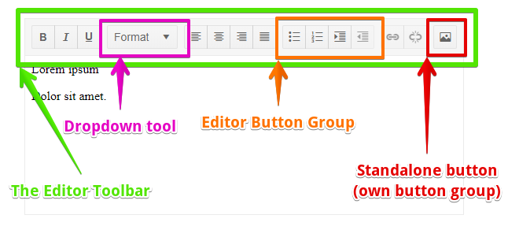

# Editor Toolbar

The toolbar of the editor is where it command buttons reside and they let the end user apply various formatting and styling - from bold and italic words, to creating lists, tables, inserting images or [custom tools]() you can define.



This article contains the following sections:

* [Basics](#basics)
* [Built-in Tool Lists](#built-in-tool-lists)
* [Choose Toolbar Items](#choose-toolbar-items)
	* [Add/Remove Tools From Existing Toolbar](#addremove-tools-from-existing-toolbar)
	* [Create a Toolbar From Scratch](#create-a-toolbar-from-scratch)
	* [Customize Built-in Tools](#customize-built-in-tools)


## Basics

The Editor tools and commands are in the `Telerik.Blazor.Components.Editor` namespace. If you will be applying settings related to the tools (such as choosing a different built-in toolset or adding custom tools), you should add an `using` statement for this namespace.

To control the collection of buttons and commands available to the user, you provide the desired collection to the `Tools` parameter of the editor, which takes a `List<IEditorTool>`.

## Built-in Tool Lists

The Editor comes with two predefined sets of tools in the `EditorToolSets` static class:

* `Default` - the default set of the most commonly used tools and commands.
* `All` - All the available tools and commands the editor has.

If you do not apply any settings, the `Default` list of tools will be used.

>caption Switch to the All tools built-in toolset

````CSHTML
@using Telerik.Blazor.Components.Editor

<TelerikEditor Tools="@EditorToolSets.All">
</TelerikEditor>
````


## Choose Toolbar Items

To define your own customized collection of tools, you use the `Tools` parameter of the Editor component and populate it with the commands you want available. They can include [custom tools]().

The `Tools` collection is a `List<IEditorTool>`.

Editor tools can be individual buttons (such as Undo, Bold), dropdowns (such as Format or FontSize), and button groups that hold several buttons. 

To add a button, add a `new <Command>()` where `Command` is the name of the tool from [this table](). The VS Intellisense can also show you the classes in the `Telerik.Blazor.Components.Editor.` namespace.

To define a button group, add a `new EditorButtonGroup(comma-separated collection of button commands)`.

Button groups can take only buttons, and dropdowns and custom tools cannot be added to them.

>caption Examples:

* [Add/Remove Tools From Existing Toolbar](#addremove-tools-from-existing-toolbar)
* [Create a Toolbar From Scratch](#create-a-toolbar-from-scratch)
* [Customize Built-in Tools](#customize-built-in-tools)

### Add/Remove Tools From Existing Toolbar

This example shows how to start from the existing `Default` toolbar collection of the editor and to modify it to:

* add Undo and Redo to the beginning, in their own tool group;
* add Supercript tool to the Bold, Italic, Underline group;
* Remove the Format tool;
* add ViewHtml at the end, in its own toolgroup.

>caption Modify the Default toolset

````CSHTML
@using Telerik.Blazor.Components.Editor

<TelerikEditor Tools="@customTools" @bind-Value="@TheEditorValue"></TelerikEditor>

@TheEditorValue

@code{
    string TheEditorValue { get; set; } = "<p>Lorem ipsum</p><p>Dolor sit amet.</p>";
    public List<IEditorTool> customTools { get; set; }

    protected override void OnInitialized()
    {
        // start with the default set of tools as base
        // alternatively, you can create a new list and populate it from scratch
        customTools = new List<IEditorTool>(EditorToolSets.Default);

        // create a tool group
        var UndoRedoGroup = new EditorButtonGroup(
                new Undo(), // add individual tools to the group
                new Redo()
            );


        // add the toolgroup to the beginning of the toolbar definition
        customTools.Insert(0, UndoRedoGroup);


        // add to an existing toolgroup
        EditorButtonGroup targetGroup = customTools[1] as EditorButtonGroup;
        if (targetGroup != null) // make sure it's a group and not an individual button
        {
            targetGroup.Tools.Add(new SuperScript());
        }


        // remove an existing tool
        customTools.RemoveAt(2);


        // add an individual tool that will form its own tool group at the end of the toolbar
        customTools.Add(new ViewHtml());


        base.OnInitialized();
    }
}
````


### Create a Toolbar From Scratch

This example shows how you can keep adding tools to the toolbar to get the desired collection.

>caption Create your own toolbar

````
@using Telerik.Blazor.Components.Editor

<TelerikEditor Tools="@MyTools" @bind-Value="@TheEditorValue"></TelerikEditor>

@code{
    string TheEditorValue { get; set; } = "<p>Lorem ipsum</p><p>Dolor sit amet.</p>";
    public List<IEditorTool> MyTools { get; set; }

    protected override void OnInitialized()
    {
        // initialize the toolbar collection
        MyTools = new List<IEditorTool>();

        // add a button group
        EditorButtonGroup firstGroup = new EditorButtonGroup(
            new Bold(),
            new Italic(),
            new Underline()
        );
        MyTools.Add(firstGroup);

        // add a dropdown
        MyTools.Add(new Format());

        // add a standalone tool
        MyTools.Add(new ViewHtml());


        base.OnInitialized();
    }
}
````


### Customize Built-in Tools

When adding a built-in tool to the collection, you can set various parameters to it, such as `Class`, `Icon`, `Title` for buttons; `DefaultText` or a customized `Data` collection for dropdowns. The tools have default values, and you can alter them. You also have access to the default `Data` collections of the drodown tools through the `EditorDropDownListToolItems` static class.

>caption Customize the default values of the built-in tools - tooltips, available items, class and appearance

````CSHTML
@using Telerik.Blazor.Components.Editor

<TelerikEditor Tools="@MyTools" @bind-Value="@TheEditorValue"></TelerikEditor>

@code{
    string TheEditorValue { get; set; } = "<p>Lorem ipsum</p><p>Dolor sit amet.</p>";
    public List<IEditorTool> MyTools { get; set; }

    protected override void OnInitialized()
    {
        // initialize the toolbar collection
        MyTools = new List<IEditorTool>();

        // add a button group
        EditorButtonGroup firstGroup = new EditorButtonGroup(
            new Bold(),
            new Italic(),
            // this is how to customize settings for a button. Intellisense will show you all the options
            // you should avoid customizing things like OnClick event handlers and CommandName
            new Underline()
            {
                Title = "My Custom Underline Title",
                Class = "special-underine",
                Icon = IconName.Gear,
            }
        );
        MyTools.Add(firstGroup);

        // this is how to customize settings for a dropdown. Intellisense will show you all the options
        // you should avoid customizing things like event handlers, and CommandName
        MyTools.Add(new Format()
        {
            DefaultText = "Choose Style",
            Width = "200px",
            Data = new List<EditorDropDownListItem>
            {
                new EditorDropDownListItem { Text = "heading", Value = "h1" },
                new EditorDropDownListItem { Text = "separated block", Value = "div class='m-5'" },
            }
        });

        // this is how you can get the default data sources - in this example, the font size
        // the EditorDropDownListToolItems static class holds the appropriate default collections
        List<EditorDropDownListItem> fontSizeChoices = EditorDropDownListToolItems.FontSizeItems.Skip(4).Take(3).ToList();
        MyTools.Add(new FontSize() { Data = fontSizeChoices });


        // add the View Html so we can easily inspect the results
        MyTools.Add(new ViewHtml());


        base.OnInitialized();
    }
}

<style>
    .special-underine.k-button{
       background: green;
       background-image:none;
    }
</style>
````


## See Also

  * [Editor Overview]()
