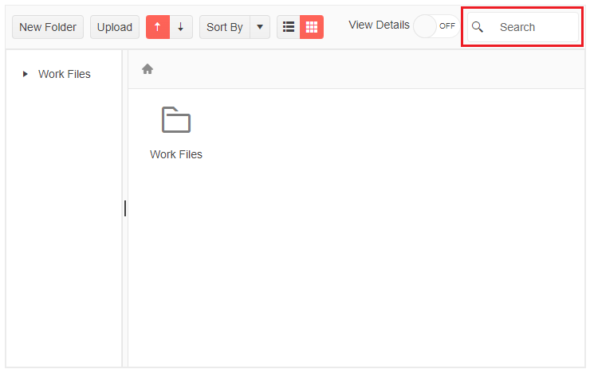

## FileManager Search

The `FileManager` provides an inbuilt Search functionality that allows you to find a specific file in the current folder. It represents a textbox input in the toolbar.

>caption Search for a file in the FileManager Toolbar input box.



````CSHTML
<TelerikFileManager Data="@Data"
                    @bind-Path="@DirectoryPath"
                    Height="400px" />
 
@code {
    public List<FlatFileEntry> Data = new List<FlatFileEntry>();
    public string DirectoryPath { get; set; } = string.Empty;
 
    // fetch the FileManager data
    protected override async Task OnInitializedAsync()
    {
        Data = await GetFlatFileEntries();
    }
 
    // a model to bind the FileManager. Should usually be in its own separate location.
    public class FlatFileEntry
    {
        public string Id { get; set; }
        public string ParentId { get; set; }
        public string Name { get; set; }
        public long Size { get; set; }
        public string Path { get; set; }
        public string Extension { get; set; }
        public bool IsDirectory { get; set; }
        public bool HasDirectories { get; set; }
        public DateTime DateCreated { get; set; }
        public DateTime DateCreatedUtc { get; set; }
        public DateTime DateModified { get; set; }
        public DateTime DateModifiedUtc { get; set; }
    }
 
    // the next lines are hardcoded data generation so you can explore the FileManager freely
    async Task<List<FlatFileEntry>> GetFlatFileEntries()
    {
        #region folder My Files config
        var workFiles = new FlatFileEntry()
            {
                Id = "1",
                ParentId = null,
                Name = "Work Files",
                IsDirectory = true,
                HasDirectories = true,
                DateCreated = new DateTime(2022, 1, 2),
                DateCreatedUtc = new DateTime(2022, 1, 2),
                DateModified = new DateTime(2022, 2, 3),
                DateModifiedUtc = new DateTime(2022, 2, 3),
                Path = Path.Combine("files"),
                Size = 3 * 1024 * 1024
            };
        #endregion
 
        #region folder Documents config
        var Documents = new FlatFileEntry()
            {
                Id = "2",
                ParentId = workFiles.Id,
                Name = "Documents",
                IsDirectory = true,
                HasDirectories = false,
                DateCreated = new DateTime(2022, 1, 2),
                DateCreatedUtc = new DateTime(2022, 1, 2),
                DateModified = new DateTime(2022, 2, 3),
                DateModifiedUtc = new DateTime(2022, 2, 3),
                Path = Path.Combine(workFiles.Path, "documents"),
                Size = 1024 * 1024
            };
        #endregion
 
        #region folder Images config
        var Images = new FlatFileEntry()
            {
                Id = "3",
                ParentId = workFiles.Id,
                Name = "Images",
                IsDirectory = true,
                HasDirectories = false,
                DateCreated = new DateTime(2022, 1, 2),
                DateCreatedUtc = new DateTime(2022, 1, 2),
                DateModified = new DateTime(2022, 2, 3),
                DateModifiedUtc = new DateTime(2022, 2, 3),
                Path = Path.Combine(workFiles.Path, "images"),
                Size = 2 * 1024 * 1024
            };
        #endregion
 
        #region Documents files config
        var specification = new FlatFileEntry()
            {
                Id = "4",
                ParentId = Documents.Id,
                Name = "Specification",
                IsDirectory = false,
                HasDirectories = false,
                Extension = ".docx",
                DateCreated = new DateTime(2022, 1, 5),
                DateCreatedUtc = new DateTime(2022, 1, 5),
                DateModified = new DateTime(2022, 2, 3),
                DateModifiedUtc = new DateTime(2022, 2, 3),
                Path = Path.Combine(Documents.Path, "specification.docx"),
                Size = 462 * 1024
            };
 
        var report = new FlatFileEntry()
            {
                Id = "5",
                ParentId = Documents.Id,
                Name = "Monthly report",
                IsDirectory = false,
                HasDirectories = false,
                Extension = ".xlsx",
                DateCreated = new DateTime(2022, 1, 20),
                DateCreatedUtc = new DateTime(2022, 1, 20),
                DateModified = new DateTime(2022, 1, 25),
                DateModifiedUtc = new DateTime(2022, 1, 25),
                Path = Path.Combine(Documents.Path, "monthly-report.xlsx"),
                Size = 538 * 1024
            };
        #endregion
 
        #region Images files coonfig
        var dashboardDesign = new FlatFileEntry()
            {
                Id = "6",
                ParentId = Images.Id,
                Name = "Dashboard Design",
                IsDirectory = false,
                HasDirectories = false,
                Extension = ".png",
                DateCreated = new DateTime(2022, 1, 10),
                DateCreatedUtc = new DateTime(2022, 1, 10),
                DateModified = new DateTime(2022, 2, 13),
                DateModifiedUtc = new DateTime(2022, 2, 13),
                Path = Path.Combine(Images.Path, "dashboard-design.png"),
                Size = 1024
            };
 
        var gridDesign = new FlatFileEntry()
            {
                Id = "7",
                ParentId = Images.Id,
                Name = "Grid Design",
                IsDirectory = false,
                HasDirectories = false,
                Extension = ".png",
                DateCreated = new DateTime(2022, 1, 12),
                DateCreatedUtc = new DateTime(2022, 1, 12),
                DateModified = new DateTime(2022, 2, 13),
                DateModifiedUtc = new DateTime(2022, 2, 13),
                Path = Path.Combine(Images.Path, "grid-design.jpg"),
                Size = 1024
            };
        #endregion
 
        var files = new List<FlatFileEntry>()
            {
                workFiles,
 
                Documents,
                specification,
                report,
 
                Images,
                dashboardDesign,
                gridDesign
            };
 
        return await Task.FromResult(files);
    }
}
````

## See Also

  * [Live Demo: FileManager](https://demos.telerik.com/blazor-ui/filemanager/overview)