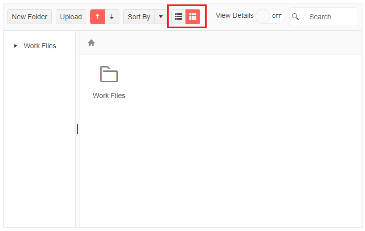

# FileManager Views

The `FileManager` provides two built-in views for content visualization. It can show files and folders as a grid (table) or as a list of thumbnails.

To switch between the views, use the Toolbar button group. The FileManager also provides a `View` parameter and a [`ViewChanged` event](slug://filemanager-events#viewchanged).

## Grid View

The Grid view uses the [Blazor Grid](slug://grid-overview) component, and it renders the files in a tabular manner. See the [example](#example).

## List View (Thumbnails)

The List view uses the [Blazor ListView](slug://listview-overview) component. The files and folders in this view renders as a list of thumbnails (tiles). See the [example](#example).

## Example

>caption FileManager change views using the Toolbar buttons.



````RAZOR
@using System.IO

<TelerikFileManager Data="@FileManagerData"
                    @bind-Path="@DirectoryPath"
                    @bind-View="@CurrentView"
                    OnModelInit="@OnModelInitHandler"
                    Height="400px" />

@code {
    private List<FlatFileEntry> FileManagerData = new List<FlatFileEntry>();

    private FileManagerViewType CurrentView { get; set; }

    private string RootPath { get; set; } = "root-folder-path";
    private string DirectoryPath { get; set; } = "root-folder-path";

    // fetch the FileManager data
    protected override async Task OnInitializedAsync()
    {
        FileManagerData = await GetFlatFileEntries();
    }

    //initialize the model to allow new folder creation
    private FlatFileEntry OnModelInitHandler()
    {
        var item = new FlatFileEntry();
        item.Name = $"New folder";
        item.Size = 0;
        item.Path = Path.Combine(DirectoryPath, item.Name);
        item.IsDirectory = true;
        item.HasDirectories = false;
        item.DateCreated = DateTime.Now;
        item.DateCreatedUtc = DateTime.Now;
        item.DateModified = DateTime.Now;
        item.DateModifiedUtc = DateTime.Now;

        return item;
    }

    // a model to bind the FileManager. Should usually be in its own separate location.
    public class FlatFileEntry
    {
        public string Id { get; set; }
        public string ParentId { get; set; }
        public string Name { get; set; }
        public long Size { get; set; }
        public string Path { get; set; }
        public string Extension { get; set; }
        public bool IsDirectory { get; set; }
        public bool HasDirectories { get; set; }
        public DateTime DateCreated { get; set; }
        public DateTime DateCreatedUtc { get; set; }
        public DateTime DateModified { get; set; }
        public DateTime DateModifiedUtc { get; set; }
    }

    // the next lines are hardcoded data generation so you can explore the FileManager freely
    private async Task<List<FlatFileEntry>> GetFlatFileEntries()
    {
        var workFiles = new FlatFileEntry()
        {
            Id = "1",
            ParentId = null,
            Name = "Work Files",
            IsDirectory = true,
            HasDirectories = true,
            DateCreated = new DateTime(2022, 1, 2),
            DateCreatedUtc = new DateTime(2022, 1, 2),
            DateModified = new DateTime(2022, 2, 3),
            DateModifiedUtc = new DateTime(2022, 2, 3),
            Path = Path.Combine(RootPath, "Work Files"),
            Size = 3 * 1024 * 1024
        };

        var Documents = new FlatFileEntry()
        {
            Id = "2",
            ParentId = workFiles.Id,
            Name = "Documents",
            IsDirectory = true,
            HasDirectories = false,
            DateCreated = new DateTime(2022, 1, 2),
            DateCreatedUtc = new DateTime(2022, 1, 2),
            DateModified = new DateTime(2022, 2, 3),
            DateModifiedUtc = new DateTime(2022, 2, 3),
            Path = Path.Combine(workFiles.Path, "Documents"),
            Size = 1024 * 1024
        };

        var Images = new FlatFileEntry()
        {
            Id = "3",
            ParentId = workFiles.Id,
            Name = "Images",
            IsDirectory = true,
            HasDirectories = false,
            DateCreated = new DateTime(2022, 1, 2),
            DateCreatedUtc = new DateTime(2022, 1, 2),
            DateModified = new DateTime(2022, 2, 3),
            DateModifiedUtc = new DateTime(2022, 2, 3),
            Path = Path.Combine(workFiles.Path, "Images"),
            Size = 2 * 1024 * 1024
        };

        var specification = new FlatFileEntry()
        {
            Id = "4",
            ParentId = Documents.Id,
            Name = "Specification",
            IsDirectory = false,
            HasDirectories = false,
            Extension = ".docx",
            DateCreated = new DateTime(2022, 1, 5),
            DateCreatedUtc = new DateTime(2022, 1, 5),
            DateModified = new DateTime(2022, 2, 3),
            DateModifiedUtc = new DateTime(2022, 2, 3),
            Path = Path.Combine(Documents.Path, "Specification.docx"),
            Size = 462 * 1024
        };

        var report = new FlatFileEntry()
        {
            Id = "5",
            ParentId = Documents.Id,
            Name = "Monthly report",
            IsDirectory = false,
            HasDirectories = false,
            Extension = ".xlsx",
            DateCreated = new DateTime(2022, 1, 20),
            DateCreatedUtc = new DateTime(2022, 1, 20),
            DateModified = new DateTime(2022, 1, 25),
            DateModifiedUtc = new DateTime(2022, 1, 25),
            Path = Path.Combine(Documents.Path, "Monthly report.xlsx"),
            Size = 538 * 1024
        };

        var dashboardDesign = new FlatFileEntry()
        {
            Id = "6",
            ParentId = Images.Id,
            Name = "Dashboard Design",
            IsDirectory = false,
            HasDirectories = false,
            Extension = ".png",
            DateCreated = new DateTime(2022, 1, 10),
            DateCreatedUtc = new DateTime(2022, 1, 10),
            DateModified = new DateTime(2022, 2, 13),
            DateModifiedUtc = new DateTime(2022, 2, 13),
            Path = Path.Combine(Images.Path, "Dashboard Design.png"),
            Size = 1024
        };

        var gridDesign = new FlatFileEntry()
        {
            Id = "7",
            ParentId = Images.Id,
            Name = "Grid Design",
            IsDirectory = false,
            HasDirectories = false,
            Extension = ".jpg",
            DateCreated = new DateTime(2022, 1, 12),
            DateCreatedUtc = new DateTime(2022, 1, 12),
            DateModified = new DateTime(2022, 2, 13),
            DateModifiedUtc = new DateTime(2022, 2, 13),
            Path = Path.Combine(Images.Path, "Grid Design.jpg"),
            Size = 1024
        };

        var files = new List<FlatFileEntry>()
        {
            workFiles,

            Documents,
            specification,
            report,

            Images,
            dashboardDesign,
            gridDesign
        };

        return files;
    }
}
````

## See Also

* [Live Demo: FileManager](https://demos.telerik.com/blazor-ui/filemanager/overview)
* [Blazor Grid](https://docs.telerik.com/blazor-ui/components/grid/overview)
* [Blazor ListView](https://demos.telerik.com/blazor-ui/listview/overview)
