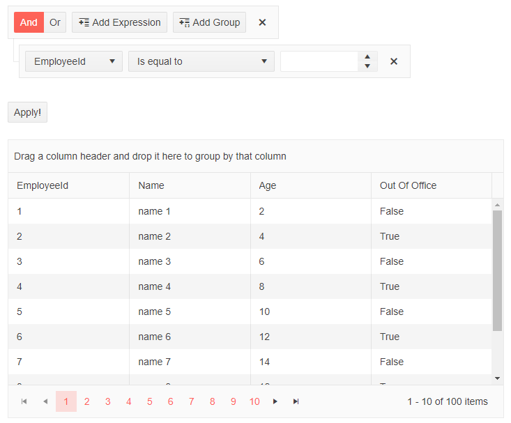
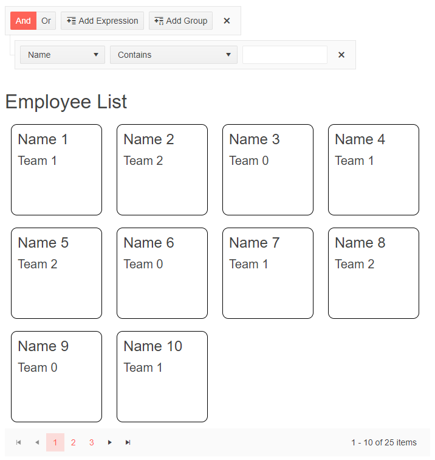
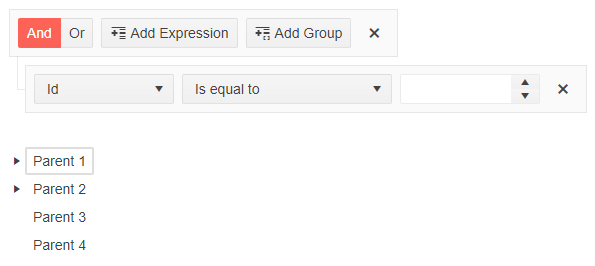
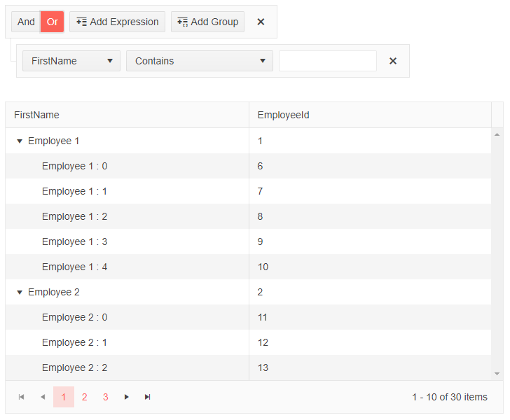

# Blazor Filter Integration
You can integrate the Filter in different data-bound components.

It also allows you to build complex filtering criteria depending on the data type of the underlying source fields.

## Filter for a Grid

**To integrate the Filter with the Telerik Grid, you need to:**

1. Set the Value parameter of the Filter via one-way or two-way binding.
2. Update the Grid data based on the Filter value.

>caption Use Filter with two-way bound value in Grid.

````CHTML
@using Telerik.DataSource;
@using Telerik.DataSource.Extensions;

<TelerikFilter @bind-Value="Value">
    <FilterFields>
        <FilterField Name="@(nameof(Person.EmployeeId))" Type="@(typeof(int))" Label="Id"></FilterField>
        <FilterField Name="@(nameof(Person.Name))" Type="@(typeof(string))" Label="First Name"></FilterField>
        <FilterField Name="@(nameof(Person.AgeInYears))" Type="@(typeof(int))" Label="Age"></FilterField>
        <FilterField Name="@(nameof(Person.IsOutOfOffice))" Type="@(typeof(bool))" Label="Out Of Office"></FilterField>
    </FilterFields>
</TelerikFilter>

<div>
    <TelerikButton OnClick="@ApplyFilters">Apply!</TelerikButton>
</div>
<br />

<TelerikGrid Data="@GridData"
             Height="400px"
             Pageable="true"
             Sortable="true"
             Groupable="true">
    <GridColumns>
        <GridColumn Field="@(nameof(Person.EmployeeId))" />
        <GridColumn Field="@(nameof(Person.Name))" Title="Name" />
        <GridColumn Field="@(nameof(Person.AgeInYears))" Title="Age" />
        <GridColumn Field="@(nameof(Person.IsOutOfOffice))" Title="Out Of Office" />
    </GridColumns>
</TelerikGrid>

@code {
    public CompositeFilterDescriptor Value { get; set; } = new CompositeFilterDescriptor();
    public IEnumerable<Person> InitialData { get; set; }
    public IEnumerable<Person> GridData { get; set; }

    private void ApplyFilters()
    {
        var dataSourceRequest = new DataSourceRequest { Filters = new List<IFilterDescriptor>{ Value } };

        var datasourceResult = InitialData.ToDataSourceResult(dataSourceRequest);

        GridData = datasourceResult.Data.Cast<Person>().ToList();
    }

    protected override void OnInitialized()
    {
        LoadData();
        base.OnInitialized();
    }

    void LoadData()
    {
        InitialData = Enumerable.Range(1, 100).Select(x => new Person
        {
            EmployeeId = x,
            Name = "name " + x,
            AgeInYears = x * 2,
            IsOutOfOffice = x % 2 == 0
        });

        GridData = new List<Person>(InitialData);
    }

    public class Person
    {
        public int EmployeeId { get; set; }

        public string Name { get; set; }

        public int AgeInYears { get; set; }

        public bool IsOutOfOffice { get; set; }
    }
}
````
>caption The result from the above code snippet.



>caption If you want to filter at the moment of change, use Filter with a [one-way bound value](#valuechanged) in Grid.

````CSHTML
@using Telerik.DataSource;
@using Telerik.DataSource.Extensions;

<TelerikFilter ValueChanged="@OnValueChanged">
    <FilterFields>
        <FilterField Name="@(nameof(Person.EmployeeId))" Type="@(typeof(int))" Label="Id"></FilterField>
        <FilterField Name="@(nameof(Person.Name))" Type="@(typeof(string))" Label="First Name"></FilterField>
        <FilterField Name="@(nameof(Person.AgeInYears))" Type="@(typeof(int))" Label="Age"></FilterField>
        <FilterField Name="@(nameof(Person.IsOutOfOffice))" Type="@(typeof(bool))" Label="Out Of Office"></FilterField>
    </FilterFields>
</TelerikFilter>

<TelerikGrid Data="@GridData"
             Height="400px"
             Pageable="true"
             Sortable="true"
             Groupable="true">
    <GridColumns>
        <GridColumn Field="@(nameof(Person.EmployeeId))" />
        <GridColumn Field="@(nameof(Person.Name))" Title="Name" />
        <GridColumn Field="@(nameof(Person.AgeInYears))" Title="Age" />
        <GridColumn Field="@(nameof(Person.IsOutOfOffice))" Title="Out Of Office" />
    </GridColumns>
</TelerikGrid>

@code {
    public IEnumerable<Person> InitialData { get; set; }
    public IEnumerable<Person> GridData { get; set; }

    private void OnValueChanged(CompositeFilterDescriptor filter)
    {
        var dataSourceRequest = new DataSourceRequest { Filters = new List<IFilterDescriptor>{ filter } };

        var datasourceResult = InitialData.ToDataSourceResult(dataSourceRequest);

        GridData = datasourceResult.Data.Cast<Person>().ToList();
    }

    protected override void OnInitialized()
    {
        LoadData();
        base.OnInitialized();
    }

    void LoadData()
    {
        InitialData = Enumerable.Range(1, 100).Select(x => new Person
        {
            EmployeeId = x,
            Name = "name " + x,
            AgeInYears = x * 2,
            IsOutOfOffice = x % 2 == 0
        });

        GridData = new List<Person>(InitialData);
    }

    public class Person
    {
        public int EmployeeId { get; set; }

        public string Name { get; set; }

        public int AgeInYears { get; set; }

        public bool IsOutOfOffice { get; set; }
    }
}
````

## Filter for a ListView

**To integrate the Filter with the Telerik ListView, you need to:**

1. Set the Value parameter of the Filter via one-way or two-way binding.
2. Update the ListView data based on the Filter value.

>caption Use Filter in ListView.

````CSHTML
@using Telerik.DataSource
@using Telerik.DataSource.Extensions

<TelerikFilter ValueChanged="@OnValueChanged">
    <FilterFields>
        <FilterField Name="@(nameof(SampleData.Id))" Type="@(typeof(int))" Label="Id"></FilterField>
        <FilterField Name="@(nameof(SampleData.Name))" Type="@(typeof(string))" Label="Name"></FilterField>
        <FilterField Name="@(nameof(SampleData.Team))" Type="@(typeof(string))" Label="Team"></FilterField>
    </FilterFields>
</TelerikFilter>

<TelerikListView Data="@ListViewData" Width="700px" Pageable="true">
    <HeaderTemplate>
        <h2>Employee List</h2>
    </HeaderTemplate>
    <Template>
        <div class="listview-item">
            <h4>@context.Name</h4>
            <h5>@context.Team</h5>
        </div>
    </Template>
</TelerikListView>

@code{
    List<SampleData> ListViewData { get; set; } = InitialData;

    private void OnValueChanged(CompositeFilterDescriptor filter)
    {
        var dataSourceRequest = new DataSourceRequest { Filters = new List<IFilterDescriptor>{ filter } };

        var datasourceResult = InitialData.ToDataSourceResult(dataSourceRequest);

        ListViewData = datasourceResult.Data.Cast<SampleData>().ToList();
    }

    static List<SampleData> InitialData { get; set; } = Enumerable.Range(1, 25).Select(x => new SampleData
    {
        Id = x,
        Name = $"Name {x}",
        Team = $"Team {x % 3}"
    }).ToList();

    public class SampleData
    {
        public int Id { get; set; }
        public string Name { get; set; }
        public string Team { get; set; }
    }
}

<style>
    .listview-item {
        height: 150px;
        width: 150px;
        display: inline-block;
        margin: 10px;
        border: 1px solid black;
        border-radius: 10px;
        padding: 10px;
    }
</style>
````
>caption The result from the above code snippet.



## Filter for a TreeView

**To integrate the Filter with the Telerik TreeView, you need to:**

1. Set the Value parameter of the Filter via one-way or two-way binding.
2. Update the TreeView data based on the Filter value.

>caption Use Filter in TreeView.

````CSHTML
@using Telerik.DataSource
@using Telerik.DataSource.Extensions

<TelerikFilter ValueChanged="@OnValueChanged">
    <FilterFields>
        <FilterField Name="@(nameof(TreeItem.Id))" Type="@(typeof(int))" Label="Id"></FilterField>
        <FilterField Name="@(nameof(TreeItem.Text))" Type="@(typeof(string))" Label="Text"></FilterField>
        <FilterField Name="@(nameof(TreeItem.HasChildren))" Type="@(typeof(bool))" Label="Has Children"></FilterField>
    </FilterFields>
</TelerikFilter>

<TelerikTreeView Data="@FlatData" @bind-ExpandedItems="@ExpandedItems">
    <TreeViewBindings>
        <TreeViewBinding ParentIdField="Parent" />
        <TreeViewBinding Level="1" TextField="SecondText" ParentIdField="Parent" />
    </TreeViewBindings>
</TelerikTreeView>

@code {
    public static IEnumerable<TreeItem> InitialData { get; set; }
    public IEnumerable<TreeItem> FlatData { get; set; } = InitialData;
    public IEnumerable<object> ExpandedItems { get; set; } = new List<TreeItem>();

    private void OnValueChanged(CompositeFilterDescriptor filter)
    {
        var dataSourceRequest = new DataSourceRequest { Filters = new List<IFilterDescriptor> { filter } };

        var datasourceResult = InitialData.ToDataSourceResult(dataSourceRequest);

        FlatData = datasourceResult.Data.Cast<TreeItem>().ToList();
    }

    public class TreeItem
    {
        public int Id { get; set; }
        public string Text { get; set; }
        public string SecondText { get; set; }
        public int? Parent { get; set; }
        public bool HasChildren { get; set; }
    }

    protected override void OnInitialized()
    {
        LoadFlat();
        ExpandedItems = InitialData.Where(x => x.HasChildren == true).ToList();
    }

    private void LoadFlat()
    {
        List<TreeItem> items = new List<TreeItem>();

        for (int i = 1; i <= 4; i++)
        {
            items.Add(new TreeItem()
            {
                Id = i,
                Text = "Parent " + i,
                Parent = null,
                HasChildren = i < 3
            });
        }

        InitialData = items;
    }
}
````
>caption The result from the above code snippet.



## Filter for a TreeList

**To integrate the Filter with the Telerik TreeList, you need to:**

1. Set the Value parameter of the Filter via one-way or two-way binding.
2. Update the TreeList data based on the Filter value.

>caption Use Filter in TreeList.

````CSHTML
@using Telerik.DataSource
@using Telerik.DataSource.Extensions

<TelerikFilter ValueChanged="@OnValueChanged">
    <FilterFields>
        <FilterField Name="@(nameof(Employee.EmployeeId))" Type="@(typeof(int))" Label="Id"></FilterField>
        <FilterField Name="@(nameof(Employee.FirstName))" Type="@(typeof(string))" Label="First Name"></FilterField>
        <FilterField Name="@(nameof(Employee.ReportsTo))" Type="@(typeof(int?))" Label="Reports"></FilterField>
    </FilterFields>
</TelerikFilter>

<TelerikTreeList Data="@Data"
                 IdField="EmployeeId"
                 ParentIdField="ReportsTo"
                 Pageable="true">
    <TreeListColumns>
        <TreeListColumn Field="FirstName" Expandable="true"></TreeListColumn>
        <TreeListColumn Field="EmployeeId"></TreeListColumn>
    </TreeListColumns>
</TelerikTreeList>

@code {
    public static List<Employee> InitialData { get; set; }
    public List<Employee> Data { get; set; } = InitialData;

    private void OnValueChanged(CompositeFilterDescriptor filter)
    {
        var dataSourceRequest = new DataSourceRequest { Filters = new List<IFilterDescriptor>{ filter } };

        var datasourceResult = InitialData.ToDataSourceResult(dataSourceRequest);

        Data = datasourceResult.Data.Cast<Employee>().ToList();
    }

    public class Employee
    {
        public int EmployeeId { get; set; }
        public string FirstName { get; set; }
        public int? ReportsTo { get; set; }
    }

    protected override void OnInitialized()
    {
        InitialData = new List<Employee>();
        var rand = new Random();
        int currentId = 1;

        for (int i = 1; i < 6; i++)
        {
            InitialData.Add(new Employee()
            {
                EmployeeId = currentId,
                ReportsTo = null,
                FirstName = "Employee  " + i.ToString()
            });

            currentId++;
        }
        for (int i = 1; i < 6; i++)
        {
            for (int j = 0; j < 5; j++)
            {
                InitialData.Add(new Employee()
                {
                    EmployeeId = currentId,
                    ReportsTo = i,
                    FirstName = "    Employee " + i + " : " + j.ToString()
                });

                currentId++;
            }
        }
    }
}
````
>caption The result from the above code snippet.

