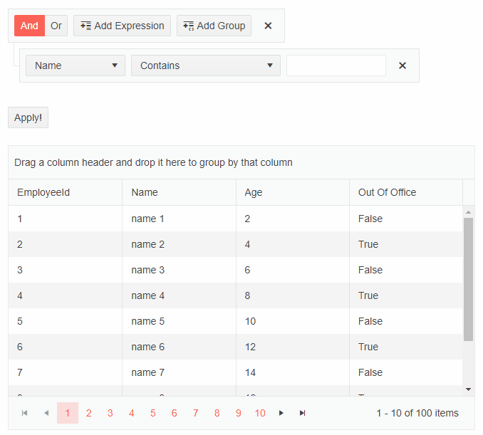
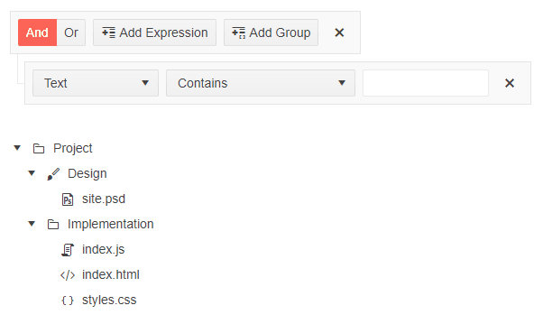
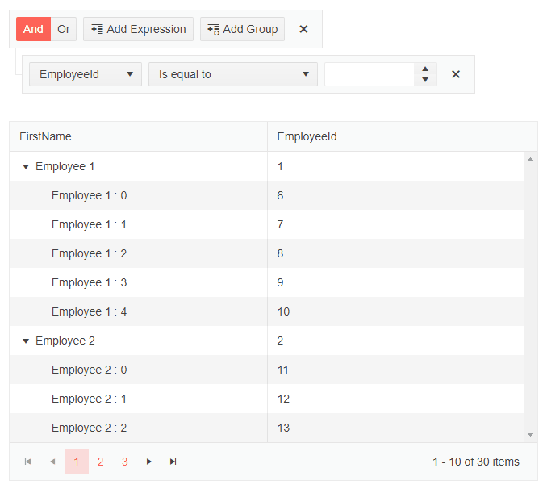
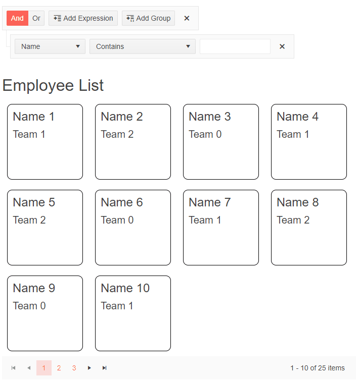
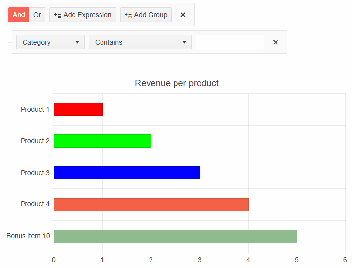

# Blazor Filter Integration
You can integrate the Filter in different data-bound components.

It also allows you to build complex filtering criteria depending on the data type of the underlying source fields.

This article contains the following sections:

* [Filter integration in Grid](#filter-for-a-grid)
* [Filter integration in TreeView](#filter-for-a-treeview)
* [Filter integration in TreeList](#filter-for-a-treelist)
* [Filter integration in ListView](#filter-for-a-listview)
* [Filter integration in Chart](#filter-for-a-chart)

## Filter for a Grid

**To integrate the Filter with the Telerik Grid, you need to:**

1. Set the Value parameter of the Filter via [one-way](slug:filter-events#onupdate) or two-way binding. If you want to filter at the moment of change, use Filter with a one-way bound value.
2. Update the Grid data based on the Filter value.

>caption Filter with two-way bound value in Grid

````RAZOR
@using Telerik.DataSource;
@using Telerik.DataSource.Extensions;

<TelerikFilter @bind-Value="Value">
    <FilterFields>
        <FilterField Name="@(nameof(Person.EmployeeId))" Type="@(typeof(int))" Label="Id"></FilterField>
        <FilterField Name="@(nameof(Person.Name))" Type="@(typeof(string))" Label="First Name"></FilterField>
        <FilterField Name="@(nameof(Person.AgeInYears))" Type="@(typeof(int))" Label="Age"></FilterField>
        <FilterField Name="@(nameof(Person.IsOutOfOffice))" Type="@(typeof(bool))" Label="Out Of Office"></FilterField>
    </FilterFields>
</TelerikFilter>

<div>
    <TelerikButton OnClick="@ApplyFilters">Apply!</TelerikButton>
</div>
<br />

<TelerikGrid Data="@GridData"
             Height="400px"
             Pageable="true"
             Sortable="true"
             Groupable="true">
    <GridColumns>
        <GridColumn Field="@(nameof(Person.EmployeeId))" />
        <GridColumn Field="@(nameof(Person.Name))" Title="Name" />
        <GridColumn Field="@(nameof(Person.AgeInYears))" Title="Age" />
        <GridColumn Field="@(nameof(Person.IsOutOfOffice))" Title="Out Of Office" />
    </GridColumns>
</TelerikGrid>

@code {
    public CompositeFilterDescriptor Value { get; set; } = new CompositeFilterDescriptor();
    public IEnumerable<Person> InitialData { get; set; }
    public IEnumerable<Person> GridData { get; set; }

    private void ApplyFilters()
    {
        var dataSourceRequest = new DataSourceRequest { Filters = new List<IFilterDescriptor>{ Value } };

        var datasourceResult = InitialData.ToDataSourceResult(dataSourceRequest);

        GridData = datasourceResult.Data.Cast<Person>().ToList();
    }

    protected override void OnInitialized()
    {
        LoadData();
        base.OnInitialized();
    }

    void LoadData()
    {
        InitialData = Enumerable.Range(1, 100).Select(x => new Person
        {
            EmployeeId = x,
            Name = "name " + x,
            AgeInYears = x * 2,
            IsOutOfOffice = x % 2 == 0
        });

        GridData = new List<Person>(InitialData);
    }

    public class Person
    {
        public int EmployeeId { get; set; }

        public string Name { get; set; }

        public int AgeInYears { get; set; }

        public bool IsOutOfOffice { get; set; }
    }
}
````

>caption The result from the above code snippet.



## Filter for a TreeView

**To integrate the Filter with the Telerik TreeView, you need to:**

1. Set the Value parameter of the Filter via one-way or two-way binding.
2. Update the TreeView data based on the Filter value.

>caption Use Filter in TreeView

````RAZOR
@using Telerik.DataSource
@using Telerik.DataSource.Extensions

<TelerikFilter Value="@FilterValue" OnUpdate="@OnUpdate">
    <FilterFields>
        <FilterField Name="@(nameof(TreeItem.Id))" Type="@(typeof(int))" Label="Id"></FilterField>
        <FilterField Name="@(nameof(TreeItem.Text))" Type="@(typeof(string))" Label="Text"></FilterField>
        <FilterField Name="@(nameof(TreeItem.HasChildren))" Type="@(typeof(bool))" Label="Has Children"></FilterField>
    </FilterFields>
</TelerikFilter>

<TelerikTreeView Data="@FlatData" @bind-ExpandedItems="@ExpandedItems">
    <TreeViewBindings>
        <TreeViewBinding IdField="Id" ParentIdField="ParentIdValue"
                         TextField="Text" HasChildrenField="HasChildren" IconField="Icon" />
    </TreeViewBindings>
</TelerikTreeView>

@code {
    private CompositeFilterDescriptor FilterValue { get; set; } = new CompositeFilterDescriptor();
    public static List<TreeItem> InitialData { get; set; } = new List<TreeItem>();
    public List<TreeItem> FlatData { get; set; }
    public IEnumerable<object> ExpandedItems { get; set; } = new List<TreeItem>();

    private void OnUpdate()
    {
        var dataSourceRequest = new DataSourceRequest { Filters = new List<IFilterDescriptor> { FilterValue } };

        var datasourceResult = InitialData.ToDataSourceResult(dataSourceRequest);
        var filteredList = datasourceResult.Data.Cast<TreeItem>().ToList();
        FlatData = new List<TreeItem>();

        foreach (TreeItem item in filteredList)
        {
            var currentItem = item;
            FlatData.Add(currentItem);

            while (currentItem.ParentIdValue != null)
            {
                var parent = InitialData.First(p => p.Id == currentItem.ParentIdValue);

                if (!FlatData.Contains(parent))
                {
                    FlatData.Add(parent);
                }

                currentItem = parent;
            }
        }
        ExpandedItems = FlatData.Where(x => x.HasChildren == true).ToList();
    }

    public class TreeItem
    {
        public int Id { get; set; }
        public string Text { get; set; }
        public int? ParentIdValue { get; set; }
        public bool HasChildren { get; set; }
        public ISvgIcon Icon { get; set; }
    }

    protected override void OnInitialized()
    {
        LoadFlatData();
        ExpandedItems = FlatData.Where(x => x.HasChildren == true).ToList();
    }

    private void LoadFlatData()
    {
        List<TreeItem> items = new List<TreeItem>();

        items.Add(new TreeItem()
        {
            Id = 1,
            Text = "Project",
            ParentIdValue = null,
            HasChildren = true,
            Icon = SvgIcon.Folder
        });

        items.Add(new TreeItem()
        {
            Id = 2,
            Text = "Design",
            ParentIdValue = 1,
            HasChildren = true,
            Icon = SvgIcon.Brush
        });
        items.Add(new TreeItem()
        {
            Id = 3,
            Text = "Implementation",
            ParentIdValue = 1,
            HasChildren = true,
            Icon = SvgIcon.Folder
        });

        items.Add(new TreeItem()
        {
            Id = 4,
            Text = "site.psd",
            ParentIdValue = 2,
            HasChildren = false,
            Icon = SvgIcon.FilePsd
        });
        items.Add(new TreeItem()
        {
            Id = 5,
            Text = "index.js",
            ParentIdValue = 3,
            HasChildren = false,
            Icon = SvgIcon.Js
        });
        items.Add(new TreeItem()
        {
            Id = 6,
            Text = "index.html",
            ParentIdValue = 3,
            HasChildren = false,
            Icon = SvgIcon.Html5
        });
        items.Add(new TreeItem()
        {
            Id = 7,
            Text = "styles.css",
            ParentIdValue = 3,
            HasChildren = false,
            Icon = SvgIcon.Css
        });

        InitialData = items;
        FlatData = InitialData;
    }
}
````
>caption The result from the above code snippet.



## Filter for a TreeList

**To integrate the Filter with the Telerik TreeList, you need to:**

1. Set the Value parameter of the Filter via one-way or two-way binding.
2. Update the TreeList data based on the Filter value.

>caption Use Filter in TreeList

````RAZOR
@using Telerik.DataSource
@using Telerik.DataSource.Extensions

<TelerikFilter Value="@FilterValue" OnUpdate="@OnUpdate">
    <FilterFields>
        <FilterField Name="@(nameof(Employee.EmployeeId))" Type="@(typeof(int))" Label="Id"></FilterField>
        <FilterField Name="@(nameof(Employee.FirstName))" Type="@(typeof(string))" Label="First Name"></FilterField>
        <FilterField Name="@(nameof(Employee.ReportsTo))" Type="@(typeof(int?))" Label="Reports"></FilterField>
    </FilterFields>
</TelerikFilter>

<TelerikTreeList Data="@Data"
                 IdField="EmployeeId"
                 ParentIdField="ReportsTo"
                 Pageable="true">
    <TreeListColumns>
        <TreeListColumn Field="FirstName" Expandable="true"></TreeListColumn>
        <TreeListColumn Field="EmployeeId"></TreeListColumn>
    </TreeListColumns>
</TelerikTreeList>

@code {
    private CompositeFilterDescriptor FilterValue { get; set; } = new CompositeFilterDescriptor();
    public static List<Employee> InitialData { get; set; } = new List<Employee>();
    public List<Employee> Data { get; set; }

    private void OnUpdate()
    {
        var dataSourceRequest = new DataSourceRequest { Filters = new List<IFilterDescriptor> { FilterValue } };

        var datasourceResult = InitialData.ToDataSourceResult(dataSourceRequest);
        var filteredList = datasourceResult.Data.Cast<Employee>().ToList();
        Data = new List<Employee>();

        foreach (Employee item in filteredList)
        {
            var currentItem = item;
            Data.Add(currentItem);

            while (currentItem.ReportsTo != null)
            {
                var parent = InitialData.First(p => p.EmployeeId == currentItem.ReportsTo);

                if (!Data.Contains(parent))
                {
                    Data.Add(parent);
                }

                currentItem = parent;
            }
        }
    }

    public class Employee
    {
        public int EmployeeId { get; set; }
        public string FirstName { get; set; }
        public int? ReportsTo { get; set; }
    }

    protected override void OnInitialized()
    {
        List<Employee> items = new List<Employee>();
        var rand = new Random();
        int currentId = 1;

        for (int i = 1; i < 6; i++)
        {
            items.Add(new Employee()
            {
                EmployeeId = currentId,
                ReportsTo = null,
                FirstName = "Employee  " + i.ToString()
            });

            currentId++;
        }
        for (int i = 1; i < 6; i++)
        {
            for (int j = 0; j < 5; j++)
            {
                items.Add(new Employee()
                {
                    EmployeeId = currentId,
                    ReportsTo = i,
                    FirstName = "    Employee " + i + " : " + j.ToString()
                });

                currentId++;
            }
        }
        InitialData = items;
        Data = InitialData;
    }
}
````
>caption The result from the above code snippet.



## Filter for a ListView

**To integrate the Filter with the Telerik ListView, you need to:**

1. Set the Value parameter of the Filter via one-way or two-way binding.
2. Update the ListView data based on the Filter value.

>caption Use Filter in ListView.

````RAZOR
@using Telerik.DataSource
@using Telerik.DataSource.Extensions

<TelerikFilter Value="@FilterValue" OnUpdate="@OnUpdate">
    <FilterFields>
        <FilterField Name="@(nameof(SampleData.Id))" Type="@(typeof(int))" Label="Id"></FilterField>
        <FilterField Name="@(nameof(SampleData.Name))" Type="@(typeof(string))" Label="Name"></FilterField>
        <FilterField Name="@(nameof(SampleData.Team))" Type="@(typeof(string))" Label="Team"></FilterField>
    </FilterFields>
</TelerikFilter>

<TelerikListView Data="@ListViewData" Width="700px" Pageable="true">
    <HeaderTemplate>
        <h2>Employee List</h2>
    </HeaderTemplate>
    <Template>
        <div class="listview-item">
            <h4>@context.Name</h4>
            <h5>@context.Team</h5>
        </div>
    </Template>
</TelerikListView>

@code {
    private CompositeFilterDescriptor FilterValue { get; set; } = new CompositeFilterDescriptor();
    List<SampleData> ListViewData { get; set; } = InitialData;

    private void OnUpdate()
    {
        var dataSourceRequest = new DataSourceRequest { Filters = new List<IFilterDescriptor> { FilterValue } };

        var datasourceResult = InitialData.ToDataSourceResult(dataSourceRequest);

        ListViewData = datasourceResult.Data.Cast<SampleData>().ToList();
    }

    static List<SampleData> InitialData { get; set; } = Enumerable.Range(1, 25).Select(x => new SampleData
    {
        Id = x,
        Name = $"Name {x}",
        Team = $"Team {x % 3}"
    }).ToList();

    public class SampleData
    {
        public int Id { get; set; }
        public string Name { get; set; }
        public string Team { get; set; }
    }
}

<style>
    .listview-item {
        height: 150px;
        width: 150px;
        display: inline-block;
        margin: 10px;
        border: 1px solid black;
        border-radius: 10px;
        padding: 10px;
    }
</style>
````
>caption The result from the above code snippet.



## Filter for a Chart

**To integrate the Filter with the Telerik Chart, you need to:**

1. Set the Value parameter of the Filter via one-way or two-way binding.
2. Update the Chart data based on the Filter value.
3. Refresh the Chart.

>important Not every type of Chart is compatible with the Filter component.

````RAZOR
@using Telerik.DataSource
@using Telerik.DataSource.Extensions

<TelerikFilter Value="@FilterValue" OnUpdate="@OnUpdate">
    <FilterFields>
        <FilterField Name="@(nameof(MyChartDataModel.ItemValue))" Type="@(typeof(double))" Label="Value"></FilterField>
        <FilterField Name="@(nameof(MyChartDataModel.Category))" Type="@(typeof(string))" Label="Category"></FilterField>
        <FilterField Name="@(nameof(MyChartDataModel.Color))" Type="@(typeof(string))" Label="Color"></FilterField>
    </FilterFields>
</TelerikFilter>

<TelerikChart @ref="myChartRef">
    <ChartSeriesItems>
        <ChartSeries Type="ChartSeriesType.Bar" Data="@ChartData" ColorField="@nameof(MyChartDataModel.Color)"
                     Field="@nameof(MyChartDataModel.ItemValue)" CategoryField="@nameof(MyChartDataModel.Category)" />
    </ChartSeriesItems>

    <ChartTitle Text="Revenue per product" />

    <ChartLegend Position="ChartLegendPosition.Right" />
</TelerikChart>

@code {
    TelerikChart myChartRef;
    private CompositeFilterDescriptor FilterValue { get; set; } = new CompositeFilterDescriptor();
    public static List<MyChartDataModel> InitialData { get; set; } = new List<MyChartDataModel>();
    public List<MyChartDataModel> ChartData { get; set; }

    public class MyChartDataModel
    {
        public string Category { get; set; }
        public double ItemValue { get; set; }
        public string Color { get; set; }
    }

    private void OnUpdate()
    {
        var dataSourceRequest = new DataSourceRequest { Filters = new List<IFilterDescriptor> { FilterValue } };

        var datasourceResult = InitialData.ToDataSourceResult(dataSourceRequest);

        ChartData = datasourceResult.Data.Cast<MyChartDataModel>().ToList();
        myChartRef.Refresh();
    }

    protected override void OnInitialized()
    {
        LoadData();
    }

    private void LoadData()
    {
        List<MyChartDataModel> items = new List<MyChartDataModel>
        {
            new MyChartDataModel
            {
                Category = "Product 1",
                ItemValue = 1,
                Color = "red"
            },
            new MyChartDataModel
            {
                Category = "Product 2",
                ItemValue = 2,
                Color = "#00ff00"
            },
            new MyChartDataModel
            {
                Category = "Product 3",
                ItemValue = 3,
                Color = "#00f"
            },
            new MyChartDataModel
            {
                Category = "Product 4",
                ItemValue = 4,
                Color = "#f56147"
            },
            new MyChartDataModel
            {
                Category = "Bonus Item 10",
                ItemValue = 5,
                Color = "darkseagreen"
            }
        };

        InitialData = items;
        ChartData = InitialData;
    }
}
````
>caption The result from the above code snippet.


