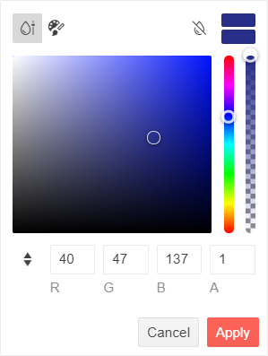

# FlatColorPicker Overview

The <a href = "https://www.telerik.com/blazor-ui/flatcolorpicker" target="_blank">FlatColorPicker for Blazor</a> is an interactive component that allows color selection from a color palette or a [HSVA](https://en.wikipedia.org/wiki/HSL_and_HSV) canvas. Users can also type a specific RGB/HEX color value manually. The FlatColorPicker is practically identical to the [ColorPicker component]() with the only difference that the ColorPicker takes up less space and displays the color selection UI in a popup.

#### In this article:
   * [Basics](#basics)
   * [Example](#example)
   * [Interface](#interface)
   * [Features](#features)
   * [Supported Value Formats](#supported-value-formats)

## Basics

To use a Telerik FlatColorPicker for Blazor:

1. Add the `TelerikFlatColorPicker` tag.
1. Set its `Value` attribute to any of the [supported HEX/RGB formats](#supported-value-formats). Use a `string` property with [one-way](#valuechanged) or [two-way](#example) binding.
1. (optional) Set the `ValueFormat` to `ColorFormat.Hex` or `ColorFormat.Rgb` if the app expects a specific color format.

## Example

Here is a simple FlatColorPicker declaration and the resulting UI.

````CSHTML
@* Blazor FlatColorPicker *@

<TelerikFlatColorPicker @bind-Value="@Color" />

@code {
    string Color { get; set; } = "rgb(40, 47, 137)";
}
````

## Interface

The image below reveals all FlatColorPicker interface elements:

* View selectors (top left)
* Color preview box (top right)
* Current color box (below the color preview)
* Clear button (top)
* Palette tiles or HSV canvas with hue and opacity sliders (middle)
* RGBA or HEX value textboxes with a toggle button (bottom)
* Apply and Cancel buttons (bottom)



## Features

The FlatColorPicker tag exposes the following features via its attributes:

* `Value` - `string` - sets the FlatColorPicker value in a few [different color formats](#supported-value-formats). Supports two-way binding.
* `ValueFormat` - `ColorFormat` - sets the color format, which the component will return in the application code. By default, the property is not set and the value format will change depending on the used view: `Rgb` when selecting a color from the GradientView, and `Hex` when selecting a color from the PaletteView.
* `FlatColorPickerViews` - `RenderFragment` - a nested container to list the [FlatColorPicker views](). All views are enabled by default and the user can switch between them with buttons. Each view tag has its own configuration attributes.
* `View` - `ColorPickerView` - sets the default selected [view]() (`ColorPickerView.Gradient` by default). Supports two-way binding.
* `ShowPreview` - `bool` - toggles the [current color box and the color preview box](#interface) in the popup (`true` by default).

* `Class` - `string` - renders a custom CSS class to the `div.k-flatcolorpicker` element.
* `Enabled` - `bool` - determines if the user can open the popup and change the value (`true` by default).

### Buttons

* `ShowButtons` - `bool` - sets the visibility of the Apply and Cancel buttons (`true` by default).
* `ShowClearButton` - `bool` - sets the visibility of the Clear button.

## Supported Value Formats

The FlatColorPicker accepts values by the application code in the following formats:

@[template](/_contentTemplates/common/coloreditors.md#value-formats)

Color keywords are not supported.

## See Also

* [FlatColorPicker Views]()
* [FlatColorPicker Events]()
* [FlatColorPicker Live Demo](https://demos.telerik.com/blazor-ui/flatcolorpicker/overview)
