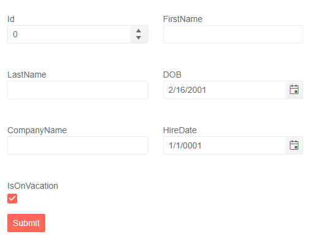

# Form Columns

The Form component for Blazor allows you to add multiple columns by using the `Columns` parameter. It takes an `int` which represents the number of columns the Form will have. To manipulate the spacing between the columns you can use the `ColumnSpacing` parameter. 

>caption Add columns to a Form with Automatically generated fields

You can set the `Columns` parameter when [`<FormItemsTemplate>`](slug:form-formitems-formitemstemplate) is not used and the Form manages its layout. The Form will spread the editors evenly across the columns.

When using `Columns`, you can also define arbitrary space between the rows with the `RowSpacing` parameter.

````RAZOR
<TelerikForm Model="@Employee"
             Columns="2"
             ColumnSpacing="24px"
             RowSpacing="24px">
</TelerikForm>

@code {
    private Person Employee { get; set; } = new();

    public class Person
    {
        public int Id { get; set; }
        public string FirstName { get; set; } = string.Empty;
        public string LastName { get; set; } = string.Empty;
        public DateTime DOB { get; set; } = DateTime.Today.AddYears(-18);
        public string CompanyName { get; set; } = string.Empty;
        public DateTime HireDate { get; set; } = DateTime.Today;
        public bool IsOnVacation { get; set; }
    }
}
````

>caption The result from the code snippet above



## See Also

  * [Overview](slug:form-overview)
  * [FormItems](slug:form-formitems)
  * [FormGroups](slug:form-formgroups)
  * [Orientation](slug:form-orientation)
  * [Events](slug:form-events)
   
