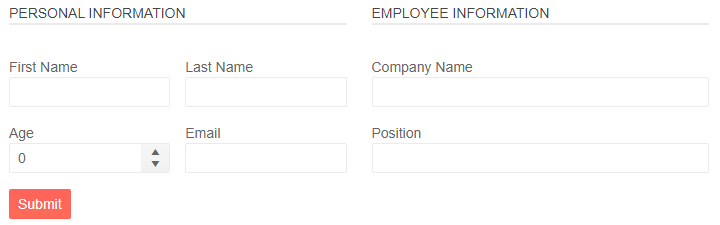

# FormGroups

You can group some associated fields in your form (model) by using the [FormItems](). and putting them inside `FormGroup` tags.

In this article:

* [Features](#features)
* [Example - Organize FormItems into Groups](#example---organize-formitems-into-groups)

## Features

The `FormGroup` tag exposes the following parameters:

* `LabelText` - `string` - defines a label for the entire group. 

* `Columns` - `int` - defines the number of columns in the group.

* `ColumnSpacing` - `string` - defines the space between the editors in the group. 

## Example - Organize FormItems into Groups

````CSHTML
@using System.ComponentModel.DataAnnotations

<TelerikForm Model="@person" Columns="2" ColumnSpacing="25px">
    <FormValidation>
        <DataAnnotationsValidator></DataAnnotationsValidator>
    </FormValidation>
    <FormItems>
        <FormGroup LabelText="Personal Information">
            <FormItem LabelText="First Name" Field="@nameof(Person.FirstName)"></FormItem>
            <FormItem LabelText="Last Name" Field="@nameof(Person.LastName)"></FormItem>
        </FormGroup>
        <FormGroup LabelText="Employee Information">
            <FormItem LabelText="Company Name" Field="@nameof(Person.CompanyName)"></FormItem>
            <FormItem LabelText="Position" Field="@nameof(Person.Position)"></FormItem>
        </FormGroup>
    </FormItems>
</TelerikForm>


@code {
    public Person person { get; set; } = new Person();

    public class Person
    {
        [Required(ErrorMessage = "The First name is required")]
        public string FirstName { get; set; }
        [Required(ErrorMessage = "The Last name is required")]
        public string LastName { get; set; }
        [Required]
        public string CompanyName { get; set; }
        [MaxLength(25, ErrorMessage ="The position can be maximum 25 characters long")]
        public string Position { get; set; }
    }
} 
}
````

>caption The result from the code snippet above



## See Also

  * [Overview]()
  * [FormItems]()
  * [Template]()
  * [Orientation]()
  * [Events]()
   
   
