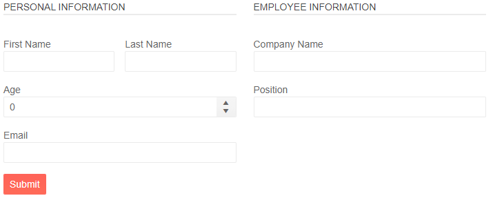

# Form Groups

You can group some associated fields in your form (model) by using the [FormItems](slug:form-formitems). and putting them inside `FormGroup` tags.

In this article:

* [Features](#features)
* [Example - Organize FormItems into Groups](#example-organize-formitems-into-groups)

## Features

The `FormGroup` tag exposes the following parameters:

@[template](/_contentTemplates/common/parameters-table-styles.md#table-layout)

| Parameter | Type and Default&nbsp;Value| Description |
| --- | --- | --- |
| `LabelText` | `string` | The label for the entire group rendered as a `<legend>` element in a `<fieldset>`. |
| `Columns` | `int` | The number of columns in the group. |
| `ColumnSpacing` | `string` (`"16px"`) | The horizontal space between the columns in the group. |
| `RowSpacing` | `string` | The vertical space between the fields in the group. The default value is zero, but there is a default top margin for Form items. This parameter has effect only when `Columns` is set. |

## Example - Organize FormItems into Groups

You can organize some FormItems into logical groups. You can configure the label of the group, the number of columns and the spacing between the items.

>caption The result from the code snippet below



````RAZOR
<TelerikForm Model="@Employee" Columns="2" ColumnSpacing="24px">
    <FormItems>
        <FormGroup LabelText="Personal Information" Columns="2" ColumnSpacing="12px" RowSpacing="6px">
            <FormItem Field="@nameof(Person.FirstName)" LabelText="First Name" />
            <FormItem Field="@nameof(Person.LastName)" LabelText="Last Name" />
            <FormItem Field="@nameof(Person.BirthDate)" LabelText="Birth Date" ColSpan="2"></FormItem>
            <FormItem Field="@nameof(Person.Email)" ColSpan="2"></FormItem>
        </FormGroup>
        <FormGroup LabelText="Employee Information" Columns="1" RowSpacing="6px">
            <FormItem Field="@nameof(Person.CompanyName)" LabelText="Company Name" />
            <FormItem Field="@nameof(Person.Position)" />
            <FormItem Field="@nameof(Person.HirehDate)" LabelText="Hire Date" />
        </FormGroup>
    </FormItems>
</TelerikForm>

@code {
    private Person Employee { get; set; } = new();

    public class Person
    {
        public string FirstName { get; set; } = string.Empty;
        public string LastName { get; set; } = string.Empty;
        public DateTime? BirthDate { get; set; }
        public string Email { get; set; } = string.Empty;
        public string CompanyName { get; set; } = string.Empty;
        public string Position { get; set; } = string.Empty;
        public DateTime HirehDate { get; set; } = DateTime.Today;
    }
}
````

## See Also

* [Overview](slug:form-overview)
* [FormItems](slug:form-formitems)
* [Template](slug:form-formitems-template)
* [Orientation](slug:form-orientation)
* [Events](slug:form-events)
