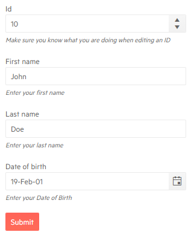

# FormItem Template

You can provide different editors to the [default](#automatic-generation-of-fields) by using the `Template`. 


## Features

The `FormItem` tag exposes the following parameters which you can use to customize the appearance of the editors:

* `LabelText` - `string` - defines the label for the associated editor. This parameter provides more compact syntax for the `<label for="myEditorId">` HTML tag. 

* `Hint` - `string` - defines a hint for the user on the place of the validation message. If a validation error occurs the hint will be replaced by the according validation message. 

* `Field` - `string` - the name of the field in the model that the editor will render for as a string (case-sensitive). You can set its as a plain string (Field="SomeField") or to have .NET extract the field name from the model for flat models (Field=@nameof(MyModelClass.SomeFIeld)).

* `FieldType` - `string` - the data type of the `Field`. This parameter should be provided if the type of the property in the model can not be extracted using reflection. 

* `ColSpan` - `int` - defines the `colspan` attribute. 

* `Class` - `string` - adds a custom CSS class to the `k-form-field` div tag.

* `Template` - `RenderFragment` - allows you to change the [default editor](#automatic-generation-of-fields) altogether. For more information read the [Template]() article.

## Examples

### Customize the appearance of the editors in the Form

````CSHTML
@* Provide a hint and change the Label of the editors *@

@using System.ComponentModel.DataAnnotations

<TelerikForm Model="@person">
    <FormValidation>
        <DataAnnotationsValidator></DataAnnotationsValidator>
    </FormValidation>
    <FormItems>
        <FormItem Field="@nameof(Person.Id)" LabelText="Id" Hint="The Id is automatically generated, you can not edit it"></FormItem>
        <FormItem Field="@nameof(Person.FirstName)" LabelText="First name" Hint="Enter your first name"></FormItem>
        <FormItem Field="@nameof(Person.LastName)" LabelText="Last name" Hint="Enter your last name" ColSpan="2"></FormItem>
        <FormItem Field="@nameof(Person.DOB)" LabelText="Date of birth" Hint="Enter your Date of Birth"></FormItem>
    </FormItems>
</TelerikForm>

@code {
    public Person person = new Person();

    public class Person
    {
        [Editable(false)]
        public int Id { get; set; } = 10;
        public string FirstName { get; set; } = "John";
        public string LastName { get; set; } = "Doe";
        public DateTime DOB { get; set; } = DateTime.Today.AddYears(-20);
    }
}
````

>caption The result from the code snippet above




### Create a Clear button

You can provide a standard [TelerikButton]() to allow the user to clear the contents of the editors in the Telerik Form.

````CSHTML
@* Add a Clear Button to the Telerik Form *@

@using System.ComponentModel.DataAnnotations

<TelerikForm Model="@person">
    <FormValidation>
        <DataAnnotationsValidator></DataAnnotationsValidator>
    </FormValidation>
    <FormItems>
        <FormItem Field="@nameof(Person.Id)" LabelText="Id" Hint="The Id is automatically generated, you can not edit it"></FormItem>
        <FormItem Field="@nameof(Person.FirstName)" LabelText="First name" Hint="Enter your first name"></FormItem>
        <FormItem Field="@nameof(Person.LastName)" LabelText="Last name" Hint="Enter your last name" ColSpan="2"></FormItem>
        <FormItem Field="@nameof(Person.DOB)" LabelText="Date of birth" Hint="Enter your Date of Birth"></FormItem>

        <TelerikButton OnClick="@ClearButton">Clear</TelerikButton>
    </FormItems>
</TelerikForm>

@code {
    private void ClearButton()
    {
        person = new Person();
    }

    public Person person = new Person();

    public class Person
    {
        [Editable(false)]
        public int Id { get; set; } = 10;
        public string FirstName { get; set; } = "John";
        public string LastName { get; set; } = "Doe";
        public DateTime DOB { get; set; } = DateTime.Today.AddYears(-20);
    }
}
````

## See Also

  * [Overview]()
  * [Template]()
  * [FormGroups]()
  * [Orientation]()
  * [Events]()
   
