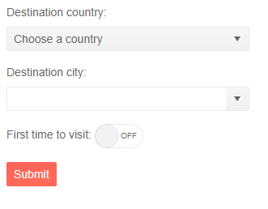

# FormItem Template

You can provide your own custom editors instead of the [default editors the form can generate](#automatic-generation-of-fields). To do that, use the the `Template` of the [FormItem]().

When the Template is used, the built-in validation messages from the Form will not be rendered. Instead you can use the [Telerik Validation tools]() to provide validation messages, or any other suitable component.

In this article you can find the following examples:

* [Use the Template to provide custom editors](#use-the-template-to-provide-custom-editors)
* [Add validation messages to templated Form Items](#add-validation-messages-to-templated-form-items)

## Use the Template to provide custom editors

````CSHMTL
@* Use the Template to change the default editors *@

@using System.ComponentModel.DataAnnotations

<TelerikForm EditContext="@EditContext">
    <FormValidation>
        <DataAnnotationsValidator></DataAnnotationsValidator>
        <ValidationSummary />
    </FormValidation>
    <FormItems>
        <FormItem>
            <Template>
                <label for="country">Destination country:</label>
                <TelerikDropDownList @bind-Value="@MyModel.Country"
                                     DefaultText="Choose a country"
                                     Data="@DropDownData"
                                     PopupHeight=""
                                     Id="country">
                </TelerikDropDownList>
            </Template>
        </FormItem>
        <FormItem>
            <Template>
                <label for="city">Destination city:</label>
                <TelerikComboBox @bind-Value="@MyModel.City"
                                 Data="@CityData"
                                 PopupHeight=""
                                 Id="city">
                </TelerikComboBox>
            </Template>
        </FormItem>
        <FormItem>
            <Template>
                <label for="visited">First time to visit:</label>
                <TelerikSwitch @bind-Value="@MyModel.FirstTime"></TelerikSwitch>
            </Template>
        </FormItem>
    </FormItems>
</TelerikForm>


@code {
    public TemplateModel MyModel { get; set; } = new TemplateModel();

    public EditContext EditContext { get; set; }

    public List<string> DropDownData { get; } = new List<string>()
    {
        "Bulgaria",
        "Italy",
        "Greece"
    };
    public List<string> CityData
    {
        get
        {
            switch (MyModel.Country)
            {
                case "Bulgaria":
                    return new List<string>() { "Sofia", "Plovdiv", "Varna", "Burgas" };
                case "Italy":
                    return new List<string>() { "Rome", "Milan", "Naples", "Turin" };
                case "Greece":
                    return new List<string>() { "Athens", "Thessaloniki", "Patras", "Piraeos" };
                default:
                    return new List<string>();
                    break;
            }
        }
    }

    protected override void OnInitialized()
    {
        EditContext = new EditContext(MyModel);
        base.OnInitialized();
    }

    public class TemplateModel
    {
        public TemplateModel()
        {

        }

        [Required]
        public string Country { get; set; }

        [Required]
        public string City { get; set; }

        [Range(typeof(bool), "true", "true", ErrorMessage = "You must confirm first time.")]
        public bool FirstTime { get; set; }
    }

    private void Clear()
    {
        MyModel = new TemplateModel();

        EditContext = new EditContext(MyModel);

        EditContext.AddDataAnnotationsValidation();
    }
}
````

>caption The result from the code snippet above



## Add validation messages to templated Form Items

You can render validation messages for templated Form items by using the [TelerikValidationMessage]().

````CSHTML
@* Use the TelerikValidationMessage to render validation messages *@

@using System.ComponentModel.DataAnnotations

<TelerikForm EditContext="@EditContext">
    <FormValidation>
        <DataAnnotationsValidator></DataAnnotationsValidator>
    </FormValidation>
    <FormItems>
        <FormItem>
            <Template>
                <label for="country">Destination country:</label>
                <TelerikDropDownList @bind-Value="@MyModel.Country"
                                     DefaultText="Choose a country"
                                     Data="@DropDownData"
                                     PopupHeight=""
                                     Id="country">
                </TelerikDropDownList>
                <TelerikValidationMessage For="@(() => MyModel.Country)" />
            </Template>
        </FormItem>
        <FormItem>
            <Template>
                <label for="city">Destination city:</label>
                <TelerikComboBox @bind-Value="@MyModel.City"
                                 Data="@CityData"
                                 PopupHeight=""
                                 Id="city">
                </TelerikComboBox>
                <TelerikValidationMessage For="@(() => MyModel.City)" />
            </Template>
        </FormItem>
        <FormItem>
            <Template>
                <label for="visited">First time to visit:</label>
                <TelerikSwitch @bind-Value="@MyModel.FirstTime"></TelerikSwitch>
                <TelerikValidationMessage For="@(() => MyModel.FirstTime)" />
            </Template>
        </FormItem>
    </FormItems>
</TelerikForm>


@code {
    public TemplateModel MyModel { get; set; } = new TemplateModel();

    public EditContext EditContext { get; set; }

    public List<string> DropDownData { get; } = new List<string>()
{
        "Bulgaria",
        "Italy",
        "Greece"
    };
    public List<string> CityData
    {
        get
        {
            switch (MyModel.Country)
            {
                case "Bulgaria":
                    return new List<string>() { "Sofia", "Plovdiv", "Varna", "Burgas" };
                case "Italy":
                    return new List<string>() { "Rome", "Milan", "Naples", "Turin" };
                case "Greece":
                    return new List<string>() { "Athens", "Thessaloniki", "Patras", "Piraeos" };
                default:
                    return new List<string>();
                    break;
            }
        }
    }

    protected override void OnInitialized()
    {
        EditContext = new EditContext(MyModel);
        base.OnInitialized();
    }

    public class TemplateModel
    {
        public TemplateModel()
        {

        }

        [Required(ErrorMessage ="Select a Country")]
        public string Country { get; set; }

        [Required(ErrorMessage ="Select a City")]
        public string City { get; set; }

        [Range(typeof(bool), "true", "true", ErrorMessage = "You must confirm first time.")]
        public bool FirstTime { get; set; }
    }

    private void Clear()
    {
        MyModel = new TemplateModel();

        EditContext = new EditContext(MyModel);

        EditContext.AddDataAnnotationsValidation();
    }
}
````

## See Also

  * [Overview]()
  * [FormItems]()
  * [FormGroups]()
  * [Orientation]()
  * [Events]()
   
