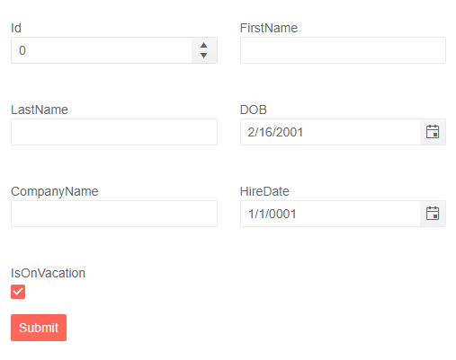

# Form Columns

The Form component for Blazor allows you to add multiple columns by using the `Columns` parameter. It takes an `int` which represents the number of columns the Form will have. To manipulate the spacing between the columns you can use the `ColumnSpacing` parameter. 

>caption Add columns to a Form with Automatically generated fields

You can set the `Columns` parameter when the Form component automatically generates the editors. The form will evenly spread the editors evenly across the columns. It will calculate it using this formula: `propertiesInModelCount / Columns`.

````CSHTML
@* Add colums to the Form component *@

<TelerikForm Model="@person"
             Columns="2" ColumnSpacing="25px">
</TelerikForm>

@code {
    public Person person = new Person();

    public class Person
    {
        public int Id { get; set; }
        public string FirstName { get; set; }
        public string LastName { get; set; }
        public DateTime DOB { get; set; } = DateTime.Today.AddYears(-20);
        public string CompanyName { get; set; }
        public DateTime HireDate { get; set; }
        public bool IsOnVacation { get; set; } = true;
    }
}
````

>caption The result from the code snippet above



## See Also

  * [Overview]()
  * [FormItems]()
  * [FormGroups]()
  * [Orientation]()
  * [Events]()
   
