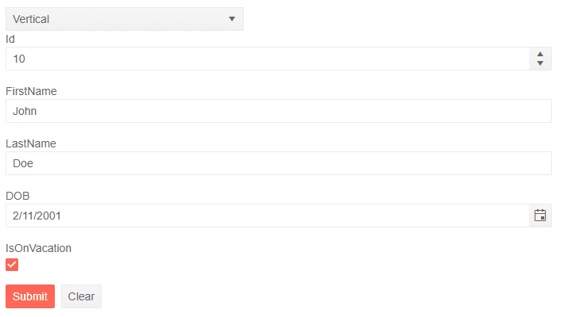

# Form Orientation


The Form component for Blazor allows you control its orientation through the `Orientation` parameter. It takes a member of the `Telerik.Blazor.Enums.FormOrientation` enum:

* `Horizontal`

* `Vertical` - by default the Form will be vertical.

Setting the orientation to `Horizonal` will place the labels to the left hand-side of the editors and thus reduce the vertical space taken by the Form.

>caption Change the orientation of the Form. The result of the code snippet below



````CSHTML
@* Use the dropdownlist to change the orientation of the Form *@

@using Telerik.Blazor.Enums;

<div>
    <TelerikDropDownList @bind-Value="@Orientation" Data="@OrientationTypes"></TelerikDropDownList>
</div>

<div>
    <TelerikForm Model="@person"
                 Orientation="@Orientation">
    </TelerikForm>
</div>


@code {
    public FormOrientation Orientation { get; set; }
    public List<FormOrientation> OrientationTypes { get; set; } = new List<FormOrientation>()
    {
        FormOrientation.Horizontal,
        FormOrientation.Vertical,
    };

    public Person person = new Person();

    public class Person
    {
        public int Id { get; set; } = 10;
        public string FirstName { get; set; } = "John";
        public string LastName { get; set; } = "Doe";
        public DateTime DOB { get; set; } = DateTime.Today.AddYears(-20);
        public bool IsOnVacation { get; set; } = true;
    }
}
````

## See Also
  
  * [Overview]()
  * [FormItems]()
  * [FormGroups]()
  * [Columns]()
  * [Events]()
   
