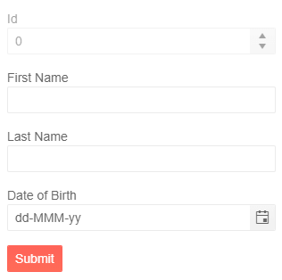

# Form Overview

The <a href = "https://www.telerik.com/blazor-ui/form" target="_blank">Form for Blazor</a> allows you to generate a form based on your model and to manage customized forms. You can control the component through various parameters, achieve the desired layout by using the [default editor](#automatic-generation-of-fields) or add [custom ones](), set the [orientation]() and organize those editors in [groups]() and [columns](). 

#### This article is separated in the following sections:


* [Use the Telerik Form for Blazor with a model](#use-the-telerik-form-for-blazor-with-a-model)
* [Use the Telerik Form for Blazor with an EditContext](#use-the-telerik-form-for-blazor-with-an-editcontext)
* [Component Reference](#component-reference)
* [Automatic Generation of fields](#automatic-generation-of-fields)
* [Data Annotation Attributes](#data-annotation-attributes)
* [Features](#features)


## Use the Telerik Form for Blazor With a Model

To use the Form component with a model: 

1. Add the `<TelerikForm>` tag.

1. Provide an object to the `Model` parameter of the component. 

1. Use the `<FormValidation>` tag and in it, provide a validator - like the `DataAnnotationsValidator` that comes with the framework, to enable form validation. 


````CSHTML
@* Provide a model to the Telerik Form *@

@using System.ComponentModel.DataAnnotations

<TelerikForm Model="@person">
    <FormValidation>
        <DataAnnotationsValidator />
    </FormValidation>
</TelerikForm>

@code {
    public Person person = new Person();

    public class Person
    {
        [Editable(false)]
        public int Id { get; set; }

        [Required]
        [MaxLength(20, ErrorMessage = "The first name should be maximum 20 characters long")]
        [Display(Name = "First Name")]
        public string FirstName { get; set; }

        [Required]
        [MaxLength(25, ErrorMessage = "The last name should be maximum 25 characters long")]
        [Display(Name = "Last Name")]
        public string LastName { get; set; }

        [Required]
        [Display(Name = "Date of Birth")]
        public DateTime? DOB { get; set; }
    }
}
````

>caption The result from the code snippet above



## Use the Telerik Form for Blazor With an EditContext

The Telerik Form for Blazor can utilize the <a href="https://docs.microsoft.com/en-us/dotnet/api/microsoft.aspnetcore.components.forms.editcontext?view=aspnetcore-5.0">EditContext class</a>. You can use the events and methods provided by the EditContext to provide custom business logic. 

To use the Form component with an EditContext: 

1. Add the `<TelerikForm>` tag.

1. Provide an object of type `EditContext` to the `EditContext` parameter of the Form. 

1. Use the `<FormValidation>` tag and provide a validator in it - like the `DataAnnotationsValidator` that comes with the framework, to enable form validation. 


````CSHTML
@* Provide an EditContext to the TelerikForm *@

@using System.ComponentModel.DataAnnotations

<TelerikForm EditContext="@MyEditContext">
    <FormValidation>
        <DataAnnotationsValidator />
    </FormValidation>
</TelerikForm>

@code {
    public EditContext MyEditContext { get; set; }

    public Person person = new Person();

    protected override void OnInitialized()
    {
        MyEditContext = new EditContext(person);
    }

    public class Person
    {
        [Editable(false)]
        public int Id { get; set; }

        [Required]
        [MaxLength(20, ErrorMessage = "The first name should be maximum 20 characters long")]
        [Display(Name = "First Name")]
        public string FirstName { get; set; }

        [Required]
        [MaxLength(25, ErrorMessage = "The last name should be maximum 25 characters long")]
        [Display(Name = "Last Name")]
        public string LastName { get; set; }

        [Required]
        [Display(Name = "Date of Birth")]
        public DateTime? DOB { get; set; }
    }
}
````

>caption The result from the code snippet above


## Component Reference

The component reference provides you with access to the `EditContext` object that the form will generate when you pass a `Model` to it. It could be useful to, for example, re-attach validation when you change the model - `FormReference.EditContext.AddDataAnnotationsValidation()`.

>caption Get a reference to the Telerik Form for Blazor 

````CSHTML
@* Get a reference to the Form component *@

<TelerikForm Model="@person" @ref="@FormReference">
</TelerikForm>

@code {
    public Telerik.Blazor.Components.TelerikForm FormReference { get; set; }

    public Person person = new Person();

    public class Person
    {
        public int Id { get; set; } = 10;
        public string FirstName { get; set; } = "John";
        public string LastName { get; set; } = "Doe";
        public DateTime DOB { get; set; } = DateTime.Today.AddYears(-20);
    }
}
````

## Automatic Generation of fields

The Telerik Form can generate [editors]() for you based on the model fields. It can take them from both a `Model`, or the `EditContext`, whichever you provide to it. You can use the [data annotation attributes](#data-annotation-attributes) to validate the value of the fields.

The following data types are supported out-of-the box and they use the following default editors:

* `string` - [Telerik TextBox]()

* `int`, `double`, `float`, `decimal` - [Telerik NumericTextBox]()

* `Enum` - [Telerik DropDownList]()

* `DateTime` - [Telerik DatePicker]()

* `bool` - [Telerik CheckBox]()

## Data Annotation Attributes

The Telerik Form for Blazor supports validation through the `<DataAnnotationsValidator />`. This allows you to take advantage of all validation attributes from the <a href="https://docs.microsoft.com/en-us/dotnet/api/system.componentmodel.dataannotations?view=net-5.0" target="_blank">data annotation attributes</a> list provided by .NET.

The Form also uses the the following attributes from the model:

* `[Display(Name="Field Caption")]` - to get the title (caption) of the field name to render out as its label. 

* `[Editable(false)]` - to render the built-in editor as disabled so the user cannot change its value.

You can customize the editors further through the [form items](). Explicit settings you provide through the parameters will take precedence over data annotation attributes.

## Features

* `Model` - `object` - the object bound to the form. It will automatically create the `EditContext` and using the two together is not supported.

* `FormValidation` - a nested tag for the Form. You should use it to enable validation and provide validation configuration - add a validation (for example `DataAnnotationsValidator`) and provide a `ValidationSummary`.

* `EditContext` - `EditContext` - the <a href="https://docs.microsoft.com/en-us/dotnet/api/microsoft.aspnetcore.components.forms.editcontext?view=aspnetcore-5.0" target="_blank">EditContext</a> of the form.

* `ValidationMessageType` - `enum` - define the validation message type for the Form. See the [Validation]() article for more information.

* `Width` - `string` - allows you to control the width of the Form.

* `FormItems` - `RenderFragment` - allows you to use custom editors. See the [FormItems]() article for more information. When a custom editor is used, no built-in editors will be generated.

* `FormButtons` - `RenderFragment` - allows you to add custom buttons to the Form. You can use the `FormButtons` tag to [add a Clear button to the Form](). If the `FormButtons` tag is defined there will be no default buttons in the Form. 

* `FormGroups` - lets you define Groups for the FormItems. See the [FormGroups]() article for more information.

* `Orientation` - `enum` - controls the orientation of the Form. See the [Orientation]() article for more information.
    
* `Columns` - `int` - defines the number of columns in the Form. See the [Columns]() article for more information.

* `ColumnSpacing` - `string` - defines the space between the FormItems. See the [Columns]() article for more information.

* `Events` - See the [Events]() article for more information

* `Width` - the width of the component. See the [Dimensions]() article.

## See Also
  
  * [Form Items]()
  * [Form Groups]()
  * [Columns]()
  * [Orientation]()
  * [Events]()
  * [Live Demo: Form](https://demos.telerik.com/blazor-ui/form/overview)
  * [API Reference](https://docs.telerik.com/blazor-ui/api/Telerik.Blazor.Components.TelerikForm)
   
