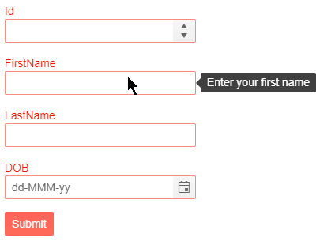

# Form Validation

To enable validation in the Form for Blazor you can use the `<FormValidation>` nested tag. The component works with the Microsoft `DataAnnotationsValidator` as well as any validator that is compatible with the `EditForm` and `EditContext` provided by the framework.

In this article:

* [Validation Message Type](#validation-message-type)
* [Examples](#examples)
    * [Validate a Model](#validate-a-model)
    * [Validate a Complex Model](#validate-a-complex-model)
    * [Fluent Validation](#fluent-validation)

## Validation Message Type

With the `ValidationMessageType` parameter of the Telerik Form for Blazor you can customize the way the validation messages are presented to the user. This setting accepts a member of the `FormValidationMessageType` enum:

* `Tooltip` - validation messages will show up in a tooltip pointing to the invalid input.
* `Inline` - the standard display of messages in text after the input. This is the default value.
* `None` - no validation messages will be rendered. The user will be notified that certain field is incorrect by a red border around the associated editor. 

>caption Change the type of the validation message to tooltip

````CSHTML
@* Set the FormValidationMessageType to Tooltip *@ 

@using System.ComponentModel.DataAnnotations

<TelerikForm Model="@person" ValidationMessageType="@FormValidationMessageType.Tooltip">
    <FormValidation>
        <DataAnnotationsValidator></DataAnnotationsValidator>
    </FormValidation>
</TelerikForm>

@code {
    public Person person = new Person();

    public class Person
    {
        [Editable(false)]
        public int Id { get; set; }
        [Required(ErrorMessage ="Enter your first name")]
        public string FirstName { get; set; }
        [Required(ErrorMessage ="Enter your last name")]
        public string LastName { get; set; }
        [Required(ErrorMessage ="Enter your date of birth")]
        public DateTime? DOB { get; set; }
    }
}
````



## Examples

This section provides the following examples:

* [Validate a Model](#validate-a-model)
* [Validate a Complex Model](#validate-a-complex-model)
* [Fluent Validation](#fluent-validation)

### Validate a Model

````CSHTML
@* Use the Telerik Edit Form for Blazor to Validate a model *@

@using System.ComponentModel.DataAnnotations

<TelerikForm Model="@person">
    <FormValidation>
        <DataAnnotationsValidator></DataAnnotationsValidator>
    </FormValidation>
</TelerikForm>


@code {
    public Person person { get; set; } = new Person();

    public class Person
    {
        [Required(ErrorMessage = "The First name is required")]
        public string FirstName { get; set; }
        [Required(ErrorMessage = "The Last name is required")]
        public string LastName { get; set; }
        [Required(ErrorMessage ="Enter the name of the company you work for")]
        public string CompanyName { get; set; }
        [Required(ErrorMessage ="Enter your position")]
        [MaxLength(25, ErrorMessage ="The position can be maximum 25 characters long")]
        public string Position { get; set; }
    }
}
````

### Validate a Complex Model

You can use the `ObjectGraphDataAnnotationsValidator` inside the Telerik Form for Blazor to validate a nested model.

When using a model with nested objects and fields, specify their `Field` setings as a dot-separate string, do *not* use the `nameof` operator, it does not return the full name of the model.

````CSHTML
@* Validate a complex model *@

@using System.Dynamic
@using System.ComponentModel.DataAnnotations

<div class="mt-4" style="margin: 0 auto;">
    <TelerikForm Model="@MyModel">
        <FormValidation>
            <ObjectGraphDataAnnotationsValidator></ObjectGraphDataAnnotationsValidator>
        </FormValidation>
        <FormItems>
            <FormItem Field="StringProperty"></FormItem>
            <FormItem Field="Child.StringProperty" />
            <FormItem Field="Child.Child.StringProperty" />
            <FormItem Field="Child.Child.IntProperty" />
            <FormItem Field="Child.Child.BoolProperty" />
            <FormItem Field="Child.Child.DateTimeProperty" />
        </FormItems>
    </TelerikForm>
</div>
@code {
    TestModel MyModel { get; set; } = new TestModel();

    abstract class TestBaseClass
    {
        [Required(ErrorMessage = "String prop is required")]
        public string StringProperty { get; set; }

        [Required(ErrorMessage = "Int prop is required")]
        public int? IntProperty { get; set; }

        [Range(typeof(bool), "true", "true", ErrorMessage = "You must accept.")]
        public bool BoolProperty { get; set; }

        [Required]
        public DateTime? DateTimeProperty { get; set; }

        [Required]
        public ExpandoObject ExpandoProperty { get; set; }

        public TestBaseClass()
        {
            ExpandoProperty = new ExpandoObject();
            ExpandoProperty.TryAdd("Test", 1);
        }
    }

    class TestGrandChildModel : TestBaseClass
    {
    }

    class TestChildModel : TestBaseClass
    {
        [ValidateComplexType]
        public TestGrandChildModel Child { get; set; }

        public TestChildModel()
        {
            Child = new TestGrandChildModel();
        }
    }

    class TestModel : TestBaseClass
    {
        public int Id { get; set; }

        [ValidateComplexType]
        public TestChildModel Child { get; set; }

        public TestModel()
        {
            Child = new TestChildModel();
        }
    }
}

````

### Fluent Validation

You can use third-party validation libraries such as <a href="https://fluentvalidation.net/" target="_blank">FluentValidation</a> together with the Telerik Form for Blazor. 

````CSHTML
@* Use FluentValidation to validate a model *@ 

@using Microsoft.AspNetCore.Components.Forms
@using FluentValidation

<div class="mt-4" style="margin: 0 auto;">
    <TelerikForm EditContext="@EditContext">
        <FormValidation>
            <FluentValidationValidator Validator="@Validator"></FluentValidationValidator>
        </FormValidation>
    </TelerikForm>
</div>

@code {
    public EditContext EditContext {get; set; }
    public Customer MyModel { get; set; } = new Customer();
    public CustomerValidator Validator { get; set; } = new CustomerValidator();

    protected override void OnInitialized()
    {
        EditContext = new EditContext(MyModel);
        base.OnInitialized();
    }

    public class Customer
    {
        public string FirstName { get; set; }
        public string LastName { get; set; }
    }

    public class CustomerValidator : AbstractValidator<Customer>
    {
        public CustomerValidator()
        {
            RuleFor(customer => customer.FirstName).NotEmpty().MaximumLength(50);
            RuleFor(customer => customer.LastName).NotEmpty().MaximumLength(50);
        }
    }
}
````