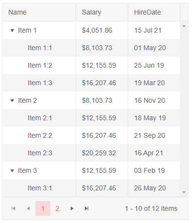

# Column Display Format

@[template](/_contentTemplates/grid/common-link.md#display-format-basics)

## Example

>caption Use C# format strings in the Gantt Tree through the component markup

````CSHTML

@* Format the dates in the Gantt Tree by using the DisplayFormat parameter *@

<TelerikGantt Data="@Data"
              Width="900px"
              Height="600px"
              IdField="Id"
              ParentIdField="ParentId">
    <GanttViews>
        <GanttDayView></GanttDayView>
        <GanttWeekView></GanttWeekView>
        <GanttMonthView></GanttMonthView>
        <GanttYearView></GanttYearView>
    </GanttViews>
    <GanttColumns>
        <GanttColumn Field="Title"
                     Expandable="true"
                     Width="160px"
                     Title="Task Title">
        </GanttColumn>
        <GanttColumn Field="Start"
                     Width="100px"
                     DisplayFormat="Start: {0:d}">
        </GanttColumn>
        <GanttColumn Field="End"
                     DisplayFormat="End: {0:d}"
                     Width="100px">
        </GanttColumn>
    </GanttColumns>
</TelerikGantt>

@code {
    public DateTime SelectedDate { get; set; } = new DateTime(2019, 11, 11, 6, 0, 0);

    class FlatModel
    {
        public int Id { get; set; }
        public int? ParentId { get; set; }
        public string Title { get; set; }
        public double PercentComplete { get; set; }
        public DateTime Start { get; set; }
        public DateTime End { get; set; }
    }

    public int LastId { get; set; } = 1;
    List<FlatModel> Data { get; set; }

    protected override void OnInitialized()
    {
        Data = new List<FlatModel>();
        var random = new Random();

        for (int i = 1; i < 6; i++)
        {
            var newItem = new FlatModel()
            {
                Id = LastId,
                Title = "Employee  " + i.ToString(),
                Start = new DateTime(2020, 12, 6 + i),
                End = new DateTime(2020, 12, 11 + i),
                PercentComplete = Math.Round(random.NextDouble(), 2)
            };

            Data.Add(newItem);
            var parentId = LastId;
            LastId++;

            for (int j = 0; j < 5; j++)
            {
                Data.Add(new FlatModel()
                {
                    Id = LastId,
                    ParentId = parentId,
                    Title = "    Employee " + i + " : " + j.ToString(),
                    Start = new DateTime(2020, 12, 6 + i + j),
                    End = new DateTime(2020, 12, 7 + i + j),
                    PercentComplete = Math.Round(random.NextDouble(), 2)
                });

                LastId++;
            }
        }

        base.OnInitialized();
    }
}
````

>caption The result from the code snippet above



## Notes

* `Numeric`, `DateTime` and Enum types can use such formats. String and Boolean types are displayed without such a format, however.

* The `CurrentInfo.CurrentCulture` is used when rendering the formats, so if you need specific formats for specific users, you must set the culture of the app accordingly.
