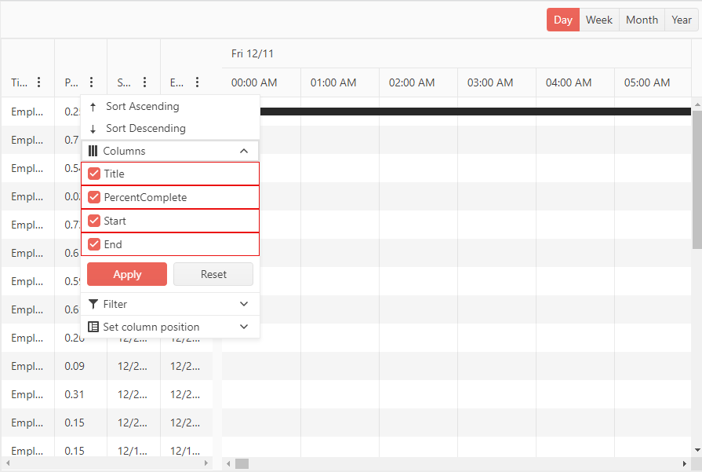

# Column Chooser Template

The Column Chooser Template lets you control the rendering of the [ColumnChooser](slug://gantt-column-menu#column-chooser). It exposes a [`context`](slug://Telerik.Blazor.Components.ColumnMenuChooserTemplateContext) object that contains a list of all columns in the Gantt. 

When you set up the Column Chooser Template, the list of columns that are rendered by default will not be present.

>caption Using the Template to provide custom rendering

````RAZOR
@* Use the Template to render the list of columns and add some custom styles. *@ 

<TelerikGantt Data="@Data"
              Width="900px"
              Height="600px"
              IdField="Id"
              ParentIdField="ParentId"
              Navigable="true"
              ColumnReorderable="true"
              Sortable="true"
              ColumnResizable="true"
              FilterMode="@GanttFilterMode.FilterMenu"
              ShowColumnMenu="true">
    <GanttSettings>
        <GanttColumnMenuSettings>
            <GanttColumnMenuChooser>
                <Template>
                    @{
                        var columns = context.Columns;
                        foreach (var column in columns)
                        {
                            <div style="border: solid 1px red">
                                <GanttColumnMenuChooserItem Title="@column.DisplayTitle" ColumnId="@column.Id" />
                            </div>
                        }
                    }
                </Template>
            </GanttColumnMenuChooser>
        </GanttColumnMenuSettings>
    </GanttSettings>
    <GanttViews>
        <GanttDayView></GanttDayView>
        <GanttWeekView></GanttWeekView>
        <GanttMonthView></GanttMonthView>
        <GanttYearView></GanttYearView>
    </GanttViews>
    <GanttColumns>
        <GanttColumn Field="@nameof(FlatModel.Title)" Id="title-column-id">
        </GanttColumn>
        <GanttColumn Field="@nameof(FlatModel.PercentComplete)" Id="percentcomplete-column-id">
        </GanttColumn>
        <GanttColumn Field="@nameof(FlatModel.Start)" Id="start-column-id">
        </GanttColumn>
        <GanttColumn Field="@nameof(FlatModel.End)" Id="end-column-id">
        </GanttColumn>
    </GanttColumns>
</TelerikGantt>

@code {
    private DateTime SelectedDate { get; set; } = new DateTime(2019, 11, 11, 6, 0, 0);

    public class FlatModel
    {
        public int Id { get; set; }
        public int? ParentId { get; set; }
        public string Title { get; set; }
        public double PercentComplete { get; set; }
        public DateTime Start { get; set; }
        public DateTime End { get; set; }
    }

    private int LastId { get; set; } = 1;
    private List<FlatModel> Data { get; set; }

    protected override void OnInitialized()
    {
        Data = new List<FlatModel>();
        var random = new Random();

        for (int i = 1; i < 6; i++)
        {
            var newItem = new FlatModel()
                {
                    Id = LastId,
                    Title = "Employee  " + i.ToString(),
                    Start = new DateTime(2020, 12, 10 + i),
                    End = new DateTime(2020, 12, 11 + i),
                    PercentComplete = Math.Round(random.NextDouble(), 2)
                };

            Data.Add(newItem);
            var parentId = LastId;
            LastId++;

            for (int j = 0; j < 5; j++)
            {
                Data.Add(new FlatModel()
                    {
                        Id = LastId,
                        ParentId = parentId,
                        Title = "    Employee " + i + " : " + j.ToString(),
                        Start = new DateTime(2020, 12, 20 + j),
                        End = new DateTime(2020, 12, 21 + i + j),
                        PercentComplete = Math.Round(random.NextDouble(), 2)
                    });

                LastId++;
            }
        }

        base.OnInitialized();
    }
}
````

>caption The result from the code snippet above



## See Also

 * [Live Demo: Gantt Templates](https://demos.telerik.com/blazor-ui/gantt/templates)
 * [Live Demo: Gantt Column Menu](https://demos.telerik.com/blazor-ui/treelist/column-menu)
 * [Live Demo: Gantt Custom Column Menu](https://demos.telerik.com/blazor-ui/gantt/custom-column-menu)
 * [Columns Menu](slug://gantt-column-menu)