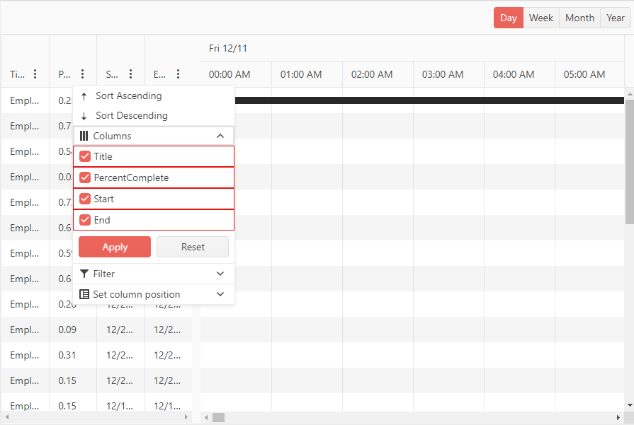

# Column Chooser Template

The Column Chooser Template lets you control the rendering of the [ColumnChooser](slug:gantt-column-menu#column-chooser). It exposes a [`context`](slug:Telerik.Blazor.Components.ColumnMenuChooserTemplateContext) object that contains a list of all columns in the Gantt. 

When you set up the Column Chooser Template, the list of columns that are rendered by default will not be present.

>caption Using the Template to provide custom rendering

<demo metaUrl="client/gantt/column-chooser/example-1/" height="740"></demo>

>caption The result from the code snippet above

## See Also

* [Live Demo: Gantt Templates](https://demos.telerik.com/blazor-ui/gantt/templates)
* [Live Demo: Gantt Column Menu](https://demos.telerik.com/blazor-ui/treelist/column-menu)
* [Live Demo: Gantt Custom Column Menu](https://demos.telerik.com/blazor-ui/gantt/custom-column-menu)
* [Columns Menu](slug:gantt-column-menu)