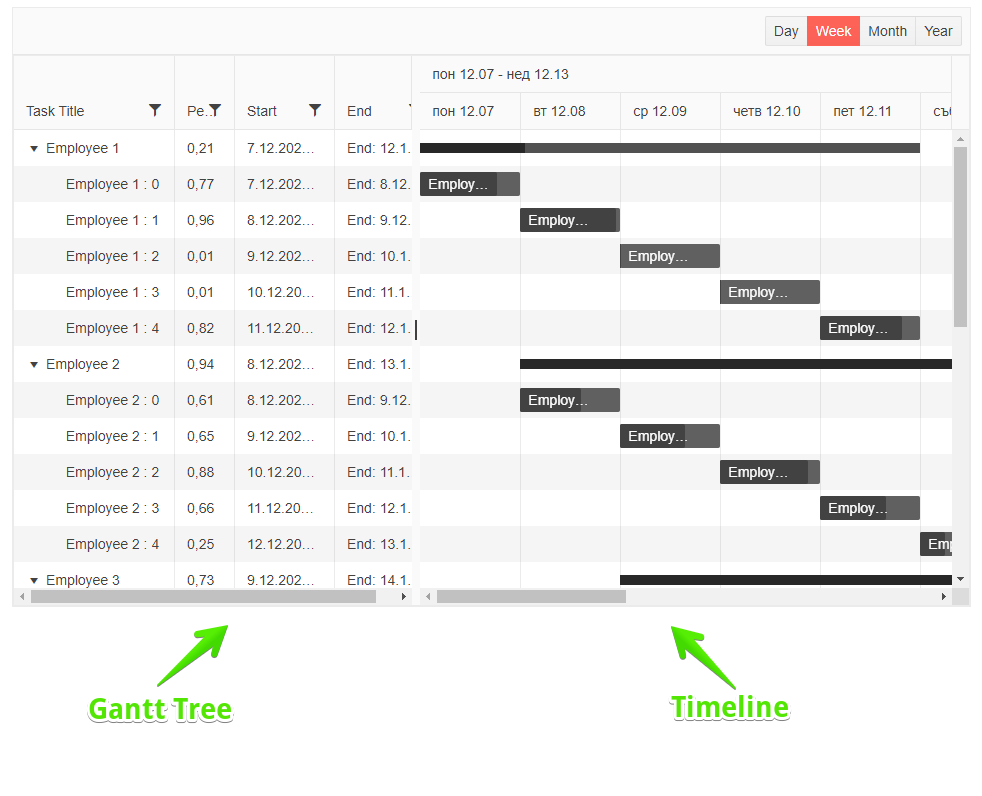
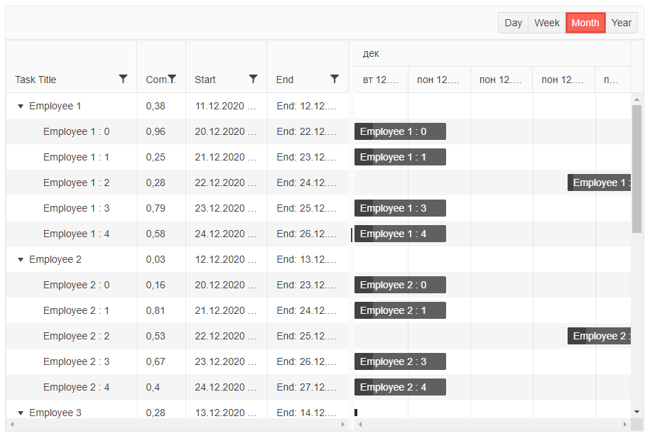

# Blazor TreeList Component Overview

The <a href = "https://www.telerik.com/blazor-ui/ganttchart" target="_blank">Blazor Gantt Chart component</a> allows you to easily illustrate a collection of tasks. The component consists of two areas: 

* the [Gantt Tree]() to the left that hosts hierarchical information on the tasks, their start and end time
* the [Timeline]() view to the right that illustrates the time-frame and the completeness of the task.

The data collection is passed to the [TreeList]() and the component will automatically render the necessary elements in the [Timeline](%slug gantt-timeline%).



#### To create a basic Telerik GanttChart:

1. Use the `TelerikGantt` tag

1. set its `Data` attribute to the variable that will hold your collection of data.
2. 
    * Read more on how to tie the model fields to the Gantt in the [Data Binding Overview]() article. In this example, we point the Gantt Chart to the location of the nested items and the field that indicates whether an Expand arrow will be generated (that there are child items).

1. under its `GanttColumns` tag, set the desired [`GanttColumn`]() instances whose `Field` property points to the name of the model field that you want to show

>caption The result from the code snippet below



>caption Get started with the Gantt Chart by providing it with a data collection and enabling its key features

````CSHTML
@* General Gantt Chart with its most common features and hierarchical data binding. 80% of this snippet is hardcoded data that is designed to look realistic *@

    <TelerikGantt Data="@Data"
                  Width="900px"
                  Height="600px"
                  IdField="Id"
                  ParentIdField="ParentId"
                  OnCancel="@(() => Console.WriteLine("CANCEL"))"
                  OnEdit="@(() => Console.WriteLine("EDIT"))"
                  OnUpdate="@UpdateItem"
                  OnDelete="@DeleteItem"
                  Sortable="true"
                  SortMode="@SortMode.Multiple"
                  FilterMode="@GanttFilterMode.FilterMenu"
                  FilterMenuType="@FilterMenuType.Menu">
        <GanttViews>
            <GanttDayView></GanttDayView>
            <GanttWeekView></GanttWeekView>
            <GanttMonthView></GanttMonthView>
            <GanttYearView></GanttYearView>
        </GanttViews>
        <GanttColumns>
            <GanttColumn Field="Id"
                         Visible="false">
            </GanttColumn>
            <GanttColumn Field="Title"
                         Expandable="true"
                         Width="160px"
                         Title="Task Title">
            </GanttColumn>
            <GanttColumn Field="PercentComplete"
                         Title="Completed"
                         Width="60px">
            </GanttColumn>
            <GanttColumn Field="Start"
                         Width="100px"
                         TextAlign="@ColumnTextAlign.Right">
            </GanttColumn>
            <GanttColumn Field="End"
                         DisplayFormat="End: {0:d}"
                         Width="100px">
            </GanttColumn>
        </GanttColumns>
    </TelerikGantt>

    @code {
        public DateTime SelectedDate { get; set; } = new DateTime(2019, 11, 11, 6, 0, 0);

        class FlatModel
        {
            public int Id { get; set; }
            public int? ParentId { get; set; }
            public string Title { get; set; }
            public double PercentComplete { get; set; }
            public DateTime Start { get; set; }
            public DateTime End { get; set; }
        }

        public int LastId { get; set; } = 1;
        List<FlatModel> Data { get; set; }

        protected override void OnInitialized()
        {
            Data = new List<FlatModel>();
            var random = new Random();

            for (int i = 1; i < 6; i++)
            {
                var newItem = new FlatModel()
                {
                    Id = LastId,
                    Title = "Employee  " + i.ToString(),
                    Start = new DateTime(2020, 12, 10 + i),
                    End = new DateTime(2020, 12, 11 + i),
                    PercentComplete = Math.Round(random.NextDouble(), 2)
                };

                Data.Add(newItem);
                var parentId = LastId;
                LastId++;

                for (int j = 0; j < 5; j++)
                {
                    Data.Add(new FlatModel()
                    {
                        Id = LastId,
                        ParentId = parentId,
                        Title = "    Employee " + i + " : " + j.ToString(),
                        Start = new DateTime(2020, 12, 20 + j),
                        End = new DateTime(2020, 12, 21 + i + j),
                        PercentComplete = Math.Round(random.NextDouble(), 2)
                    });

                    LastId++;
                }
            }

            base.OnInitialized();
        }

        private void UpdateItem(GanttUpdateEventArgs args)
        {
            var item = args.Item as FlatModel;

            var foundItem = Data.FirstOrDefault(i => i.Id.Equals(item.Id));

            if (foundItem != null)
            {
                foundItem.Title = item.Title;
                foundItem.Start = item.Start;
                foundItem.End = item.End;
                foundItem.PercentComplete = item.PercentComplete;
            }
        }

        private void DeleteItem(GanttDeleteEventArgs args)
        {
            var item = Data.FirstOrDefault(i => i.Id.Equals((args.Item as FlatModel).Id));

            RemoveChildRecursive(item);
        }

        private void RemoveChildRecursive(FlatModel item)
        {
            var children = Data.Where(i => item.Id.Equals(i.ParentId)).ToList();

            foreach (var child in children)
            {
                RemoveChildRecursive(child);
            }

            Data.Remove(item);
        }
    }
````

## Data Binding

To show data in a Telerik Gantt Chart, you need to define [GanttColumn]() instances - they take a model `Field` and exposes settings to control the [visibility]() of the column, the [format of the displayed data](), the [expanded state]() of the node, and the [text alignment]().

>tip The Telerik Blazor Gantt Chart is data source agnostic - you can use any database and service according to your project, you only need to get the collection of data models to the Gantt Chart in the view-model of the component hosting it.

The following list of resources provides examples for data binding a Gantt Chart in various scenarios:

* General information on how data binding works - [Gantt Chart Data Binding Overview]().

* Binding to a self-referencing flat data source - [Bind the Gantt Chart to Flat Self-Referencing Data]().

* Using hierarchical data source with item collections nested in each item - [Bind the Gantt Chart to Hierarchical Data]().


## Blazor Gantt Chart Reference

The Gantt Chart is a generic component, and to store a reference, you must use the model type that you pass to its `Data` when declaring the variable.

>caption Store a reference to a Telerik Gantt Chart

````CSHTML
@* The reference type depends on the Data model type *@

<TelerikGantt @ref="@TelerikGanttRef"
              Data="@Data"
              Width="100%"
              Height="600px"
              IdField="Id"
              ParentIdField="ParentId"
              OnUpdate="@UpdateItem"
              OnDelete="@DeleteItem"
              OnCreate="@CreateItem"
              Sortable="true"
              SortMode="@SortMode.Multiple"
              FilterMode="@GanttFilterMode.FilterMenu"
              FilterMenuType="@FilterMenuType.Menu">
    <GanttToolBar>
        <GanttCommandButton Command="Add" Icon="add">Add</GanttCommandButton>
    </GanttToolBar>
    <GanttViews>
        <GanttDayView></GanttDayView>
        <GanttWeekView></GanttWeekView>
        <GanttMonthView></GanttMonthView>
        <GanttYearView></GanttYearView>
    </GanttViews>
    <GanttColumns>
        <GanttColumn Field="Id"
                     Visible="false">
        </GanttColumn>
        <GanttColumn Field="Title"
                     Expandable="true"
                     Width="160px"
                     Title="Task Title">
        </GanttColumn>
        <GanttColumn Field="PercentComplete"
                     Width="60px">
        </GanttColumn>
        <GanttColumn Field="Start"
                     Width="100px"
                     TextAlign="@ColumnTextAlign.Right">
        </GanttColumn>
        <GanttColumn Field="End"
                     DisplayFormat="End: {0:d}"
                     Width="100px">
        </GanttColumn>
        <GanttCommandColumn>
            <GanttCommandButton Command="Add" Icon="add"></GanttCommandButton>
            <GanttCommandButton Command="Delete" Icon="delete"></GanttCommandButton>
        </GanttCommandColumn>
    </GanttColumns>
</TelerikGantt>

@code {
    private TelerikGantt<FlatModel> TelerikGanttRef { get; set; }

    public DateTime SelectedDate { get; set; } = new DateTime(2019, 11, 11, 6, 0, 0);

    class FlatModel
    {
        public int Id { get; set; }
        public int? ParentId { get; set; }
        public string Title { get; set; }
        public double PercentComplete { get; set; }
        public DateTime Start { get; set; }
        public DateTime End { get; set; }
    }

    public int LastId { get; set; } = 1;
    List<FlatModel> Data { get; set; }

    protected override void OnInitialized()
    {
        Data = new List<FlatModel>();
        var random = new Random();

        for (int i = 1; i < 6; i++)
        {
            var newItem = new FlatModel()
            {
                Id = LastId,
                Title = "Employee  " + i.ToString(),
                Start = new DateTime(2020, 12, 6 + i),
                End = new DateTime(2020, 12, 11 + i),
                PercentComplete = Math.Round(random.NextDouble(), 2)
            };

            Data.Add(newItem);
            var parentId = LastId;
            LastId++;

            for (int j = 0; j < 5; j++)
            {
                Data.Add(new FlatModel()
                {
                    Id = LastId,
                    ParentId = parentId,
                    Title = "    Employee " + i + " : " + j.ToString(),
                    Start = new DateTime(2020, 12, 6 + i + j),
                    End = new DateTime(2020, 12, 7 + i + j),
                    PercentComplete = Math.Round(random.NextDouble(), 2)
                });

                LastId++;
            }
        }

        base.OnInitialized();
    }

    private void CreateItem(GanttCreateEventArgs args)
    {
        var argsItem = args.Item as FlatModel;

        argsItem.Id = LastId++;

        if (args.ParentItem != null)
        {
            var parent = (FlatModel)args.ParentItem;

            argsItem.ParentId = parent.Id;
        }

        Data.Insert(0, argsItem);

        CalculateParentPercentRecursive(argsItem);
        CalculateParentRangeRecursive(argsItem);
    }

    private void UpdateItem(GanttUpdateEventArgs args)
    {
        var item = args.Item as FlatModel;

        var foundItem = Data.FirstOrDefault(i => i.Id.Equals(item.Id));

        if (foundItem != null)
        {
            var startOffset = item.Start - foundItem.Start;
            if (startOffset != TimeSpan.Zero)
            {
                MoveChildrenRecursive(foundItem, startOffset);
            }

            foundItem.Title = item.Title;
            foundItem.Start = item.Start;
            foundItem.End = item.End;
            foundItem.PercentComplete = item.PercentComplete;
        }

        CalculateParentPercentRecursive(foundItem);
        CalculateParentRangeRecursive(foundItem);
    }

    private void DeleteItem(GanttDeleteEventArgs args)
    {
        var item = Data.FirstOrDefault(i => i.Id.Equals((args.Item as FlatModel).Id));

        RemoveChildRecursive(item);

        CalculateParentPercentRecursive(item);
        CalculateParentRangeRecursive(item);
    }

    private void RemoveChildRecursive(FlatModel item)
    {
        var children = GetChildren(item).ToList();

        foreach (var child in children)
        {
            RemoveChildRecursive(child);
        }

        Data.Remove(item);
    }

    private void CalculateParentPercentRecursive(FlatModel item)
    {
        if (item.ParentId != null)
        {
            var parent = GetParent(item);

            var children = GetChildren(parent);

            if (children.Any())
            {
                parent.PercentComplete = children.Average(i => i.PercentComplete);

                CalculateParentPercentRecursive(parent);
            }
        }
    }

    private void CalculateParentRangeRecursive(FlatModel item)
    {
        if (item.ParentId != null)
        {
            var parent = GetParent(item);

            var children = GetChildren(parent);

            if (children.Any())
            {
                parent.Start = children.Min(i => i.Start);
                parent.End = children.Max(i => i.End);

                CalculateParentRangeRecursive(parent);
            }
        }
    }

    private void MoveChildrenRecursive(FlatModel item, TimeSpan offset)
    {
        var children = GetChildren(item);

        foreach (var child in children)
        {
            child.Start = child.Start.Add(offset);
            child.End = child.End.Add(offset);

            MoveChildrenRecursive(child, offset);
        }
    }

    private FlatModel GetParent(FlatModel item)
    {
        return Data.FirstOrDefault(i => i.Id.Equals(item.ParentId));
    }

    private IEnumerable<FlatModel> GetChildren(FlatModel item)
    {
        return Data.Where(i => item.Id.Equals(i.ParentId));
    }
}
````

## Editing

The Gantt Chart can perform CRUD operations on its current data collection and exposes events that let you control the operations and transfer changes to the actual data source. You can edit both the tasks in the [TreeList]() and their respective representation in the [Timeline]().

## Sorting

The Gantt Chart can sort data automatically. You can read more about this feature in the [Sorting]() article.

## Filtering

The Gantt Chart can filter data automatically. You can read more about this feature in the [Filtering]() article.


## Tree Column Features

The columns of the Gantt TreeList are one of its main building blocks and they offer a rich set of functionality to enable great flexibility for your application scenarios.

>caption Column features include

* [Display Format]()

* [Visibility]()

* [Expandable]()

* [TextAlign]()


## Toolbar

You can define user actions in a [dedicated toolbar](). For the moment, they are mostly custom actions, but in future versions you will be able to add features like exporting there.

## Scrolling

When the total column width exceeds the width of the Gantt Chart, you will get a horizontal scrollbar.

When the height of the rows exceeds the Height of the Gantt Chart, you will get a vertical scrollbar.

## Styling

You can customize the rendering of the items in the [Timeline]() by using the exposed [Templates]().

You can also set the [`Height` of the Gantt](), and you can use the `Class` to provide more complex CSS rules (like ones that will be inherited in a template).

## See Also

  * [Live Demos: Gantt](https://demos.telerik.com/blazor-ui/gantt/index)
  * [Gantt Tree]()
  * [Timeline]() 
  * [API Reference](https://docs.telerik.com/blazor-ui/api/Telerik.Blazor.Components.TelerikGantt-1)
