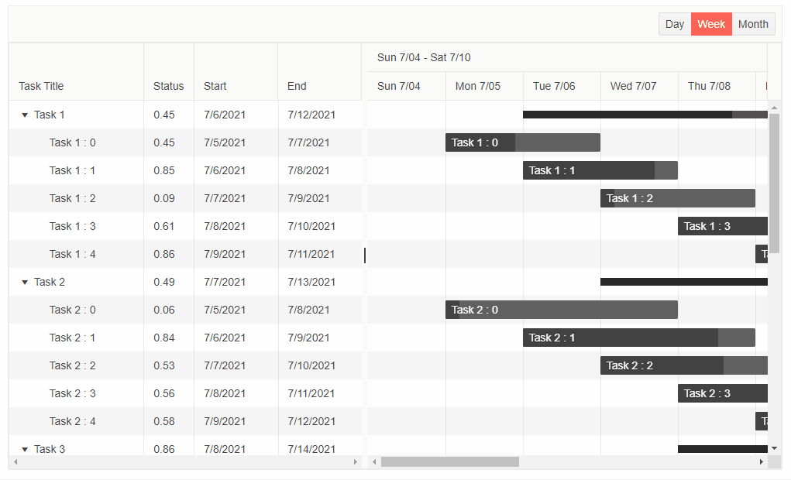

# Timeline Editing

The Gantt component allows you to initiate editing from its Timeline component in several ways. The updates will be accordingly applied in both Gantt components - Gantt Tree and Timeline.

* [Popup Editing](#popup-editing)

* [Drag Tasks](#drag-tasks)

* [Resize Tasks](#resize-tasks)

* [Drag Handle](#drag-handle)

* [Delete Tasks](#delete-tasks)


>caption Edit the Gantt records from the Timeline by double clicking on a task, drag, resize or delete it. The result from the snippet below.



````CSHTML
@* Edit the Gantt records from the Timeline component *@

<TelerikGantt Data="@Data"
              @bind-View="@SelectedView"
              Width="1000px"
              Height="600px"
              IdField="Id"
              ParentIdField="ParentId"
              OnUpdate="@UpdateItem"
              OnDelete="@DeleteItem">
    <GanttColumns>
        <GanttColumn Field="Title"
                     Expandable="true"
                     Width="160px"
                     Title="Task Title">
        </GanttColumn>
        <GanttColumn Field="PercentComplete"
                     Title="Status"
                     Width="60px">
        </GanttColumn>
        <GanttColumn Field="Start"
                     Width="100px"
                     DisplayFormat="{0:d}">
        </GanttColumn>
        <GanttColumn Field="End"
                     Width="100px"
                     DisplayFormat="{0:d}">
        </GanttColumn>
    </GanttColumns>
    <GanttViews>
        <GanttDayView></GanttDayView>
        <GanttWeekView></GanttWeekView>
        <GanttMonthView></GanttMonthView>
    </GanttViews>
</TelerikGantt>

@code {
    public GanttView SelectedView { get; set; } = GanttView.Week;

    List<FlatModel> Data { get; set; }

    class FlatModel
    {
        public int Id { get; set; }
        public int? ParentId { get; set; }
        public string Title { get; set; }
        public double PercentComplete { get; set; }
        public DateTime Start { get; set; }
        public DateTime End { get; set; }
    }

    public int LastId { get; set; } = 1;

    protected override void OnInitialized()
    {
        Data = new List<FlatModel>();
        var random = new Random();

        for (int i = 1; i < 6; i++)
        {
            var newItem = new FlatModel()
            {
                Id = LastId,
                Title = "Task  " + i.ToString(),
                Start = new DateTime(2021, 7, 5 + i),
                End = new DateTime(2021, 7, 11 + i),
                PercentComplete = Math.Round(random.NextDouble(), 2)
            };

            Data.Add(newItem);
            var parentId = LastId;
            LastId++;

            for (int j = 0; j < 5; j++)
            {
                Data.Add(new FlatModel()
                {
                    Id = LastId,
                    ParentId = parentId,
                    Title = "    Task " + i + " : " + j.ToString(),
                    Start = new DateTime(2021, 7, 5 + j),
                    End = new DateTime(2021, 7, 6 + i + j),
                    PercentComplete = Math.Round(random.NextDouble(), 2)
                });

                LastId++;
            }
        }

        base.OnInitialized();
    }

    private void UpdateItem(GanttUpdateEventArgs args)
    {
        var item = args.Item as FlatModel;

        var foundItem = Data.FirstOrDefault(i => i.Id.Equals(item.Id));

        if (foundItem != null)
        {
            foundItem.Title = item.Title;
            foundItem.Start = item.Start;
            foundItem.End = item.End;
            foundItem.PercentComplete = item.PercentComplete;
        }
    }

    private void DeleteItem(GanttDeleteEventArgs args)
    {
        var item = Data.FirstOrDefault(i => i.Id.Equals((args.Item as FlatModel).Id));

        RemoveChildRecursive(item);
    }

    private void RemoveChildRecursive(FlatModel item)
    {
        var children = Data.Where(i => item.Id.Equals(i.ParentId)).ToList();

        foreach (var child in children)
        {
            RemoveChildRecursive(child);
        }

        Data.Remove(item);
    }
}
````

## Popup Editing

You can invoke popup editing of a task by double clicking on it. A Popup container will be displayed containing the default editors for the fields defined in the Gantt.

If you have set the corresponding handlers, you will be able to Save or Cancel the editing operation, or Delete the record.

## Drag Tasks

The Gantt allows you to horizontally drag the tasks in the Timeline component. Once the task is dropped in the desired slot, its Start and End fields in the Gantt Tree will be updated. Tasks editing through dragging can be applied to all kinds of tasks (regular, summary and milestone).

## Resize Tasks

You are able to resize the tasks by expanding and collapsing their width through side handles. Thus, you can update the Start/End time of a certain task as well as its duration. Once the handles are released, the Start and End fields of the task in the Gantt Tree will be updated. Tasks editing through resizing can be applied only to the regular tasks.

## Drag Handle

When a task is hovered a drag handle is rendered underneath its status bar. It allows you to drag it and thus update the completeness of the task. Once the handle is dropped, the Percent Complete field of the Gantt will be updated for the corresponding task. Updating the task status can be applied only to the regular tasks.

## Delete Tasks

By default, a delete button is rendered on the right side of a task when it is hovered. Pressing it will delete the corresponding task from the Timeline and Tree components.

## See Also

  * [Live Demo: Gantt Editing](https://demos.telerik.com/blazor-ui/gantt/editing-incell)