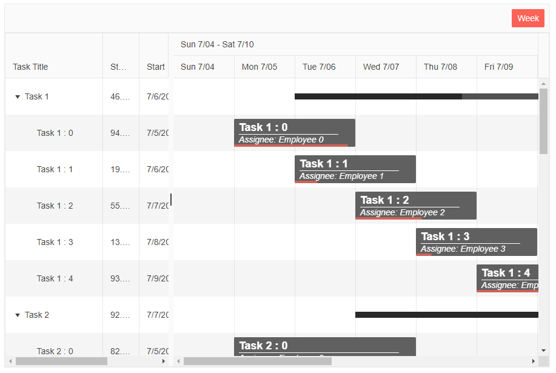

# TaskTemplate

The `TaskTemplate` provides you with full control over the rendering of the Timeline tasks.
It is applied on regular tasks (not summary or milestone).

The `TaskTemplate` is of type `RenderFragment<TItem>`, so the `context` has the datatype of the model. Therefore, no casting is needed in the template.

>caption Customize the Tasks content and appearance through a `TaskTemplate`. The result from the snippet.




````CSHTML
@* Customize the content of the tasks through the TaskTemplate *@

<TelerikGantt Data="@Data"
              Width="900px"
              Height="600px"
              IdField="Id"
              ParentIdField="ParentId"
              RowHeight="60"
              OnUpdate="@UpdateItem"
              OnDelete="@DeleteItem">
    <TaskTemplate>
            <div class="task-title">@context.Title</div>
            <div class="task-assignee">Assignee: @context.Assignee</div>
            <div class="progress" style="width:@(context.PercentComplete * 100)%"></div>
    </TaskTemplate>
    <GanttColumns>
        <GanttColumn Field="Title"
                     Expandable="true"
                     Width="160px"
                     Title="Task Title">
        </GanttColumn>
        <GanttColumn Field="PercentComplete"
                     Title="Status"
                     Width="60px"
                     DisplayFormat="{0:P}">
        </GanttColumn>
        <GanttColumn Field="Start"
                     Width="100px"
                     DisplayFormat="{0:d}">
        </GanttColumn>
        <GanttColumn Field="End"
                     Width="100px"
                     DisplayFormat="{0:d}">
        </GanttColumn>
    </GanttColumns>
    <GanttViews>
        <GanttWeekView></GanttWeekView>
    </GanttViews>
</TelerikGantt>

@code {
    List<FlatModel> Data { get; set; }

    class FlatModel
    {
        public int Id { get; set; }
        public int? ParentId { get; set; }
        public string Title { get; set; }
        public double PercentComplete { get; set; }
        public DateTime Start { get; set; }
        public DateTime End { get; set; }
        public string Assignee { get; set; }
    }

    public int LastId { get; set; } = 1;

    protected override void OnInitialized()
    {
        Data = new List<FlatModel>();
        var random = new Random();

        for (int i = 1; i < 6; i++)
        {
            var newItem = new FlatModel()
            {
                Id = LastId,
                Title = "Task  " + i.ToString(),
                Start = new DateTime(2021, 7, 5 + i),
                End = new DateTime(2021, 7, 11 + i),
                PercentComplete = Math.Round(random.NextDouble(), 2)
            };

            Data.Add(newItem);
            var parentId = LastId;
            LastId++;

            for (int j = 0; j < 5; j++)
            {
                Data.Add(new FlatModel()
                {
                    Id = LastId,
                    ParentId = parentId,
                    Title = "    Task " + i + " : " + j.ToString(),
                    Start = new DateTime(2021, 7, 5 + j),
                    End = new DateTime(2021, 7, 6 + i + j),
                    PercentComplete = Math.Round(random.NextDouble(), 2),
                    Assignee = "    Employee " + j
                });

                LastId++;
            }
        }

        base.OnInitialized();
    }

    private void UpdateItem(GanttUpdateEventArgs args)
    {
        var item = args.Item as FlatModel;

        var foundItem = Data.FirstOrDefault(i => i.Id.Equals(item.Id));

        if (foundItem != null)
        {
            foundItem.Title = item.Title;
            foundItem.Start = item.Start;
            foundItem.End = item.End;
            foundItem.PercentComplete = item.PercentComplete;
        }
    }

    private void DeleteItem(GanttDeleteEventArgs args)
    {
        var item = Data.FirstOrDefault(i => i.Id.Equals((args.Item as FlatModel).Id));

        RemoveChildRecursive(item);
    }

    private void RemoveChildRecursive(FlatModel item)
    {
        var children = Data.Where(i => item.Id.Equals(i.ParentId)).ToList();

        foreach (var child in children)
        {
            RemoveChildRecursive(child);
        }

        Data.Remove(item);
    }
}

<style>
    .task-title {
        font-size: 18px;
        font-weight: bold;
        border-bottom: 1px solid;
    }

    .task-assignee {
        font-style: italic;
    }

    .progress {
        position: absolute;
        left: 0;
        bottom: 0;
        height: 4px;
        background: rgba(252, 98, 87, .7);
    }
</style>
````

## See Also

  * [Live Demo: Gantt Templates](https://demos.telerik.com/blazor-ui/gantt/templates)