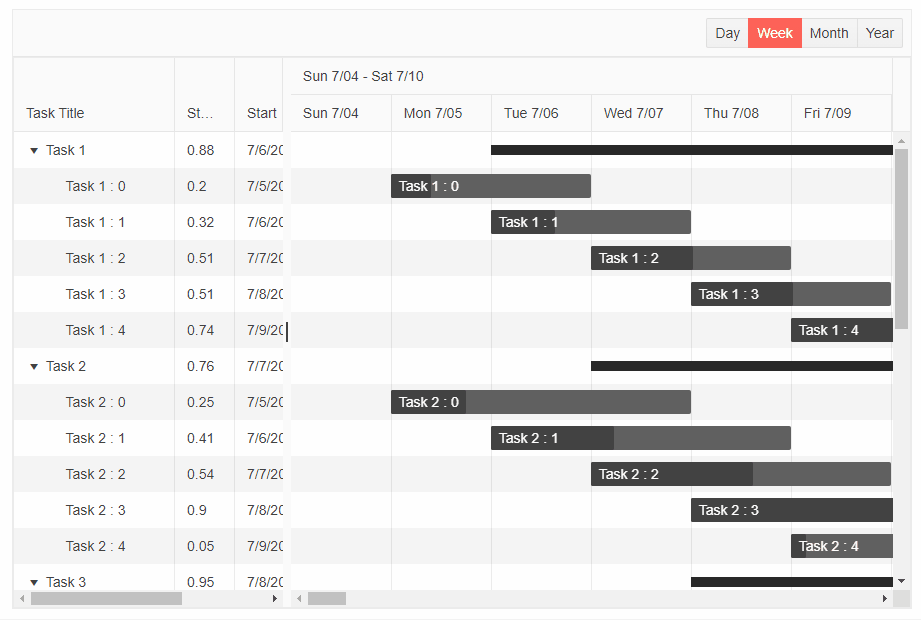

# Timeline Views

The Gantt Timeline provides four predefined views, which dictate how much time a single time slot represents:

* `DayView` - each slot is a single hour. Main Header row shows the day, and the secondary row shows each hour slot.

* `WeekView` - each slot is a single day. Main Header row shows the week, and the secondary row shows each day slot.

* `MonthView` - each slot is a whole week. Main Header row shows the month, and the secondary row shows each week slot.

* `YearView` - each slot is whole month. Main Header row shows the year, and the secondary row shows each month slot.

## Basics

### To use the desired Views for the Timeline:

1. Under the `<GanttViews>` define the desired views. (You should include at least one view that the Timeline will display, otherwise the component will throw an exception).

2. Use the features the views expose to control their setup

>caption Define and configure the Gantt Timeline Views. The result from the snippet




````CSHTML

<TelerikGantt Data="@Data"
              @bind-View="@SelectedView"
              Width="900px"
              Height="600px"
              IdField="Id"
              ParentIdField="ParentId"              
              OnUpdate="@UpdateItem"
              OnDelete="@DeleteItem">
    <GanttViews>
        <GanttDayView SlotWidth="80"
                      RangeStart="@(new DateTime(2021, 7, 5, 0, 0, 0))"
                      RangeEnd="@(new DateTime(2021, 8, 31, 0, 0, 0))">
        </GanttDayView>
        <GanttWeekView SlotWidth="100"
                       RangeStart="@(new DateTime(2021, 7, 5, 0, 0, 0))"
                       RangeEnd="@(new DateTime(2021, 10, 1, 0, 0, 0))">
        </GanttWeekView>
        <GanttMonthView SlotWidth="100"
                        RangeStart="@(new DateTime(2021, 7, 1, 0, 0, 0))"
                        RangeEnd="@(new DateTime(2021, 12, 1, 0, 0, 0))">
        </GanttMonthView>
        <GanttYearView SlotWidth="30"
                       RangeStart="@(new DateTime(2021, 1, 1, 0, 0, 0))"
                       RangeEnd="@(new DateTime(2022, 12, 31, 0, 0, 0))">
        </GanttYearView>
    </GanttViews>
    <GanttColumns>       
        <GanttColumn Field="Title"
                     Expandable="true"
                     Width="160px"
                     Title="Task Title">
        </GanttColumn>
        <GanttColumn Field="PercentComplete"
                     Title="Status"
                     Width="60px">
        </GanttColumn>
        <GanttColumn Field="Start"
                     Width="100px"
                     DisplayFormat="{0:d}">
        </GanttColumn>
        <GanttColumn Field="End"                     
                     Width="100px"
                     DisplayFormat="{0:d}">
        </GanttColumn>
    </GanttColumns>
</TelerikGantt>

@code {
    public GanttView SelectedView { get; set; } = GanttView.Week;

    List<FlatModel> Data { get; set; }

    class FlatModel
    {
        public int Id { get; set; }
        public int? ParentId { get; set; }
        public string Title { get; set; }
        public double PercentComplete { get; set; }
        public DateTime Start { get; set; }
        public DateTime End { get; set; }
    }

    public int LastId { get; set; } = 1;

    protected override void OnInitialized()
    {
        Data = new List<FlatModel>();
        var random = new Random();

        for (int i = 1; i < 6; i++)
        {
            var newItem = new FlatModel()
            {
                Id = LastId,
                Title = "Task  " + i.ToString(),
                Start = new DateTime(2021, 7, 5 + i),
                End = new DateTime(2021, 7, 11 + i),
                PercentComplete = Math.Round(random.NextDouble(), 2)
            };

            Data.Add(newItem);
            var parentId = LastId;
            LastId++;

            for (int j = 0; j < 5; j++)
            {
                Data.Add(new FlatModel()
                {
                    Id = LastId,
                    ParentId = parentId,
                    Title = "    Task " + i + " : " + j.ToString(),
                    Start = new DateTime(2021, 7, 5 + j),
                    End = new DateTime(2021, 7, 6 + i + j),
                    PercentComplete = Math.Round(random.NextDouble(), 2)
                });

                LastId++;
            }
        }

        base.OnInitialized();
    }

    private void UpdateItem(GanttUpdateEventArgs args)
    {
        var item = args.Item as FlatModel;

        var foundItem = Data.FirstOrDefault(i => i.Id.Equals(item.Id));

        if (foundItem != null)
        {
            foundItem.Title = item.Title;
            foundItem.Start = item.Start;
            foundItem.End = item.End;
            foundItem.PercentComplete = item.PercentComplete;
        }
    }

    private void DeleteItem(GanttDeleteEventArgs args)
    {
        var item = Data.FirstOrDefault(i => i.Id.Equals((args.Item as FlatModel).Id));

        RemoveChildRecursive(item);
    }

    private void RemoveChildRecursive(FlatModel item)
    {
        var children = Data.Where(i => item.Id.Equals(i.ParentId)).ToList();

        foreach (var child in children)
        {
            RemoveChildRecursive(child);
        }

        Data.Remove(item);
    }
}
````


## Features

* `SlotWidth` - `double` - the width of each individual slot in pixels.

* `RangeStart` - `DateTime` - determines where the view should start. If not provided, the value is calculated based on the data source. If no data is present `DateTime.Now` is used, and the view shows a single major time slot (a day in `DayView`, month in `MonthView` and so on).

* `RangeEnd` - `DateTime` - determines where the view should end. If not provided the value is calculated based on the data source.

## See Also

  * [Live Demo: Gantt Views](https://demos.telerik.com/blazor-ui/treelist/editing-inline)