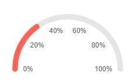
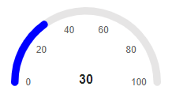
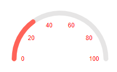
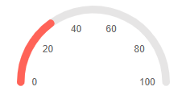
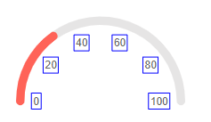

## Arc Gauge Labels

You can customize the appearance of the labels rendered on the [scale]() of the Arc Gauge by using the `<ArcGaugeScaleLabels>`, child tag of the `<ArcGaugeScale>`, and the parameters it exposes:

* [Format](#format)

* [Center Template](#center-template)

* [Color](#color)

* [Visible](#visible)

* [Position](#position)

* [Additional Customization](#additional-customization)

## Format

The `Format` (`string`) parameter allows you to customize the rendering of the labels by using the <a href="https://docs.microsoft.com/en-us/dotnet/standard/base-types/standard-numeric-format-strings" target="_blank">standard numeric format strings</a>. You can set the values of the labels to showcase, for example, currency, percentage, and so on.

>caption Use the Format parameter to showcase currency. The result from the code snippet below.



````CSHTML
@* Use the {0:P0} format string to format the values of the labels as percentage. *@

<TelerikArcGauge>
    <ArcGaugeScales>
        <ArcGaugeScale Min="0" Max="1">
            <ArcGaugeScaleLabels Visible="true" Format="{0:P0}" />
        </ArcGaugeScale>
    </ArcGaugeScales>

    <ArcGaugePointers>

        <ArcGaugePointer Value="0.3">
            
        </ArcGaugePointer>

    </ArcGaugePointers>
</TelerikArcGauge>
````

## Center Template

The center template allows you to take control of the rendering of the central section of the Arc Gauge. It provides a `context` object (`GaugeCenterLabelTemplateContext`) with exposes a list that holds the pointer in the component.

>caption Use the Center Template to display the Value of the pointer. The result from the code snippet below.



````CSHTML
@* Print the value of the pointer in the center of the component *@

<TelerikArcGauge>
    <ArcGaugeCenterLabel>
        <Template>
            @{
                var item = context;

                var pointer = context.Pointers.FirstOrDefault();

                <div style="font-weight: bold">@pointer.Value</div>
            }
        </Template>
    </ArcGaugeCenterLabel>
    <ArcGaugeScales>
        <ArcGaugeScale Min="0" Max="100">
            <ArcGaugeScaleLabels Visible="true" />
        </ArcGaugeScale>
    </ArcGaugeScales>

    <ArcGaugePointers>

        <ArcGaugePointer Value="30" Color="blue">
            
        </ArcGaugePointer>

    </ArcGaugePointers>
</TelerikArcGauge>
````

## Color

The `Color` (`string`) parameter controls the color of the labels. It accepts **CSS**, **HEX** and **RGB** colors.

>caption Change the color of the labels. The result from the code snippet below.



````CSHTML
@* Change the color of the labels to red *@

<TelerikArcGauge>
    <ArcGaugeScales>
        <ArcGaugeScale Min="0" Max="100">
            <ArcGaugeScaleLabels Visible="true" Color="red" />
        </ArcGaugeScale>
    </ArcGaugeScales>

    <ArcGaugePointers>

        <ArcGaugePointer Value="30">
            
        </ArcGaugePointer>

    </ArcGaugePointers>
</TelerikArcGauge>

````

## Visible

The `Visible` (`bool`) parameter controls wether the labels will be rendered. By default the labels would not be rendered.

>caption Show the labels by using the Visible parameter. The result from the code snippet below



````CSHTML
@* Set the Visible parameter to true to show the labels *@

<TelerikArcGauge>
    <ArcGaugeScales>
        <ArcGaugeScale Min="0" Max="100">
            <ArcGaugeScaleLabels Visible="true" />
        </ArcGaugeScale>
    </ArcGaugeScales>

    <ArcGaugePointers>

        <ArcGaugePointer Value="30">
            
        </ArcGaugePointer>

    </ArcGaugePointers>
</TelerikArcGauge>
````

## Additional Customization

@[template](/_contentTemplates/gauges/additional-customization.md#linear-gauge-additional-customization)

>caption Customize the borders of the Labels. The result from the code snippet below.



````CSHTML
@* Provide color, solid outline and custom width to the label borders *@

<TelerikArcGauge>
    <ArcGaugeScales>
        <ArcGaugeScale Min="0" Max="100">
            <ArcGaugeScaleLabels Visible="true">
                <ArcGaugeScaleLabelsBorder Color="blue" DashType="@DashType.Solid" Width="1"></ArcGaugeScaleLabelsBorder>
            </ArcGaugeScaleLabels>
        </ArcGaugeScale>
    </ArcGaugeScales>

    <ArcGaugePointers>

        <ArcGaugePointer Value="30">
            
        </ArcGaugePointer>

    </ArcGaugePointers>
</TelerikArcGauge>
````

## See Also

* [Arc Gauge: Overview]()
* [Arc Gauge: Scale]()
* [Arc Gauge: Pointers]()
