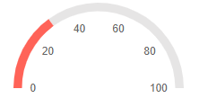
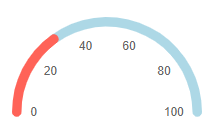
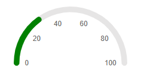
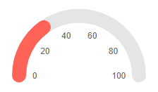

# Arc Gauge Pointers

The pointers are the values that will be marked on the scale. You can customize them through the parameters they expose:

* [LineCap](#linecap)

* [PlaceholderColor](#placeholdercolor)

* [Color](#color)

* [Size](#size)

## LineCap

The `LineCap` parameter controls the shape of the scale ending and takes a member of the `ArcGaugePointerLineCap` enum:

* `Round` - by default the shape of the scale ending would be round

* `Butt` 

>caption Change the shape of the scale. The result from the code snippet below.



````CSHTML
@* Use a flat shape for the end of the scale *@

<TelerikArcGauge>
    <ArcGaugeScales>
        <ArcGaugeScale>
            <ArcGaugeScaleLabels Visible="true" />
        </ArcGaugeScale>
    </ArcGaugeScales>

    <ArcGaugePointers>

        <ArcGaugePointer Value="30" LineCap="@ArcGaugePointerLineCap.Butt">
        </ArcGaugePointer>

    </ArcGaugePointers>
</TelerikArcGauge>
````

## PlaceholderColor

The `PlaceholderColor` (`string`) parameter controls the background color of the ponter. It accepts **CSS**, **HEX** and **RGB** colors.

>caption Change the background color of the pointer. The result from the code snippet below:



````CSHTML
@* Set the PlaceholderColor to light blue *@

<TelerikArcGauge>
    <ArcGaugeScales>
        <ArcGaugeScale>
            <ArcGaugeScaleLabels Visible="true" />
        </ArcGaugeScale>
    </ArcGaugeScales>

    <ArcGaugePointers>

        <ArcGaugePointer Value="30" PlaceholderColor="lightblue">
        </ArcGaugePointer>

    </ArcGaugePointers>
</TelerikArcGauge>
````

## Color

The `Color` (`string`) parameter controls the color of the pointer. It accepts **CSS**, **HEX** and **RGB** colors.

>caption Change the color of the pointer. The result from the code snippet below



````CSHTML
@* Change the color of the pointer to green *@

<TelerikArcGauge>
    <ArcGaugeScales>
        <ArcGaugeScale>
            <ArcGaugeScaleLabels Visible="true" />
        </ArcGaugeScale>
    </ArcGaugeScales>

    <ArcGaugePointers>

        <ArcGaugePointer Value="30" Color="green">
        </ArcGaugePointer>

    </ArcGaugePointers>
</TelerikArcGauge>
````

## Size

The `Size` (`double`) parameter controls the size of the pointer. 



````CSHTML
@* Change the sizes of the pointer *@ 

<TelerikArcGauge>
    <ArcGaugeScales>
        <ArcGaugeScale>
            <ArcGaugeScaleLabels Visible="true" />
        </ArcGaugeScale>
    </ArcGaugeScales>

    <ArcGaugePointers>

        <ArcGaugePointer Value="30" Size="20">
        </ArcGaugePointer>

    </ArcGaugePointers>
</TelerikArcGauge>
````

## See Also

* [Arc Gauge: Overview]()
* [Arc Gauge: Scale]()
