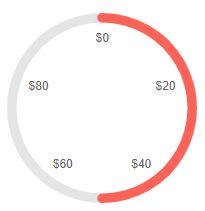
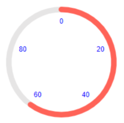
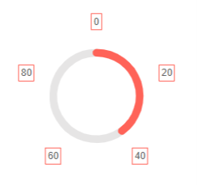

# Circular Gauge Labels

You can customize the appearance of the labels rendered on the [scale]() of the Circular Gauge by using the `<CircularGaugeScaleLabels>`, child tag of the `<CircularGaugeScale>`, and the parameters it exposes:

* [Format](#format)

* [Color](#color)

* [Visible](#visible)

* [Additional Customization](#additional-customization)

## Format

The `Format` (`string`) parameter allows you to customize the rendering of the labels by using the <a href="https://docs.microsoft.com/en-us/dotnet/standard/base-types/standard-numeric-format-strings" target="_blank">standard numeric format strings</a>. You can set the values of the labels to showcase, for example, currency, percentage, and so on.

>caption Use the Format parameter to showcase currency. The result from the code snippet below.



````CSHTML
@* Use the {0:C0} format string to format the values of the labels as currency. *@


<TelerikCircularGauge>
    <CircularGaugeScales>

        <CircularGaugeScale>           
            <CircularGaugeScaleLabels Format="{0:C0}" Visible="true"></CircularGaugeScaleLabels>
        </CircularGaugeScale>

    </CircularGaugeScales>

    <CircularGaugePointers>

        <CircularGaugePointer Value="50">
        </CircularGaugePointer>

    </CircularGaugePointers>
</TelerikCircularGauge>
````

## Color

The `Color` (`string`) parameter controls the color of the labels. It accepts **CSS**, **HEX** and **RGB** colors.

>caption Change the color of the labels. The result from the code snippet below.



````CSHTML
@* Change the color of the labels to blue *@

<TelerikCircularGauge>
    <CircularGaugeScales>

        <CircularGaugeScale>           
            <CircularGaugeScaleLabels Color="blue" Visible="true"></CircularGaugeScaleLabels>
        </CircularGaugeScale>

    </CircularGaugeScales>

    <CircularGaugePointers>

        <CircularGaugePointer Value="60">
        </CircularGaugePointer>

    </CircularGaugePointers>
</TelerikCircularGauge>
````

## Visible

The `Visible` (`bool`) parameter controls wether the labels will be rendered. Its default value is `false`. If you want to display the labels include the `<CircularGaugeScaleLabels>` tag in the `<CircularGaugeScale>` and set its `Visible` parameter to `true`.

>caption Show the labels by using the Visible parameter. The result from the code snippet below


````CSHTML
@* Set the Visible parameter to true to show the labels *@

<TelerikCircularGauge>
    <CircularGaugeScales>

        <CircularGaugeScale>           
            <CircularGaugeScaleLabels Visible="true"></CircularGaugeScaleLabels>
        </CircularGaugeScale>

    </CircularGaugeScales>

    <CircularGaugePointers>

        <CircularGaugePointer Value="40">
        </CircularGaugePointer>

    </CircularGaugePointers>
</TelerikCircularGauge>
````

## Additional Customization

@[template](/_contentTemplates/gauges/additional-customization.md#circular-gauge-additional-customization)

>caption Customize the background and the margin of the Labels. The result from the code snippet below.



````CSHTML
@* Customize the position, border and padding of the labels. *@

<TelerikCircularGauge>
    <CircularGaugeScales>

        <CircularGaugeScale>
            <CircularGaugeScaleLabels Position="CircularGaugeScaleLabelsPosition.Outside" Visible="true">
                <CircularGaugeScaleLabelsBorder Width="1" Color="rgb(255,99,88)" DashType="DashType.Solid"></CircularGaugeScaleLabelsBorder>
                <CircularGaugeScaleLabelsPadding Top="3" Bottom="3" Left="3" Right="3"></CircularGaugeScaleLabelsPadding>
            </CircularGaugeScaleLabels>
        </CircularGaugeScale>

    </CircularGaugeScales>

    <CircularGaugePointers>

        <CircularGaugePointer Value="40">
        </CircularGaugePointer>

    </CircularGaugePointers>
</TelerikCircularGauge>
````

## See Also

* [Circular Gauge: Live Demo](https://demos.telerik.com/blazor-ui/circular-gauge)
* [Circular Gauge: Overview]()
* [Circular Gauge: Scale]()
* [Circular Gauge: Pointers]()