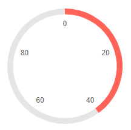
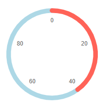
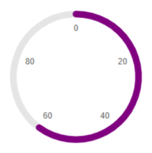
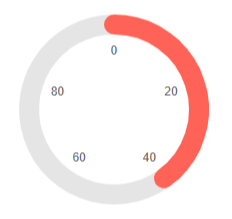

# Circular Gauge Pointers

The pointers are the values that will be marked on the scale. You can customize them through the parameters they expose:

* [LineCap](#linecap)

* [PlaceholderColor](#placeholdercolor)

* [Color](#color)

* [Size](#size)

## LineCap

The `LineCap` parameter controls the shape of the scale ending and takes a member of the `CircularGaugePointerLineCap` enum:

* `Round` - by default the shape of the scale ending would be round

* `Butt` 

>caption Change the shape of the scale. The result from the code snippet below.



````CSHTML
@* Use a flat shape for the end of the scale *@

<TelerikCircularGauge>
    <CircularGaugeScales>

        <CircularGaugeScale>
            <CircularGaugeScaleLabels Visible="true" />
        </CircularGaugeScale>

    </CircularGaugeScales>

    <CircularGaugePointers>

        <CircularGaugePointer Value="40" LineCap="@CircularGaugePointerLineCap.Butt">
        </CircularGaugePointer>

    </CircularGaugePointers>
</TelerikCircularGauge>
````

## PlaceholderColor

The `PlaceholderColor` (`string`) parameter controls the background color of the ponter. It accepts **CSS**, **HEX** and **RGB** colors.

>caption Change the background color of the pointer. The result from the code snippet below:



````CSHTML
@* Set the PlaceholderColor to light blue *@

<TelerikCircularGauge>
    <CircularGaugeScales>

        <CircularGaugeScale>
            <CircularGaugeScaleLabels Visible="true" />
        </CircularGaugeScale>

    </CircularGaugeScales>

    <CircularGaugePointers>

        <CircularGaugePointer Value="40" PlaceholderColor="lightblue">
        </CircularGaugePointer>

    </CircularGaugePointers>
</TelerikCircularGauge>
````

## Color

The `Color` (`string`) parameter controls the color of the pointer. It accepts **CSS**, **HEX** and **RGB** colors.

>caption Change the color of the pointer. The result from the code snippet below



````CSHTML
@* Change the color of the pointer to purple *@

<TelerikCircularGauge>
    <CircularGaugeScales>

        <CircularGaugeScale>
            <CircularGaugeScaleLabels Visible="true" />
        </CircularGaugeScale>

    </CircularGaugeScales>

    <CircularGaugePointers>

        <CircularGaugePointer Value="60" Color="purple">
        </CircularGaugePointer>

    </CircularGaugePointers>
</TelerikCircularGauge>
````

## Size

The `Size` (`double`) parameter controls the size of the pointer.



````CSHTML
@* Change the size of the pointer *@ 

<TelerikCircularGauge>
    <CircularGaugeScales>

        <CircularGaugeScale>
            <CircularGaugeScaleLabels Visible="true" />
        </CircularGaugeScale>

    </CircularGaugeScales>

    <CircularGaugePointers>

        <CircularGaugePointer Value="40" Size="20">
        </CircularGaugePointer>

    </CircularGaugePointers>
</TelerikCircularGauge>
````

## See Also

* [Circular Gauge: Live Demo](https://demos.telerik.com/blazor-ui/circular-gauge)
* [Circular Gauge: Overview]()
* [Circular Gauge: Scale]()
* [Circular Gauge: Labels]()
