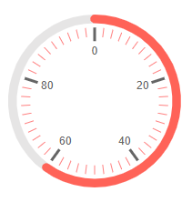
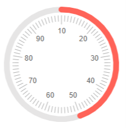
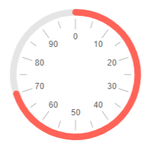
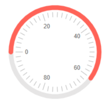
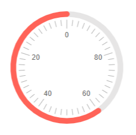

# Circular Gauge Scale

The scale of the Circular Gauge renders the values, pointers and labels. You can customize it by adding an instance of the `<CircularGaugeScale>` to the `<CircularGaugeScales>` collection, child tag of the `<TelerikCircularGauge>`. The `<CircularGaugeScale>` exposes the following parameters:

* [MinorTicks and MajorTicks](#minorticks-and-majorticks)

* [Min and Max](#min-and-max)

* [MinorUnit and MajorUnit](#minorunit-and-majorunit)

* [Start Angle](#start-angle)

* [Reverse](#reverse)


## MinorTicks and MajorTicks

* The `MinorTicks` (`object`) parameter configures the scale minor ticks. It exposes `Color`, `Size`, `Visible` and `Width` parameters to control the rendering of the minor ticks. 
    * The default value of the `Visible` parameter is false, so in order to display the MinorTicks on the scale include `<CircularGaugeScaleMinorTicks Visible="true"></CircularGaugeScaleMinorTicks>` in the `<CircularGaugeScale>` tag.

* The `MajorTicks` (`object`) parameter configures the scale major ticks. It exposes `Color`, `Size`, `Visible` and `Width` parameters to control the rendering of the major ticks.
    *  The default value of the `Visible` parameter is false, so in order to display the MajorTicks on the scale include `<CircularGaugeScaleMajorTicks Visible="true"></CircularGaugeScaleMajorTicks>` in the `<CircularGaugeScale>` tag.

>caption Change the rendering of the minor and major ticks. The result from the code snippet below.



````CSHTML
@* Render and customize the minor and major ticks. *@

<TelerikCircularGauge>
    <CircularGaugeScales>

        <CircularGaugeScale>
            <CircularGaugeScaleMajorTicks Visible="true" Width="3"></CircularGaugeScaleMajorTicks>
            <CircularGaugeScaleMinorTicks Visible="true" Color="red"></CircularGaugeScaleMinorTicks>
            <CircularGaugeScaleLabels Visible="true"></CircularGaugeScaleLabels>
        </CircularGaugeScale>

    </CircularGaugeScales>

    <CircularGaugePointers>

        <CircularGaugePointer Value="60">
        </CircularGaugePointer>

    </CircularGaugePointers>
</TelerikCircularGauge>
````

## Min and Max

* The `Max` (`double`) parameter controls the maximum value that the component can reach.

* The `Min` (`double`) parameter controls the minimum value of the component.

>caption Change the minimum and the maximum values for the scale. The result from the code snippet below.



````CSHTML
@* Use the Min and Max parameters to change the minimum and maximum values for the scale *@

<TelerikCircularGauge>
    <CircularGaugeScales>

        <CircularGaugeScale Min="10" Max="100">
            <CircularGaugeScaleMajorTicks Visible="true"></CircularGaugeScaleMajorTicks>
            <CircularGaugeScaleMinorTicks Visible="true"></CircularGaugeScaleMinorTicks>
            <CircularGaugeScaleLabels Visible="true"></CircularGaugeScaleLabels>
        </CircularGaugeScale>

    </CircularGaugeScales>

    <CircularGaugePointers>

        <CircularGaugePointer Value="50">
        </CircularGaugePointer>

    </CircularGaugePointers>
</TelerikCircularGauge>
````

## MinorUnit and MajorUnit

* The `MajorUnit` (`double`) parameter controls the interval between the major unit divisions of the component. The [labels]() will be rendered next to the `MajorUnit` ticks.

* The `MinorUnit` (`double`) parameter controls the interval between the minor unit divisions of the component.

>caption Change the rendering of the minor and major unit divisions. The result from the code snippet below.



````CSHTML
@* Update the rendering of the major and minor units. *@

<TelerikCircularGauge>

    <CircularGaugeScales>

        <CircularGaugeScale MajorUnit="10" MinorUnit="5">
            <CircularGaugeScaleMajorTicks Visible="true"></CircularGaugeScaleMajorTicks>
            <CircularGaugeScaleMinorTicks Visible="true"></CircularGaugeScaleMinorTicks>
            <CircularGaugeScaleLabels Visible="true"></CircularGaugeScaleLabels>
        </CircularGaugeScale>

    </CircularGaugeScales>

    <CircularGaugePointers>

        <CircularGaugePointer Value="70">
        </CircularGaugePointer>

    </CircularGaugePointers>
</TelerikCircularGauge>
````

## Start Angle

The `StartAngle` (`double`) parameter controls the start angle of the gauge. The gauge is rendered clockwise (0 degrees are the 180 degrees in the polar coordinate system). Defaults to 90 degrees.

>caption Change the Start Angle of the Circular Gauge. The result from the code snippet below.



````CSHTML
@* Use StartAngle parameter to change the start angle of the scale. *@

<TelerikCircularGauge>
    <CircularGaugeScales>

        <CircularGaugeScale StartAngle="0">
            <CircularGaugeScaleMajorTicks Visible="true"></CircularGaugeScaleMajorTicks>
            <CircularGaugeScaleMinorTicks Visible="true"></CircularGaugeScaleMinorTicks>
            <CircularGaugeScaleLabels Visible="true"></CircularGaugeScaleLabels>
        </CircularGaugeScale>

    </CircularGaugeScales>

    <CircularGaugePointers>

        <CircularGaugePointer Value="60">
        </CircularGaugePointer>

    </CircularGaugePointers>
</TelerikCircularGauge>
````

## Reverse

If you set the `Reverse` (`bool`) parameter to `true` the scale direction will be reversed - values will increase anticlockwise.

>caption Reverse the scale of the Circular Gauge. The result from the code snippet below.



````CSHTML
@* Reverse the scale. *@

<TelerikCircularGauge>
    <CircularGaugeScales>

        <CircularGaugeScale Reverse="true">
            <CircularGaugeScaleMajorTicks Visible="true"></CircularGaugeScaleMajorTicks>
            <CircularGaugeScaleMinorTicks Visible="true"></CircularGaugeScaleMinorTicks>
            <CircularGaugeScaleLabels Visible="true"></CircularGaugeScaleLabels>
        </CircularGaugeScale>

    </CircularGaugeScales>

    <CircularGaugePointers>

        <CircularGaugePointer Value="60">
        </CircularGaugePointer>

    </CircularGaugePointers>
</TelerikCircularGauge>
````

## Additional Customization

@[template](/_contentTemplates/gauges/additional-customization.md#circular-gauge-additional-customization)


## See Also

* [Circular Gauge: Live Demo](https://demos.telerik.com/blazor-ui/circular-gauge)
* [Circular Gauge: Overview]()
* [Circular Gauge: Pointers]()
* [Circular Gauge: Labels]()
