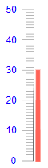
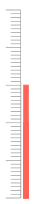

## Linear Gauge Labels

You can customize the appearance of the labels rendered on the [scale]() of the Linear Gauge by using the `<LinearGaugeScaleLabels>`, child tag of the `<LinearGaugeScale>`, and the parameters it exposes:

* [Format](#format)

* [Color](#color)

* [Visible](#visible)

## Format

The `Format` (`string`) parameter allows you to customize the rendering of the labels by using the <a href="https://docs.microsoft.com/en-us/dotnet/standard/base-types/standard-numeric-format-strings" target="_blank">standard numeric format strings</a>. You can set the values of the labels to showcase, for example, currency, percentage, and so on.

>caption Use the Format parameter to showcase currency. The result from the code snippet below.


````CSHTML
@* Use the {0:C0} format string to format the values of the labels as currency. *@

<TelerikLinearGauge>
    <LinearGaugeScales>
        <LinearGaugeScale>
            <LinearGaugeScaleLabels Format="{0:C0}">
            </LinearGaugeScaleLabels>
        </LinearGaugeScale>
    </LinearGaugeScales>

    <LinearGaugePointers>

        <LinearGaugePointer Value="10">
        </LinearGaugePointer>

        <LinearGaugePointer Value="20">
        </LinearGaugePointer>

        <LinearGaugePointer Value="30">
        </LinearGaugePointer>

    </LinearGaugePointers>
</TelerikLinearGauge>
````

## Color

The `Color` (`string`) parameter controls the color of the labels. It accepts **CSS**, **HEX** and **RGB** colors.

>caption Change the color of the labels. The result from the code snippet below.



````CSHTML
@* Change the color of the labels to blue *@

<TelerikLinearGauge>
    <LinearGaugeScales>
        <LinearGaugeScale>
            <LinearGaugeScaleLabels Color="blue">
            </LinearGaugeScaleLabels>
        </LinearGaugeScale>
    </LinearGaugeScales>

    <LinearGaugePointers>

        <LinearGaugePointer Value="10">
        </LinearGaugePointer>

        <LinearGaugePointer Value="20">
        </LinearGaugePointer>

        <LinearGaugePointer Value="30">
        </LinearGaugePointer>

    </LinearGaugePointers>
</TelerikLinearGauge>
````

## Visible

The `Visible` (`bool`) parameter controls wether the labels will be rendered.

>caption Hide the labels by using the Visible parameter. The result from the code snippet below



````CSHTML
@* Set the Visible parameter to false to hide the labels *@

<TelerikLinearGauge>
    <LinearGaugeScales>
        <LinearGaugeScale>
            <LinearGaugeScaleLabels Visible="false">
            </LinearGaugeScaleLabels>
        </LinearGaugeScale>
    </LinearGaugeScales>

    <LinearGaugePointers>

        <LinearGaugePointer Value="10">
        </LinearGaugePointer>

        <LinearGaugePointer Value="20">
        </LinearGaugePointer>

        <LinearGaugePointer Value="30">
        </LinearGaugePointer>

    </LinearGaugePointers>
</TelerikLinearGauge>
````

## See Also

* [Linear Gauge: Overview]()
* [Linear Gauge: Scale]()
* [Linear Gauge: Ranges]()
* [Linear Gauge: Pointers]()
