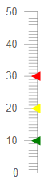

# Linear Gauge Pointers

The pointers are the values that will be marked on the scale. You can customize them through the parameters they expose:

* [Shape](#shape)

* [Color](#color)

* [Opacity](#opacity)

* [Size](#size)

* [Margin](#margin)

* [Additional Customization](#additional-customization)

>note The examples in this article are using the [Arrow shape](#shape) of the Pointers, but you can use BarIndicator too.

## Shape

The `Shape` parameter controls the shape of the pointer and takes a member of the `LinearGaugePointerShape` enum:

* `BarIndicator` - by default a bar indication will be rendered as the pointer shape

* `Arrow`

>caption Change the shape of the pointer. The result from the code snippet below.


````CSHTML
@* Use arrows as pointers in the Linear Gauge *@

<TelerikLinearGauge>
    <LinearGaugePointers>
        <LinearGaugePointer Value="10" Shape="@LinearGaugePointerShape.Arrow">
        </LinearGaugePointer>

        <LinearGaugePointer Value="20" Shape="@LinearGaugePointerShape.Arrow">
        </LinearGaugePointer>

        <LinearGaugePointer Value="30" Shape="@LinearGaugePointerShape.Arrow">
        </LinearGaugePointer>
        
    </LinearGaugePointers>
</TelerikLinearGauge>
````

## Color

The `Color` (`string`) parameter controls the color of the pointers. It accepts **CSS**, **HEX** and **RGB** colors.

>caption Change the color of the arrow pointers. The result from the code snippet below



````CSHTML
@* Change the color of the pointers *@

<TelerikLinearGauge>
    <LinearGaugePointers>
        <LinearGaugePointer Value="10" Color="#008000" Shape="@LinearGaugePointerShape.Arrow">
        </LinearGaugePointer>

        <LinearGaugePointer Value="20" Color="rgb(255,255,0)" Shape="@LinearGaugePointerShape.Arrow">
        </LinearGaugePointer>

        <LinearGaugePointer Value="30" Color="red" Shape="@LinearGaugePointerShape.Arrow">
        </LinearGaugePointer>
        
    </LinearGaugePointers>
</TelerikLinearGauge>
````

## Opacity

The `Opacity` (`double`) parameter controls the opacity of the pointers. The value passed to it should be between **0** and **1**.

````CSHML
@* Change the opacity of a pointer *@

<TelerikLinearGauge>
    <LinearGaugePointers>
        <LinearGaugePointer Value="10" Opacity="0.4" Color="green" Shape="@LinearGaugePointerShape.Arrow">
        </LinearGaugePointer>

        <LinearGaugePointer Value="20" Color="yellow" Shape="@LinearGaugePointerShape.Arrow">
        </LinearGaugePointer>

        <LinearGaugePointer Value="30" Color="red" Shape="@LinearGaugePointerShape.Arrow">
        </LinearGaugePointer>
        
    </LinearGaugePointers>
</TelerikLinearGauge>
````

## Size

The `Size` (`double`) parameter controls the size of the pointers. 

````CSHTML
@* Change the sizes of the pointers *@ 

<TelerikLinearGauge>
    <LinearGaugePointers>
        <LinearGaugePointer Value="10" Color="green" Shape="@LinearGaugePointerShape.Arrow" Size="15">
        </LinearGaugePointer>

        <LinearGaugePointer Value="20" Color="yellow" Shape="@LinearGaugePointerShape.Arrow" Size="10">
        </LinearGaugePointer>

        <LinearGaugePointer Value="30" Color="red" Shape="@LinearGaugePointerShape.Arrow" Size="5">
        </LinearGaugePointer>
        
    </LinearGaugePointers>
</TelerikLinearGauge>
````

## Margin

The `Margin` (`double`) parameter controls the margin between the [Scale]() and the pointers.

````CSHTML
@* Change the margin between the scale and the pointers *@

<TelerikLinearGauge>
    <LinearGaugePointers>
        <LinearGaugePointer Value="10" Margin="10" Shape="@LinearGaugePointerShape.Arrow" >
        </LinearGaugePointer>

        <LinearGaugePointer Value="20" Margin="8" Shape="@LinearGaugePointerShape.Arrow">
        </LinearGaugePointer>

        <LinearGaugePointer Value="30" Margin="6" Shape="@LinearGaugePointerShape.Arrow">
        </LinearGaugePointer>
        
    </LinearGaugePointers>
</TelerikLinearGauge>
````

## Additional Customization

@[template](/_contentTemplates/gauges/additional-customization.md#linear-gauge-additional-customization)

## See Also

* [Linear Gauge: Overview]()
* [Linear Gauge: Scale]()
