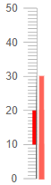
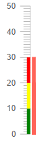
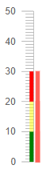

## Linear Gauge Ranges

You can highlight specific value ranges by providing one or more instances of the `<LinearGaugeScaleRange>` to the `<LinearGaugeScaleRanges>` collection, child tag of the `<LinearGaugeScale>`. You can customize them by using the parameters exposed on the `<LinearGaugeScaleRange>`:

* [From and To](#from-and-to)

* [Color](#color)

* [Opacity](#opacity)

* [Class](#class)

## From and To

* The `From` (`double?`) parameter controls the lowest point in the range.

* The `To` (`double?`) parameter controls the highest point in the range.

>caption Use the From and To parameters to provide a range. The result from the code snippet below.



````CSHTML
@* Use the From and To parameters to provide a range on the scale. *@

<TelerikLinearGauge>
    <LinearGaugeScales>
        <LinearGaugeScale>
            <LinearGaugeScaleRanges>
                <LinearGaugeScaleRange From="10" To="20" Color="red"></LinearGaugeScaleRange>
            </LinearGaugeScaleRanges>
        </LinearGaugeScale>
    </LinearGaugeScales>

    <LinearGaugePointers>

        <LinearGaugePointer Value="10">
        </LinearGaugePointer>

        <LinearGaugePointer Value="20">
        </LinearGaugePointer>

        <LinearGaugePointer Value="30">
        </LinearGaugePointer>

    </LinearGaugePointers>
</TelerikLinearGauge>
````

## Color

The `Color` (`string`) parameter controls the color of the range. It accepts **CSS**, **HEX** and **RGB** colors.

If you do not define the `Color` parameter the range will not be visually rendered.

>caption Use an RGB colors for the ranges in the linear gauge. The result from the code snippet below.



````CSHTML
@* Change the color of the ranges *@

<TelerikLinearGauge>
    <LinearGaugeScales>
        <LinearGaugeScale>
            <LinearGaugeScaleRanges>
                <LinearGaugeScaleRange From="0" To="10" Color="rgb(0,128,0)"></LinearGaugeScaleRange>
                <LinearGaugeScaleRange From="10" To="20" Color="rgb(255,255,0)"></LinearGaugeScaleRange>
                <LinearGaugeScaleRange From="20" To="30" Color="rgb(255, 0, 0)"></LinearGaugeScaleRange>
            </LinearGaugeScaleRanges>
        </LinearGaugeScale>
    </LinearGaugeScales>

    <LinearGaugePointers>

        <LinearGaugePointer Value="10">
        </LinearGaugePointer>

        <LinearGaugePointer Value="20">
        </LinearGaugePointer>

        <LinearGaugePointer Value="30">
        </LinearGaugePointer>

    </LinearGaugePointers>
</TelerikLinearGauge>
````

## Opacity

The `Opacity` (`double`) parameter controls the of the range. The value passed to it should be between **0** and **1**.

>caption Change the opacity of a range. The result from the code snippet below



````CSHTML
@* Make a range more opaque *@

<TelerikLinearGauge>
    <LinearGaugeScales>
        <LinearGaugeScale>
            <LinearGaugeScaleRanges>
                <LinearGaugeScaleRange From="0" To="10" Color="rgb(0,128,0)"></LinearGaugeScaleRange>
                <LinearGaugeScaleRange From="10" To="20" Color="rgb(255,255,0)" Opacity="0.5"></LinearGaugeScaleRange>
                <LinearGaugeScaleRange From="20" To="30" Color="rgb(255, 0, 0)"></LinearGaugeScaleRange>
            </LinearGaugeScaleRanges>
        </LinearGaugeScale>
    </LinearGaugeScales>

    <LinearGaugePointers>

        <LinearGaugePointer Value="10">
        </LinearGaugePointer>

        <LinearGaugePointer Value="20">
        </LinearGaugePointer>

        <LinearGaugePointer Value="30">
        </LinearGaugePointer>

    </LinearGaugePointers>
</TelerikLinearGauge>
````

## Class

The `Class` (`string`) parameter renders a custom CSS class on the range. You can use it to provide additional customizations. 

## See Also

* [Linear Gauge: Overview]()
* [Linear Gauge: Overview]()
* [Linear Gauge: Pointers]()
