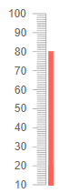
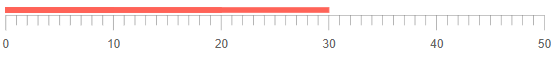
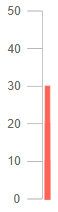

## Linear Gauge Scale

You can customize the scale of the component by adding an instance of the `<LinearGaugeScale>` to the `<LinearGaugeScale>` collection, child tag of the `<TelerikLinearGauge>`. The `<LinearGaugeScale>` exposes the following parameters:

* [Min and Max](#min-and-max)

* [MinorUnit and MajorUnit](#minorunit-and-majorunit)

* [Mirror](#mirror)

* [Reverse](#reverse)

* [Vertical](#vertical)

* [Additional Customization](#additional-customization)

    * [Example: Remove the MinorUnit ticks](#example:-remove-the-minorunit-ticks)


## Min and Max

* The `Max` (`double`) parameter controls the maximum value that the component can reach.

* The `Min` (`double`) parameter controls the lowest value of the component.

>caption Change the lowest and the highest values for the scale. The result from the code snippet below.



````CSHTML
@* Use the Min and Max parameters to change the lowest and highest values for the scale *@

<TelerikLinearGauge>
    <LinearGaugeScales>
        <LinearGaugeScale Min="10" Max="100" ></LinearGaugeScale>
    </LinearGaugeScales>

    <LinearGaugePointers>

        <LinearGaugePointer Value="10">
        </LinearGaugePointer>

        <LinearGaugePointer Value="20">
        </LinearGaugePointer>

        <LinearGaugePointer Value="80">
        </LinearGaugePointer>

    </LinearGaugePointers>
</TelerikLinearGauge>
````

## MinorUnit and MajorUnit

* The `MajorUnit` (`double`) parameter controls the interval between the major unit divisions of the component. The values provided to the `LinearGaugePointer` will render as a `MajorUnit` tick.

* The `MinorUnit` (`double`) parameter controls the interval between the minor unit divisions of the component.

>caption Change the rendering frequency of the minor and major unit divisions. The result from the code snippet below.


````CSHTML
@* Update the rendering of the major and minor ticks *@

<TelerikLinearGauge>
    <LinearGaugeScales>
        <LinearGaugeScale MajorUnit="10" MinorUnit="5"></LinearGaugeScale>
    </LinearGaugeScales>

    <LinearGaugePointers>

        <LinearGaugePointer Value="10">
        </LinearGaugePointer>

        <LinearGaugePointer Value="20">
        </LinearGaugePointer>

        <LinearGaugePointer Value="80">
        </LinearGaugePointer>

    </LinearGaugePointers>
</TelerikLinearGauge>
````

## Mirror

If you set the `Mirror` (`bool`) parameter to `true` the scale will render the labels and the unit divisions to the right of the scale. By default the labels and unit divisions are rendered to the left side of the scale.

>caption Render the labels and the ticks of the scale to the right. The result from the code snippet below


````CSHTML
@* Set the Mirror parameter to true *@

<TelerikLinearGauge>
    <LinearGaugeScales>
        <LinearGaugeScale Mirror="true"></LinearGaugeScale>
    </LinearGaugeScales>
    <LinearGaugePointers>

        <LinearGaugePointer Value="10">
        </LinearGaugePointer>

        <LinearGaugePointer Value="20">
        </LinearGaugePointer>

        <LinearGaugePointer Value="30">
        </LinearGaugePointer>

    </LinearGaugePointers>
</TelerikLinearGauge>
````

## Reverse

If you set the `Reverse` (`bool`) parameter to `true` the values of the scale will increase from top to bottom. By default they will raise from the bottom to the top.

>caption Reverse the scale of the component. The result from the code snippet below.


````CSHTML
@* Set the Reverse parameter to true *@

<TelerikLinearGauge>
    <LinearGaugeScales>
        <LinearGaugeScale Reverse="true"></LinearGaugeScale>
    </LinearGaugeScales>
    <LinearGaugePointers>

        <LinearGaugePointer Value="10">
        </LinearGaugePointer>

        <LinearGaugePointer Value="20">
        </LinearGaugePointer>

        <LinearGaugePointer Value="30">
        </LinearGaugePointer>

    </LinearGaugePointers>
</TelerikLinearGauge>
````

## Vertical

The `Vertical` (`bool`) parameter controls the orientation of the linear gauge. By default its value is `true`, but you can set to `false` so that the component renders horizontally.

>caption Change the orientation of the Linear Gauge. The result from the code snippet below.



````CSHTML
@* Use the Vertical parameter to change the orientation of the scale *@

<TelerikLinearGauge>
    <LinearGaugeScales>
        <LinearGaugeScale Vertical="false"></LinearGaugeScale>
    </LinearGaugeScales>
    <LinearGaugePointers>

        <LinearGaugePointer Value="10">
        </LinearGaugePointer>

        <LinearGaugePointer Value="20">
        </LinearGaugePointer>

        <LinearGaugePointer Value="30">
        </LinearGaugePointer>

    </LinearGaugePointers>
</TelerikLinearGauge>
````

## Additional Customization

@[template](/_contentTemplates/gauges/additional-customization.md#linear-gauge-additional-customization)

### Example: Remove the MinorUnit ticks

You can remove the MinorUnit ticks from the rendering of the scale by using the `<LinearGaugeScaleMinorTicks>` nested tag and its `Visible` parameter.

>caption Remove the MinorUnit ticks. The result from the code snippet below.



````CSHMTL
@* Remove the MinorUnit ticks. *@

<TelerikLinearGauge>
    <LinearGaugeScales>
        <LinearGaugeScale>
            <LinearGaugeScaleMinorTicks Visible="false"></LinearGaugeScaleMinorTicks>
        </LinearGaugeScale>
    </LinearGaugeScales>

    <LinearGaugePointers>

        <LinearGaugePointer Value="10">
        </LinearGaugePointer>

        <LinearGaugePointer Value="20">
        </LinearGaugePointer>

        <LinearGaugePointer Value="30">
        </LinearGaugePointer>

    </LinearGaugePointers>
</TelerikLinearGauge>
````

## See Also

* [Linear Gauge: Overview]()
* [Linear Gauge: Pointers]()
