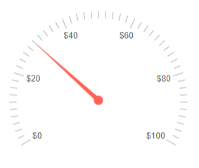
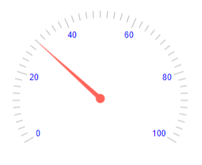
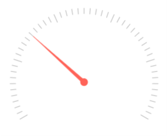
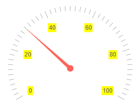

# Radial Gauge Labels

You can customize the appearance of the labels rendered on the [scale]() of the Radial Gauge by using the `<RadialGaugeScaleLabels>`, child tag of the `<RadialGaugeScale>`, and the parameters it exposes:

* [Format](#format)

* [Color](#color)

* [Visible](#visible)

* [Additional Customization](#additional-customization)

## Format

The `Format` (`string`) parameter allows you to customize the rendering of the labels by using the <a href="https://docs.microsoft.com/en-us/dotnet/standard/base-types/standard-numeric-format-strings" target="_blank">standard numeric format strings</a>. You can set the values of the labels to showcase, for example, currency, percentage, and so on.

>caption Use the Format parameter to showcase currency. The result from the code snippet below.



````CSHTML
@* Use the {0:C0} format string to format the values of the labels as currency. *@

<TelerikRadialGauge>
    <RadialGaugeScales>

        <RadialGaugeScale>
            <RadialGaugeScaleLabels Format="{0:C0}">
            </RadialGaugeScaleLabels>
        </RadialGaugeScale>

    </RadialGaugeScales>

    <RadialGaugePointers>

        <RadialGaugePointer Value="30">
        </RadialGaugePointer>
        
    </RadialGaugePointers>
</TelerikRadialGauge>
````

## Color

The `Color` (`string`) parameter controls the color of the labels. It accepts **CSS**, **HEX** and **RGB** colors.

>caption Change the color of the labels. The result from the code snippet below.



````CSHTML
@* Change the color of the labels to blue *@

<TelerikRadialGauge>
    <RadialGaugeScales>
        <RadialGaugeScale>
            <RadialGaugeScaleLabels Color="blue">
            </RadialGaugeScaleLabels>
        </RadialGaugeScale>
    </RadialGaugeScales>

    <RadialGaugePointers>       

        <RadialGaugePointer Value="30">
        </RadialGaugePointer>

    </RadialGaugePointers>
</TelerikRadialGauge>
````

## Visible

The `Visible` (`bool`) parameter controls wether the labels will be rendered.

>caption Hide the labels by using the Visible parameter. The result from the code snippet below



````CSHTML
@* Set the Visible parameter to false to hide the labels *@

<TelerikRadialGauge>
    <RadialGaugeScales>
        <RadialGaugeScale>
            <RadialGaugeScaleLabels Visible="false">
            </RadialGaugeScaleLabels>
        </RadialGaugeScale>
    </RadialGaugeScales>

    <RadialGaugePointers>        

        <RadialGaugePointer Value="30">
        </RadialGaugePointer>

    </RadialGaugePointers>
</TelerikRadialGauge>
````

## Additional Customization

@[template](/_contentTemplates/gauges/additional-customization.md#radial-gauge-additional-customization)

>caption Customize the background and the margin of the Labels. The result from the code snippet below.



````CSHTML
@* Provide background color and margin to the labels *@

<TelerikRadialGauge>
    <RadialGaugeScales>

        <RadialGaugeScale>
            <RadialGaugeScaleLabels Background="yellow">
                <RadialGaugeScaleLabelsMargin Top="10" Bottom="10" Left="10" Right="10"></RadialGaugeScaleLabelsMargin>
            </RadialGaugeScaleLabels>
        </RadialGaugeScale>
    </RadialGaugeScales>

    <RadialGaugePointers>

        <RadialGaugePointer Value="30">
        </RadialGaugePointer>

    </RadialGaugePointers>
</TelerikRadialGauge>
````

## See Also

* [Radial Gauge: Live Demo](https://demos.telerik.com/blazor-ui/radial-gauge)
* [Radial Gauge: Overview]()
* [Radial Gauge: Scale]()
* [Radial Gauge: Pointers]()
* [Radial Gauge: Ranges]()