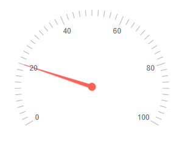

# Radial Gauge Overview

The Telerik Radial Gauge for Blazor represents numerical values on a [scale]() of ranges in a radial format.

#### This article is separated in the following sections: 

* [Basics](#basics)

* [Features](#features)

* [Methods](#methods)

## Basics

>caption To add a Telerik Radial Gauge for Blazor to your application:

1. Add the `<TelerikRadialGauge>` tag.

1. Add one or more instances of the `<RadialGaugePointer>` to the `<RadialGaugePointers>` collection.

1. Provide a `Value` for each `<RadialGaugePointer>`.

>caption Basic Telerik Radial Gauge for Blazor.



````CSHTML
@* Setup a basic radial gauge *@

<TelerikRadialGauge>
    <RadialGaugePointers>
        <RadialGaugePointer Value="20">            
        </RadialGaugePointer>        
    </RadialGaugePointers>    
</TelerikRadialGauge>
````

## Features

The Telerik Radial Gauge for Blazor exposes the following features:

#### Radial Gauge Size

* `Width` - `string` - controls the width of the component. You can read more on how they work in the [Dimensions]() article.

* `Height` - `string` - controls the height of the component. You can read more on how they work in the [Dimensions]() article.

You can also set the Gauge size in percentage values so it occupies its container when it renderes. If the parent container size changes, you must call the gauge's `Refresh()` C# [method](#methods) after the DOM has been redrawn and the new container dimensions are rendered.

#### Other Features

* `Class` - renders a custom CSS class on the topmost wrapping element of the component. You can use that class to reposition the component on the page.

* [Scale]() - The scale of the radial gauge renders the values of the [pointers](), different [ranges]() and [labels](). 

* [Ranges]() - The ranges are used to visually distinguish particular values on the scale.

* [Labels]() - The labels are rendered on the scale of the component to give information to the users.

* [Pointers]() - The pointers indicate the values on the scale of the component. 

## Methods

The Radial Gauge reference exposes the `Refresh` method which allows you to programatically re-render the component. 

>caption Get a component reference and use the Refresh method

````CSHTML
@* Change the Height of the component *@

<TelerikButton OnClick="@ChangeHeight">Change the height</TelerikButton>

<TelerikRadialGauge @ref="@RadialGaugeRef" Height="@Height">
    <RadialGaugePointers>
        <RadialGaugePointer Value="20">
        </RadialGaugePointer>
    </RadialGaugePointers>
</TelerikRadialGauge>

@code{
    Telerik.Blazor.Components.TelerikRadialGauge RadialGaugeRef { get; set; }

    public string Height { get; set; } = "200px";

    async Task ChangeHeight()
    {
        Height = "400px";

        //give time to the framework and browser to resize the actual DOM so the gauge can use the expected size
        await Task.Delay(30);

        RadialGaugeRef.Refresh();
    }
}
````

## See Also

* [Radial Gauge: Live Demo](https://demos.telerik.com/blazor-ui/radial-gauge)
* [Radial Gauge: Scale]()
* [Radial Gauge: Pointers]()
* [Radial Gauge: Ranges]()
* [Radial Gauge: Labels]()