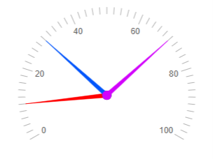
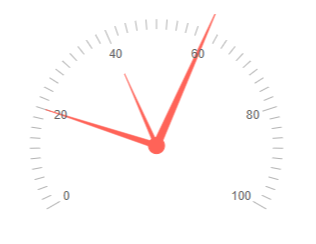
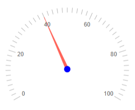
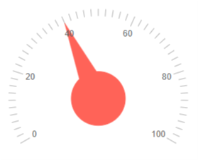
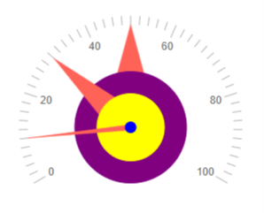

# Radial Gauge Pointers

The Pointers mark the values on the scale. They consist of pointer arrow (called just "pointer" for brevity) and a pointer cap - the circle that marks the pointer center. You can customize pointers and pointer caps through the parameters they expose:

* Pointer

    * [Pointer Color](#pointer-color)

    * [Pointer Length](#pointer-length)

* Pointer Cap

    * [Pointer Cap Color](#pointer-cap-color)

    * [Pointer Cap Size](#pointer-cap-size)

* [Notes](#notes)


## Pointer Color

The `Color` (`string`) parameter controls the color of the pointers. It accepts **CSS**, **HEX** and **RGB** colors.

>caption Change the color of the pointer. The result from the code snippet below.



````CSHTML
@* Change the color of the pointers in the Radial Gauge *@

<TelerikRadialGauge>
    <RadialGaugePointers>
        <RadialGaugePointer Value="10" Color="red">
        </RadialGaugePointer>

        <RadialGaugePointer Value="30" Color="#0356fc" >
        </RadialGaugePointer>

        <RadialGaugePointer Value="70" Color="rgb(210, 3, 252)" >
        </RadialGaugePointer>

    </RadialGaugePointers>
</TelerikRadialGauge>
````

## Pointer Length

The `Length` (`string`) parameter controls the pointers length (in percent) that is based on the distance to the scale. The default length of 1 indicates that the pointer exactly reaches the scale. Accepts values between 0.1 and 1.5.

>caption Change the length of the pointers. The result from the code snippet below



````CSHTML
@* Change the length of the pointers *@

<TelerikRadialGauge>
    <RadialGaugePointers>
        <RadialGaugePointer Value="20" Length="1">
        </RadialGaugePointer>

        <RadialGaugePointer Value="40" Length="0.7" >
        </RadialGaugePointer>

        <RadialGaugePointer Value="60" Length="1.3">
        </RadialGaugePointer>

    </RadialGaugePointers>
</TelerikRadialGauge>
````

## Pointer Cap Color

The `Color` (`string`) parameter controls the color of the pointer cap. It accepts **CSS**, **HEX** and **RGB** colors.

>caption Change the color of the pointer cap. The result from the code snippet below.



````CSHML
@* Change the color of the pointer cap *@

<TelerikRadialGauge>
    <RadialGaugePointers>
        <RadialGaugePointer Value="40">
            <RadialGaugePointerCap Color="blue">
            </RadialGaugePointerCap>
        </RadialGaugePointer>       
    </RadialGaugePointers>
</TelerikRadialGauge>
````

## Pointer Cap Size

The `Size` (`double`) parameter controls the size of the pointer cap in percentage according to the scale radius. (from 0 to 1). The default size is 0.05.

>caption Change the size of the pointer cap. The result from the code snippet below.



````CSHTML
@* Change the sizes of the pointers *@ 

<TelerikRadialGauge>
    <RadialGaugePointers>
        <RadialGaugePointer Value="40">
            <RadialGaugePointerCap Size="0.3">
            </RadialGaugePointerCap>
        </RadialGaugePointer>       
    </RadialGaugePointers>
</TelerikRadialGauge>
````


## Notes


### Pointer Order

The pointer caps are rendered as per the order they are declared in the markup - the last pointer will be rendered on top of the others regardless of its value. Therefore, you should consider that when operating with the pointer cap parameters in order for their values to be visible (for example if the first pointer cap has the same size as the last pointer cap, it will not be visible.)

>caption Change the sizes and colors of the pointer caps. The result from the code snippet below.



````CSHTML
@* Change the sizes and colors of the pointer caps *@ 

<TelerikRadialGauge>
    <RadialGaugePointers>
        <RadialGaugePointer Value="50">
            <RadialGaugePointerCap Color="purple" Size="0.5">
            </RadialGaugePointerCap>
        </RadialGaugePointer>

        <RadialGaugePointer Value="30">
            <RadialGaugePointerCap Color="yellow" Size="0.3">
            </RadialGaugePointerCap>
        </RadialGaugePointer>

        <RadialGaugePointer Value="10">
            <RadialGaugePointerCap Color="blue">
            </RadialGaugePointerCap>
        </RadialGaugePointer>
    </RadialGaugePointers>
</TelerikRadialGauge>
````

## See Also

* [Radial Gauge: Live Demo](https://demos.telerik.com/blazor-ui/radial-gauge)
* [Radial Gauge: Overview]()
* [Radial Gauge: Scale]()
* [Radial Gauge: Labels]()
* [Radial Gauge: Ranges]()
